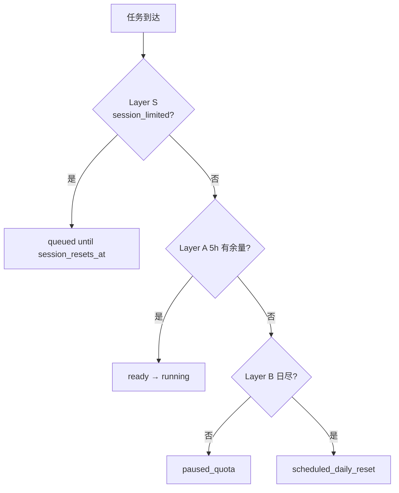

# Fori 多 Agent 编排主指南

> **版本**: 3.0 · 2026-07-03  
> **受众**: Cursor（编排者）、Hermes（调度器）  
> **机器可读**: `MODEL_ROUTING_MATRIX.json` · `claude-routing.json` · `codex-routing.json` · `quota-ledger.json`  
> **研究报告**: `docs/execution/QUOTA_OPTIMIZATION_STUDY.md`  
> **续跑**: `RESUME_ORCHESTRATION.md` · `scripts/resume-pending.sh`

---

## 1. 执行摘要

Fori 采用 **双节点固定主路由 + 三层配额 + 科学模型矩阵**：

| Agent | 主节点 | 计划 | 核心职责 |
|-------|--------|------|----------|
| **Claude Code** | epix | Pro | 架构、ADR、设计、深审 |
| **Codex** | woot | Plus | 实现、测试、重构 |
| **Cursor** | epix | Pro+ | **编排**、合并 main、文档 Gate（**不替代** Claude 设计/评审） |
| **Hermes** | epix | API | 7×24 调度、验证、续跑 cron |

**标准并行对**：epix Claude + woot Codex（双限可用时 burst）。

**Cursor 拥有续跑**：`manifest.pendingResume` + `resume-pending.sh`，配额重置后自动派发，无需 Human 触发。

---

## 2. 三层配额模型（v3 新增 Layer S）

| 层级 | Claude Pro | Codex Plus | Cursor Pro+ |
|------|------------|------------|-------------|
| **Layer S** | Session limit（交互 5h 池，与 claude.ai 共享） | — | — |
| **Layer A** | ~45 msg/5h (`-p`) | ~300 min/5h | ~$70/mo API 池 |
| **Layer B** | 22:30 PDT 日硬地板 | 00:29 PDT 日硬地板 | 账单周期重置 |



### 2.1 ledger 状态枚举

`available` | `warning` | `exhausted` | `session_limited` | `auth_error` | `paused_quota`

**quota-check.sh 退出码**: 0=ok · 1=session/paused · 2=daily · 3=auth_error

---

## 3. Cursor Pro+ 编排角色（v3）

| 用 Cursor | 委派 Claude/Codex |
|-----------|-------------------|
| manifest / handoff / 配额账本 | design / adr / review |
| 合并 main、HTTP 冒烟 | implement / refactor |
| PM 计划、研究报告 | security_review |
| `resume-pending.sh` 触发 | verify L2+ 深审 |

**反模式**：Claude `session_limited` 时用 Cursor 代写设计 → 必须 `pendingResume` 排队。

---

## 4. 模型路由矩阵

机器可读：`.ai/orchestration/MODEL_ROUTING_MATRIX.json`

| 层级 | task_type | agent | model |
|------|-----------|-------|-------|
| blade | design, review, implement | claude/codex | default / gpt-5.5 |
| lite | docs, test, design_review_codex | codex | gpt-5.4-mini |
| lite | orchestration, merge | cursor | composer |

---

## 5. 暂停与续跑（Cursor 拥有）

1. 429 / session limit → 写 ledger + `manifest.pendingResume[]`
2. Hermes/Cursor cron → `resume-pending.sh --wave N`
3. **每次续跑周期最多 1 次 `claude -p`**
4. 禁止重复 `claude auth login`（见 `AUTH_PERSISTENCE.md`）

详见 `RESUME_ORCHESTRATION.md`。

---

## 6. 时段调度（三层感知）

| 时段 (PDT) | 策略 |
|------------|------|
| 00:30–08:00 | Codex 优先；02:10+ Claude session 续跑 |
| 08:00–22:00 | Claude ∥ Codex burst |
| 22:00–22:30 | 停 heavy Claude |
| 22:30–00:29 | 双 Agent Layer B 挂起 |

---

## 7. 派发前检查

```bash
.ai/orchestration/scripts/quota-check.sh claude   # 或 codex / all
.ai/orchestration/scripts/resume-pending.sh --dry-run
```

---

## 8. 相关文件

| 路径 | 用途 |
|------|------|
| `MODEL_ROUTING_MATRIX.json` | 任务→模型矩阵 |
| `RESUME_ORCHESTRATION.md` | 自动续跑手册 |
| `scripts/resume-pending.sh` | 续跑脚本 |
| `docs/execution/QUOTA_OPTIMIZATION_STUDY.md` | 研究报告 |
| `quota-ledger.schema.json` | v3 schema（含 session_limited） |

---

*v3.0 · 集成配额优化研究 · 2026-07-03*
