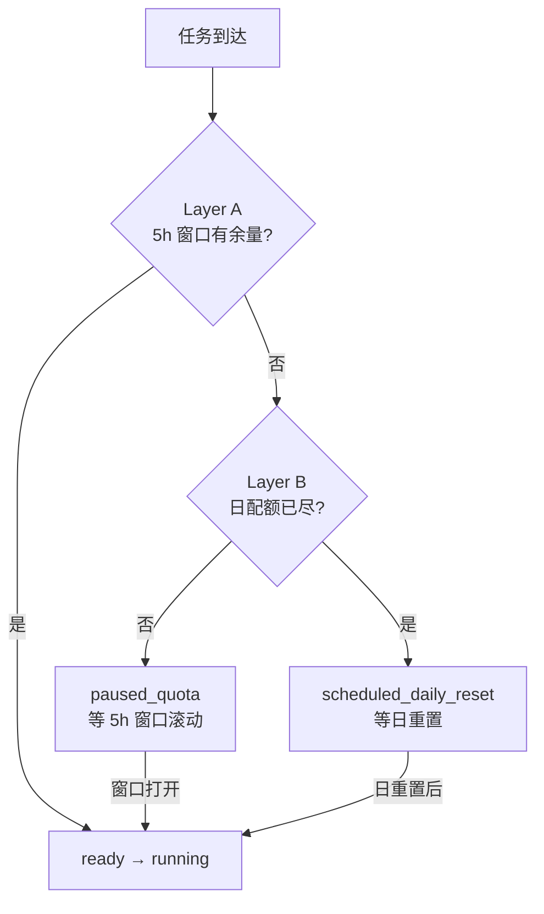

# Fori 多 Agent 编排主指南

> **版本**: 2.0 · 2026-07-02  
> **受众**: Cursor（编排者）、Hermes（调度器）、Human  
> **机器可读**: `claude-routing.json` · `codex-routing.json` · `agent-routes.json` · `quota-ledger.json`

---

## 1. 执行摘要

Fori 采用 **双节点固定主路由 + 交叉降级 + 双层配额模型**：

| Agent | 主节点 | 计划 | 核心职责 |
|-------|--------|------|----------|
| **Claude Code** | epix | Pro | 架构、ADR、设计、深审 |
| **Codex** | woot | Plus | 实现、测试、重构 |
| **Cursor** | epix | — | 编排、合并 main、产品 Gate |
| **Hermes** | epix | API | 7×24 调度、验证、续跑 |

**标准并行对**：epix 跑 Claude + woot 跑 Codex，互不阻塞。

---

## 2. 为何曾用「日重置」而非「5 小时窗口」？

### 2.1 历史原因（v1.0 的偏差）

早期编排文档（v1.0）以 **可观测的日界重置时刻** 作为调度依据：

| Agent | 观测到的日重置 (PDT) | 观测到的日重置 (北京) |
|-------|---------------------|----------------------|
| Claude Pro `claude -p` | 22:30 | 次日 13:30 |
| Codex Plus | 00:29 | 当日 15:29 |

这些时刻来自**实战经验**：当 5 小时滚动窗口在一天内多次耗尽后，CLI 会在固定日历时刻「全面恢复」。它们**不是**订阅的 primary limit，而是 **Layer B 硬地板**。

### 2.2 实际订阅机制（应以之为准）

| 层级 | 机制 | Claude Pro | Codex Plus |
|------|------|------------|------------|
| **Layer A（主）** | **5 小时滚动窗口** | headless `-p` 约 **~45 条消息/5h**（经验值，非官方精确数） | **5h 用量配额**（429 明确返回 `5-hour usage quota` + `resets_at`） |
| **Layer B（辅）** | **日重置硬地板** | 全日耗尽后约 22:30 PDT 恢复 | 全日耗尽后约 00:29 PDT 恢复 |
| **Layer C（观测）** | CLI 无 quota status | 无 `claude quota` 命令；靠 429/错误文案 + ledger | `codex doctor` 无配额；429 含 `resets_in_seconds` |

**结论**：调度、暂停、续跑必须以 **Layer A 5h 滚动窗口** 为主；日重置仅作 **当日配额彻底耗尽** 时的 fallback。

### 2.3 CLI 配额探测现状（诚实披露）

| 工具 | 官方 quota 命令 | 可用信号 |
|------|----------------|----------|
| `claude -p` | ❌ 无 | 429 / rate limit 文案；**禁止**用探测性调用来测限额 |
| `codex exec` | ❌ 无（`codex doctor` 仅环境诊断） | 429 `AccountQuotaExceeded` + `resets at …` / `resets_in_seconds` |
| Hermes Gateway | 部分路径 | `usage_limit_reached` + `resets_in_seconds` |

**推荐**：`.ai/orchestration/quota-ledger.json` + `scripts/quota-check.sh` 启发式账本（见 `QUOTA_LEDGER.md`）。

---

## 3. 双层配额模型



### 3.1 Layer A — 5 小时滚动配额（主调度层）

| 字段 | 说明 |
|------|------|
| `window_hours` | 5（Codex 官方确认；Claude 同理按 5h 处理） |
| `window_start` | 本窗口内首次 heavy 调用时刻 |
| `window_end` | `window_start + 5h` 或 429 返回的 `quota_reset_at` |
| `budget_claude_msgs` | ~45（headless `-p` 经验上限，按 `--max-turns` 预估消耗） |
| `budget_codex_minutes` | ~300（5h 内 heavy exec 分钟数，按任务 `estimated_minutes` 扣减） |

**用途**：任务排队、burst 分配、mid-task 暂停、5h 后续跑。

### 3.2 Layer B — 日重置（辅 / 硬地板）

当 Layer A 在一天内多次滚动耗尽且 CLI 持续 429 至日界时刻，任务进入 `scheduled_daily_reset`：

| Agent | 日重置 (PDT) | 日重置 (北京) |
|-------|-------------|---------------|
| Claude | 22:30 | 次日 13:30 |
| Codex | 00:29 | 当日 15:29 |

**双限耗尽窗口**（22:30–00:29 PDT / 北京 13:30–15:29）：两 Agent 可能同时 Layer B 耗尽 → 仅 Cursor 文档类 / Paseo 兜底。

### 3.3 任务队列状态

| 状态 | 含义 | 触发 | 恢复条件 |
|------|------|------|----------|
| `ready` | 配额充足，可派发 | 账本检查通过 | — |
| `running` | Agent 执行中 | 派发成功 | 完成 / 429 |
| `paused_quota` | Layer A 5h 窗口耗尽 | 429 + `resets_in` < 24h | `now >= quota_reset_at` |
| `scheduled_daily_reset` | Layer B 日配额耗尽 | 多次 5h 耗尽或 `resets_at` 跨过日界 | 对应 Agent 日重置时刻 |
| `completed` | 正常结束 | Hermes 验证 PASS | — |
| `failed` | 不可恢复错误 | 非配额失败 | 人工介入 |

**manifest.json** 中 `currentTask.status` 与上表对齐；Hermes Kanban 的 `scheduled` 映射到 `paused_quota` 或 `scheduled_daily_reset`。

---

## 4. 暂停与续跑规则

### 4.1 Mid-task 暂停（Layer A 耗尽）

1. Agent 返回 429 / usage limit → **立即** `git commit`（含断点说明 `[agent]`）
2. 调用 `codex-quota-record.sh`（Codex）或写入 `quota-ledger.json`（Claude）
3. 从错误文案提取 `quota_reset_at`（优先）或 `now + 5h`（fallback）
4. `manifest.status = paused_quota`；更新 `plan/current.md` Breakpoint
5. Hermes cron `fori-quota-watchdog`（每 15–30min）比对 `quota_reset_at`
6. 窗口打开 → `unblock` → 新会话续跑（**禁止** `--continue` 自审场景）

### 4.2 日重置续跑（Layer B）

1. 若 `quota_reset_at` 落在下一日界之后，或连续 N 次 5h 耗尽 → `scheduled_daily_reset`
2. watchdog 在日重置后优先队列：**00:29 Codex** → **22:30 Claude**
3. 续跑使用 **新** `claude -p` / `codex exec` + handoff 文件上下文（非会话记忆）

### 4.3 禁止事项（不变）

1. **`claude -p` / `codex exec` 必须 `< /dev/null`**
2. **禁止** `pkill -f "codex exec"`
3. **禁止** Claude 限额耗尽时用 Codex 做设计/评审
4. **禁止** Codex 限额耗尽时用 Claude 做编码
5. **禁止** 用探测性 CLI 调用检测配额（封号风险）
6. **禁止** Codex 自验标 done（Hermes 必须 `git diff`）

---

## 5. 时段调度建议（双层感知）

调度时**先查 ledger Layer A**，再参考 Layer B 日界：

| 时段 (PDT) | Layer A 策略 | Layer B 注意 | 优先派发 |
|------------|-------------|-------------|----------|
| 00:30–08:00 | Codex 新 5h 窗口常可用 | Codex 日重置刚过 | Codex 长实现（woot） |
| 08:00–12:00 | 人类在线，burst 设计+实现 | — | Claude 设计/评审 ∥ Codex |
| 12:00–18:00 | Codex 窗口中段，适合批量 | 监控 ledger 余量 | Codex 批量实现 |
| 18:00–22:00 | 预留 Claude 窗口给深审 | Claude 接近日界 | Claude 深审 + Cursor Gate |
| 22:00–22:30 | Claude Layer B 可能触顶 | **双限窗口前夕** | 停 heavy Claude；完成中的 Codex |
| 22:30–00:29 | 双 Agent Layer B 耗尽 | **挂起区** | `scheduled_daily_reset` 或 Cursor 文档 |
| 22:30+ | Claude 日重置 → 新窗口 | — | Claude 架构/ADR 优先 |

**Cursor 派发前**：运行 `.ai/orchestration/scripts/quota-check.sh` 或读 `quota-ledger.json`。

---

## 6. 角色矩阵（RACI 精简）

| 活动 | Cursor | Hermes | Claude | Codex | Human |
|------|--------|--------|--------|-------|-------|
| 产品优先级 / Gate | **A/R** | C | C | I | **A** |
| PRD/架构/UI 设计 | C | I | **R** | I | I |
| 对抗性评审 | C | C | **R**（新会话） | I | I |
| 原型/生产代码 | I | C | I | **R** | I |
| 自动化验证 | C | **R** | I | C | I |
| 合并 main | **R** | I | I | I | **A** |
| 配额账本 / 续跑 | C | **R** | I | I | I |

---

## 7. 路由决策树

```
任务进入 Cursor
│
├─ quota-check.sh → paused_quota / scheduled_daily_reset？ ──→ 排队，写 handoff
│
├─ 产品 Gate / MVP 切片 / 合并？ ──────────────→ Cursor 主导
│
├─ 设计 / ADR / 深审？
│   ├─ 只读 <15min + ledger 余量足 ───────────→ Cursor 直调 claude -p
│   └─ 长文档 / 多轮 / 需续跑 ────────────────→ Hermes → claude -p (epix)
│
├─ 实现 / 测试 / 重构？
│   ├─ <15min 轻量 + ledger 余量足 ───────────→ Cursor 直调 codex (woot ssh)
│   └─ >15min / 批量 / worktree ──────────────→ Hermes → codex exec (woot)
│
└─ 验证？
    ├─ L0/L1 自动脚本 ────────────────────────→ Hermes 脚本
    └─ L2+ 深审 ──────────────────────────────→ Claude 新会话评审
```

---

## 8. 分支策略

```
main ← 唯一合并点（Cursor/Human）
├── claude/fori-041-adr-migration
├── codex/fori-042-monorepo-init
├── cursor/fori-040-mvp-slice
└── hermes/fori-050-ci-pipeline
```

### 8.1 并发规则

| 场景 | 规则 |
|------|------|
| 不同文件 | ✅ epix Claude + woot Codex 并行 |
| 同文件不同函数 | ⚠️ 串行（manifest owner lock） |
| 同文件同区域 | ❌ 严格串行 + 交叉审查 |
| D4+ 生产开发 | worktree-per-task + `codex/*` 分支 |

---

## 9. 任务类型 → 工具映射

### 9.1 Claude Code（`claude-routing.json`）

| task_type | max_turns | 预估配额 | 节点 |
|-----------|-----------|----------|------|
| design | 30 | ~30 msg | epix |
| review | 15 | ~15 msg | epix |
| readonly_audit | 10 | ~10 msg | epix |
| adr | 25 | ~25 msg | epix |
| security_review | 20 | ~20 msg | epix |

### 9.2 Codex（`codex-routing.json`）

| task_type | model | 预估分钟 | 节点 |
|-----------|-------|----------|------|
| implement | gpt-5.5 | 30 | woot |
| implement_simple | gpt-5.4-mini | 15 | woot |
| refactor | gpt-5.5 | 30 | woot |
| test | gpt-5.4-mini | 20 | woot |

---

## 10. 配额节约策略

### 10.1 Claude Pro

- ✅ 短只读评审（<15min）Cursor 直调；登记 ledger
- ✅ `--max-turns` 硬上限
- ✅ 长多轮设计交 Hermes（API 路径，不耗 `-p`）
- ❌ 不用 Claude 做批量页面实现
- ❌ 不用探测调用测限额

### 10.2 Codex Plus

- ✅ 批量相似任务合并派发
- ✅ 文档/测试用 `gpt-5.4-mini`
- ✅ woot 主跑；429 → `codex-quota-record.sh`（CAMA 脚本可复用）
- ❌ 禁止 epix 与 woot 同时 heavy `codex exec`

---

## 11. 四阶段 + 分级门禁

```
Design (Claude) → Review (Claude 新会话) → Execute (Codex) → Verify (Hermes)
```

| 级别 | 变更类型 | 流程 |
|------|----------|------|
| L0 | 文案、Mock、样式 | Codex → 自动 build |
| L1 | 新页面、路由 | Codex → Hermes Verify |
| L2 | PRD/架构/UI 修订 | Claude 修订 → 评审 → Cursor 确认 |
| L3 | API/DB/Agent 接口 | 设计 → 评审 → Codex worktree → 安全审查 |
| L4 | 合规/资金/公证 | L3 + Human 必审 |

---

## 12. Handoff 契约

| # | 动作 | 产物 |
|---|------|------|
| 1 | Git commit `[agent]` | branch |
| 2 | 更新 manifest.json | currentTask + limits |
| 3 | 更新 plan/current.md | Breakpoint |
| 4 | 更新 startup/STARTUP_BRIEF.md | 跨会话摘要 |
| 5 | 登记 quota-ledger.json | 配额消耗 |
| 6 | 填写 handoffs/FORI-XXX.md | D4+ 强制 |

---

## 13. 派发命令速查

### 派发前

```bash
.ai/orchestration/scripts/quota-check.sh claude   # 或 codex / all
```

### Claude 设计（epix）

```bash
cd /Users/epix/Dev/Fori
claude -p "$(cat .ai/handoffs/FORI-041.md)" \
  --max-turns 30 --allowedTools Read,Write,Bash \
  --dangerously-skip-permissions < /dev/null
```

### Codex 实现（woot）

```bash
ssh woot 'cd /Users/woot/Dev/Fori && git checkout -B codex/{{branch}} && \
  codex exec "$(cat .ai/handoffs/FORI-042.md)" --model gpt-5.5 --yolo < /dev/null 2>&1'
```

---

## 14. 升级路径

| 情况 | 动作 |
|------|------|
| Claude 401 | `claude auth login`（OAuth 过期，非配额） |
| Claude/Codex 429 Layer A | `paused_quota` → ledger → cron 续跑 |
| Claude/Codex 日尽 Layer B | `scheduled_daily_reset` → 等日界 |
| woot 不可达 | Codex fallback epix |
| 双限耗尽 | 挂起；Cursor 文档类 |

---

## 15. 相关文件

| 路径 | 用途 |
|------|------|
| `.ai/orchestration/quota-ledger.json` | 配额账本（机器可读） |
| `.ai/orchestration/QUOTA_LEDGER.md` | 账本操作说明 |
| `.ai/orchestration/scripts/quota-check.sh` | 派发前门控 |
| `.ai/orchestration/claude-routing.json` | Claude 路由 |
| `.ai/orchestration/codex-routing.json` | Codex 路由 |
| CAMA `QUOTA_ROUTING_PLAYBOOK.md` | 跨项目配额 Playbook |
| CAMA `codex-quota-record.sh` | Codex 429 登记（可复用） |
