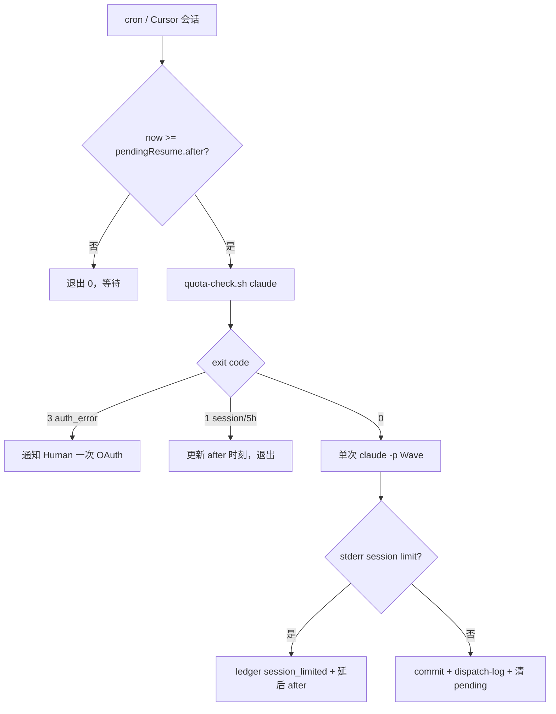

# Cursor 拥有：自动续跑编排手册

> **版本**: 1.0 · 2026-07-03  
> **所有者**: Cursor（非 Human）  
> **脚本**: `.ai/orchestration/scripts/resume-pending.sh`

---

## 1. 目的

当 Claude/Codex 因配额挂起时，由 **Cursor 或 Hermes cron** 自动检测恢复时刻并续跑，**无需 Human 手动触发**。

当前挂起任务：**FORI-044** Wave 1（设计）+ Wave 4（实现评审）。

---

## 2. 触发条件

| 来源 | 字段 | 含义 |
|------|------|------|
| `manifest.json` | `pendingResume[]` | `{task, wave, after, branch, handoff}` |
| `quota-ledger.json` | `agents.claude.layer_a.status` | `session_limited` / `paused_quota` / `auth_error` |
| `.ai/handoffs/PENDING_CLAUDE_RESUME.md` | 人类可读步骤 | Wave 命令模板 |

---

## 3. 续跑流程



---

## 4. 命令

### 4.1 检查（不派发）

```bash
.ai/orchestration/scripts/resume-pending.sh --dry-run
```

### 4.2 执行 Wave 1（设计包，最多 1 次 claude -p）

```bash
.ai/orchestration/scripts/resume-pending.sh --wave 1
```

### 4.3 执行 Wave 4（实现评审，需 W1 完成且配额 OK）

```bash
.ai/orchestration/scripts/resume-pending.sh --wave 4
```

### 4.4 Hermes cron 建议

```cron
# 每 15 分钟，02:00–08:00 PDT 加密检查 FORI-044
*/15 2-8 * * * cd /Users/epix/Dev/Fori && .ai/orchestration/scripts/resume-pending.sh --wave 1 >> /tmp/fori-resume.log 2>&1
```

---

## 5. 配额规则（续跑专用）

1. **每次续跑周期最多 1 次 `claude -p`**（session 珍贵）
2. **禁止**重复 `claude auth login`；`auth_error` → 通知 Human
3. **禁止** Cursor 代写 Claude 设计/评审
4. 派发前必须 `quota-check.sh claude` exit 0
5. 若 `-p` 仍返回 `session limit` → 更新 `session_resets_at`，不 retry

---

## 6. 状态更新清单

续跑成功或挂起后更新：

- [ ] `quota-ledger.json` — status、entries[]
- [ ] `manifest.json` — `currentTask`、`pendingResume`、`limits.claude`
- [ ] `dispatch-log.jsonl` — 追加一行
- [ ] `plan/current.md` — Breakpoint
- [ ] Wave 完成 → 归档 `PENDING_CLAUDE_RESUME.md`

---

## 7. FORI-044 时间表

| 事件 | 时刻 (PDT) |
|------|------------|
| 挂起 | 2026-07-02 ~22:43 |
| Session reset | **2026-07-03 02:10** |
| 建议 cron 首发 | 02:15 PDT |
| Wave 4 | W1 成功后 + 配额 OK |

---

*续跑手册 · Cursor 编排 · 2026-07-03*
