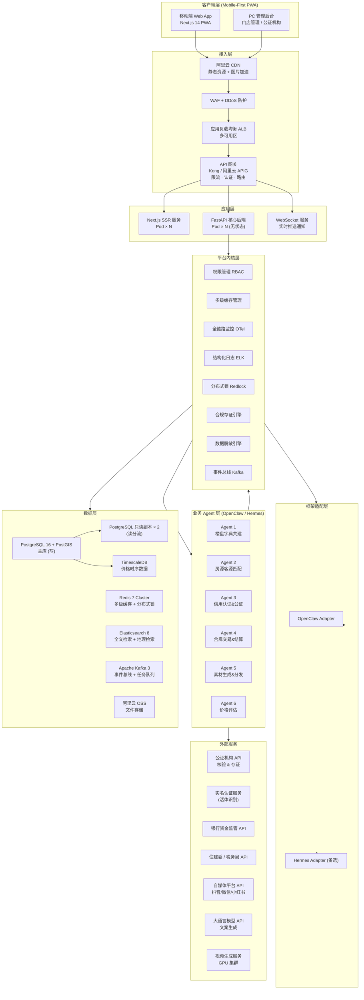
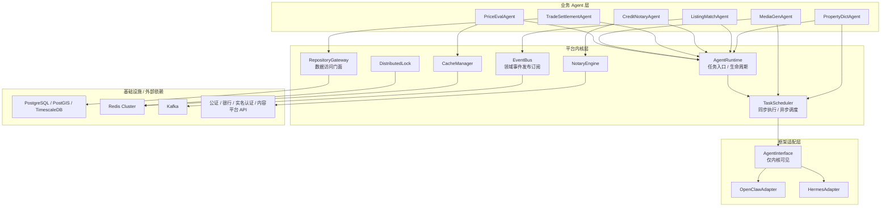
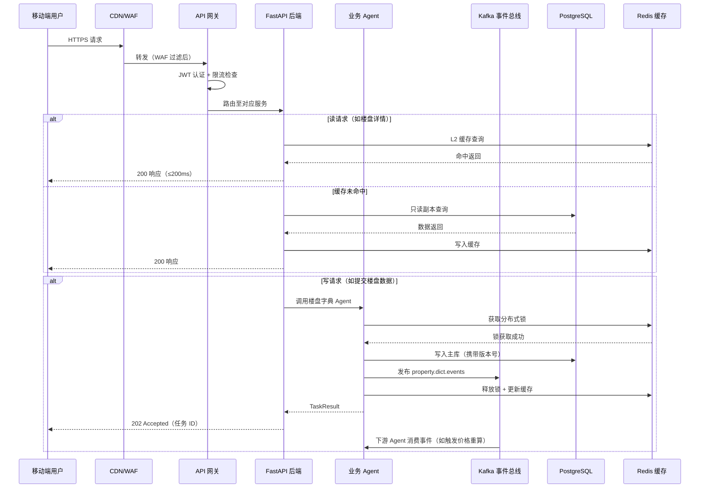
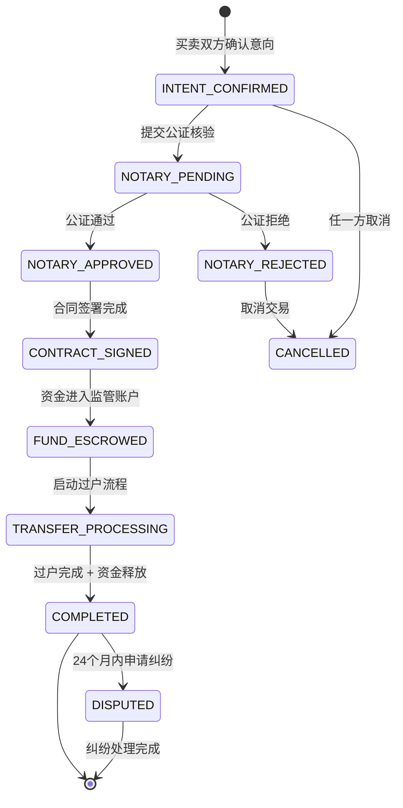

# Fori 房产交易中介生态平台·技术架构设计文档

> **版本**：v1.0.0  
> **撰写日期**：2026-07-01  
> **文档状态**：正式版  
> **文档负责人**：Claude Code（Expert · 架构/深审）  
> **依据文档**：`docs/PRD.md` v1.0.0  
> **架构原则**：移动端优先 Web App、Agent 原生、三层解耦、高并发高可用

---

## 目录

1. [系统全景概述](#1-系统全景概述)
2. [技术栈选型](#2-技术栈选型)
3. [系统架构图](#3-系统架构图)
4. [三层解耦架构详细设计](#4-三层解耦架构详细设计)
5. [数据模型设计](#5-数据模型设计)
6. [六大业务 Agent 详细设计](#6-六大业务-agent-详细设计)
7. [API 设计规范](#7-api-设计规范)
8. [高并发方案](#8-高并发方案)
9. [高可用方案](#9-高可用方案)
10. [部署架构](#10-部署架构)
11. [安全架构](#11-安全架构)
12. [架构决策记录 ADR 汇总](#12-架构决策记录-adr-汇总)

---

## 1. 系统全景概述

### 1.1 架构设计原则

Fori 平台的技术架构围绕五大核心原则展开：

**P1 · Agent 原生（Agent-Native）**：所有业务逻辑封装为独立智能体，Agent 是第一公民，而非后期补充。系统从第一行代码起即以 Agent 协同编排为核心范式。

**P2 · 移动端优先（Mobile-First）**：产品形态统一为 Next.js 14 PWA + 响应式 Web。所有 UI/交互设计、网络策略、性能优化均以手机浏览器为首要目标；需要摄像头、活体识别、推送等设备能力时，通过 Web API、第三方 H5 SDK 或服务端回调桥接。

**P3 · 三层解耦（Decoupled Layers）**：框架适配层 / 平台内核层 / 业务 Agent 层完全解耦，框架升级或切换时业务层代码零改动。技术债务集中在适配层，业务代码长期稳定。

**P4 · 合规优先（Compliance by Design）**：数据脱敏、存证、审计日志、权限控制不是事后加装的模块，而是平台内核层的内置能力，所有业务 Agent 自动继承。

**P5 · 渐进式扩展（Progressive Scale）**：初期以单城市、万级并发为目标设计，架构上预留分库分表、多地域部署的扩展路径，不过度超前设计，但接口和数据模型需支持后续无缝扩展。

### 1.2 核心技术挑战

| 挑战 | 规模 | 技术应对方向 |
|-----|------|------------|
| 楼盘字典并发写冲突 | 多人同时编辑同一楼盘 | 乐观锁 + 版本号 + 写队列 |
| 房源客源实时匹配 | 百万级房源 × 万级客源 | 向量检索 + 离线批量 + 实时增量 |
| 视频素材生成 | GPU 密集型，任务 P95 ≤15 分钟 | 独立 GPU Worker 池 + 优先级队列 |
| 公证存证永久可查 | 法律级别不可篡改 | 哈希 + 时间戳 + 公证机构三重保障 |
| 价格图谱实时渲染 | P99 ≤3 秒 | 多级缓存 + 预计算基准值 |
| 峰值 5 万并发用户 | 经纪人 + 用户同时在线 | 无状态水平扩展 + Kubernetes 弹性伸缩 |

### 1.3 非功能性目标约束

- **可用性**：交易核心链路 SLA ≥ 99.9%（年宕机 ≤ 8.76 小时）
- **响应时间**：读接口 P50 ≤ 200ms，P99 ≤ 1000ms；写接口 P99 ≤ 2000ms
- **扩展性**：支持全国 200+ 城市、10 亿+ 套住宅数据体量
- **合规性**：等保 2.0 三级、个人信息保护法、数据本地化（境内存储）

---

## 2. 技术栈选型

### 2.1 前端框架

**选型决策**：Next.js 14（App Router）+ TypeScript

**理由**：
1. **SSR/SSG 兼备**：楼盘详情页、房源列表页需要 SEO 友好的服务端渲染；用户中心、工作台等交互密集页面采用 CSR，Next.js 的混合渲染策略精准匹配此需求。
2. **PWA 能力支持**：配合 `next-pwa` 插件可实现 Service Worker 缓存、离线模式、安装到主屏等 PWA 能力，满足经纪人在弱网（3G）下操作楼盘字典的需求。
3. **移动端性能**：App Router 的 React Server Components 显著减少 JS Bundle 体积，首屏 LCP 目标 ≤ 2.5 秒在中端移动设备浏览器可达。
4. **生态成熟度**：国内外大量高并发项目验证，文档丰富，招聘市场充裕。

**UI 层**：Tailwind CSS 4.x + shadcn/ui（基于 Radix UI 无障碍原语）  
**地图组件**：高德地图 JS API 2.0（小区位置、片区边界可视化）  
**图表组件**：ECharts 5（价格走势折线图、瀑布图、热力图）  
**状态管理**：Zustand（轻量、TypeScript 友好，适合中等复杂度 SPA）  
**数据请求**：TanStack Query v5（缓存、请求去重、乐观更新）  
**表单验证**：React Hook Form + Zod  

**备选方案**：Vue 3 + Nuxt 3  
**不选原因**：团队技术栈偏 React，Nuxt 3 的 SSR hydration 在大型数据密集页面的稳定性经验略逊于 Next.js；shadcn/ui 生态目前仅有 React 版本最为完善。

---

### 2.2 后端框架

**选型决策**：Python 3.12 + FastAPI

**理由**：
1. **AI/ML 生态对齐**：OpenClaw、Hermes 等 Agent 框架均以 Python 为一等公民，素材生成 Agent（调用视觉模型）、价格评估 Agent（统计模型）天然在 Python 生态内运行，避免跨语言 RPC 开销。
2. **异步原生**：FastAPI 基于 Starlette + asyncio，与 Agent 任务的异步编排模型契合，高并发连接下 Python 的 GIL 限制通过多进程（Gunicorn multi-worker）规避。
3. **类型安全**：Pydantic v2 提供运行时数据验证和自动 OpenAPI 文档生成，降低 API 契约漂移风险。
4. **招聘可行性**：中国 AI 方向开发者以 Python 为主，团队扩张阻力最小。

**异步任务处理**：Celery 5 + Kafka（任务分发）  
**ORM**：SQLAlchemy 2.0（异步模式 + Core API 用于高性能批量操作）  
**迁移工具**：Alembic  
**后端测试**：pytest + pytest-asyncio + httpx（异步测试客户端）

**备选方案**：Go 1.22 + Gin/Fiber  
**适用场景**：若楼盘字典查询 TPS 压测超出 Python 能力上限（预估 > 30,000 TPS），可将只读高频接口迁移至 Go 微服务，作为分流层。架构上预留此扩展路径（API Gateway 路由层可按路径前缀分流至不同后端）。

---

### 2.3 数据库

**主数据库：PostgreSQL 16 + PostGIS 扩展**

**理由**：
1. **地理数据支持**：片区 GeoJSON 边界、小区坐标点、地铁站距离计算均依赖 PostGIS 的空间索引（GiST）和地理函数，无需单独引入地理数据库。
2. **JSONB 灵活存储**：楼盘字典中各层级配套设施标签、版本历史 diff 使用 JSONB 存储，兼顾查询效率与字段灵活性。
3. **事务完整性**：交易状态机的状态迁移、佣金结算等强一致性场景依赖 ACID 事务，PostgreSQL 是关系型数据库中功能最全、扩展性最强的选择。
4. **TimescaleDB 扩展**：价格历史时序数据使用 TimescaleDB（PostgreSQL 扩展），支持时序压缩、连续聚合（Continuous Aggregates），价格趋势查询性能比普通表提升 10～100 倍。

**水平扩展**：Citus（PostgreSQL 分布式扩展）用于楼盘字典分库分表（按城市 ID 分片）

**备选方案**：MySQL 8.0  
**不选原因**：缺乏原生 PostGIS 支持，JSON 查询性能弱于 JSONB，全文检索能力不足。

---

### 2.4 缓存

**选型决策**：Redis 7 Cluster（三主三从，自动故障转移）

**理由**：
1. **多数据结构**：Sorted Set 实现楼盘维护积分排行（Top 3 经纪人）；Hash 存储价格基准缓存；Pub/Sub 实现实时客源推送通知。
2. **Redlock 分布式锁**：平台内核层的分布式锁统一基于 Redis Redlock 算法，楼盘并发写保护、幂等检查均依赖此机制。
3. **高性能**：Redis 7 的多线程 I/O 在单节点可达 100 万 QPS，满足楼盘字典查询 ≥ 10,000 TPS 要求有充裕余量。

**多级缓存架构**：
- **L1（进程内缓存）**：Gunicorn Worker 内的 Python dict（TTL 30 秒），用于极热点数据（城市列表、枚举值）
- **L2（分布式缓存）**：Redis Cluster（TTL 5 分钟～1 小时，按数据更新频率设置）
- **L3（持久化存储）**：PostgreSQL

**高可用模型**：生产环境优先使用阿里云云数据库 Redis 集群版，按云产品的分片主从架构部署 3 个主分片 + 3 个从副本；主分片故障时由云产品完成副本提升、VIP/代理路由切换和槽位恢复。自建 Redis 时使用 Redis Cluster 自带故障转移，不混用其他主从高可用模式。

**备选方案**：Memcached（不支持 Pub/Sub 和 Sorted Set，排除）；KeyDB（Redis 兼容的多线程版，可作升级路径）

---

### 2.5 消息队列

**选型决策**：Apache Kafka 3.6

**理由**：
1. **高吞吐持久化**：楼盘数据更新事件、客源匹配触发事件需要持久化消息，支持消费者失败后重放，Kafka 的日志存储模型天然满足此需求。
2. **死信队列（DLQ）**：Kafka 通过专用 DLQ Topic 实现重试 3 次仍失败的任务隔离，人工介入处理。
3. **流处理**：素材生成任务的状态流转、价格数据更新通知可通过 Kafka Streams 实现实时聚合。
4. **解耦 Agent 间通信**：六大 Agent 通过 Kafka Topic 发布/订阅领域事件，实现松耦合协作，避免直接 RPC 调用导致的级联故障。

**Topic 规划**：
```
fori.property.dict.events    # 楼盘字典变更事件
fori.listing.validate        # 房源核验任务
fori.buyer.validate          # 客源核验任务
fori.matching.run            # 匹配任务触发
fori.material.gen            # 素材生成任务
fori.transaction.state       # 交易状态变更事件
fori.notary.request          # 公证请求队列
fori.dlq.*                   # 各业务死信队列
```

**备选方案**：RabbitMQ（适合复杂路由场景，但高吞吐下性能不及 Kafka）；阿里云消息服务 MNS/RocketMQ（云原生但厂商锁定，作为迁移备选）

---

### 2.6 文件存储

**选型决策**：阿里云 OSS（对象存储服务）

**理由**：
1. **数据本地化合规**：用户上传的房产证、身份证照片、视频素材存储于境内节点，满足《个人信息保护法》数据本地化要求。
2. **CDN 集成**：OSS 与阿里云 CDN 原生集成，用户上传的房源图片通过 CDN 节点下发，移动端加载延迟显著降低。
3. **生命周期策略**：核验完成后 30 天自动删除原始证件照（合规要求），通过 OSS 生命周期规则实现，无需业务代码干预。
4. **防盗链与访问控制**：通过 OSS Bucket Policy + 签名 URL 实现文件访问权限控制，存证文件仅向授权方开放。

**存储分类**：
| 类型 | Bucket | 访问策略 | 生命周期 |
|-----|--------|---------|---------|
| 房源实拍图片 | `fori-listing-photos` | CDN 公开 | 永久（下架后移至冷存储）|
| 核验原始证件 | `fori-kyc-raw` | 私有，签名 URL | 30 天后自动删除 |
| 生成视频素材 | `fori-materials-video` | CDN 公开 | 90 天（用户可手动延期）|
| 存证文件 | `fori-notary-archive` | 私有，审计访问 | 永久（法律要求 7 年+）|
| 用户头像 | `fori-user-avatars` | CDN 公开 | 永久 |

**备选方案**：腾讯云 COS（功能相近，价格略低，可作灾备节点）

---

### 2.7 搜索引擎

**选型决策**：Elasticsearch 8.x

**理由**：
1. **全文检索**：楼盘名称、小区名称的模糊搜索（支持拼音、简称、别名）依赖倒排索引，PostgreSQL 全文检索在中文分词和模糊匹配上的性能和功能弱于 ES。
2. **地理位置检索**：买家按距离/区域搜索房源，ES 的 `geo_distance` 和 `geo_bounding_box` 查询高效支持。
3. **复合过滤**：多维度筛选（区域 + 户型 + 价格区间 + 楼层 + 装修）在 ES 的倒排索引 + 过滤缓存下，百万级数据响应 P99 ≤ 100ms。
4. **向量检索（未来扩展）**：ES 8.x 支持 kNN 向量检索，为后续"智能相似房源推荐"预留技术路径。

**索引规划**：
- `fori_properties`：楼盘字典索引（小区/楼栋/单套）
- `fori_listings`：在售房源索引（带地理坐标、价格、户型）
- `fori_buyers`：客源需求索引（用于经纪人侧反向检索）

**中文分词插件**：IK Analysis Plugin（细粒度分词 + 自定义地名词典）

**备选方案**：Meilisearch（更轻量，但地理检索和向量检索能力弱于 ES）；OpenSearch（AWS 生态版 ES，不选，厂商绑定）

---

### 2.8 部署方案

**选型决策**：阿里云 ACK（Managed Kubernetes）+ 阿里云基础设施

**理由**：
1. **数据主权**：阿里云国内节点，满足数据本地化合规要求，且与 OSS、CDN、RDS 等云服务原生集成。
2. **弹性伸缩**：Kubernetes HPA 基于 CPU/内存/自定义指标（Kafka Consumer Lag）自动扩缩容，应对经纪人早晚高峰和楼市热点时段的流量突增。
3. **Managed 服务**：ACK 托管控制面，减少运维负担；PolarDB for PostgreSQL 托管数据库，内置主从复制和自动故障切换。

**基础设施清单**：
| 服务 | 产品 | 规格（初期）|
|-----|------|-----------|
| 容器编排 | 阿里云 ACK | 3 主节点 + 弹性工作节点 |
| 数据库 | PolarDB for PostgreSQL 16 | 2C + 只读节点 × 2 |
| 缓存 | 阿里云云数据库 Redis 7 | 集群版 16G |
| 消息队列 | 阿里云消息队列 Kafka 版 | 3 Broker |
| 搜索 | Alibaba Cloud Elasticsearch | 3 节点集群 |
| 对象存储 | 阿里云 OSS | 按量付费 |
| CDN | 阿里云 CDN | 全国节点 |
| API 网关 | 阿里云 API 网关 / Kong | 集群模式 |
| 负载均衡 | 阿里云 ALB | 多可用区 |

---

## 3. 系统架构图

### 3.1 整体系统拓扑



### 3.1.1 三层依赖方向图

三层解耦的依赖方向以“业务 Agent 只依赖平台内核接口”为硬约束。业务 Agent 不导入 `AgentInterface`，不持有 OpenClaw/Hermes 适配器实例，也不直接调用框架 SDK；框架适配器只在平台内核内部由 `TaskScheduler` 封装调用。



**依赖规则**：
- 业务 Agent 允许依赖：`AgentRuntime`、`TaskScheduler`、`EventBus`、`CacheManager`、`DistributedLock`、`NotaryEngine`、`RepositoryGateway` 等平台内核接口。
- 业务 Agent 禁止依赖：`AgentInterface`、`OpenClawAgentAdapter`、`HermesAgentAdapter`、OpenClaw/Hermes SDK、Kafka/Redis/SQLAlchemy 客户端实例。
- 平台内核允许依赖框架适配层，并负责把平台 `Task` 转换为框架任务、执行重试、写入任务状态表、发布结果事件。
- 框架适配层不得反向依赖业务 Agent 包；适配器只处理框架协议转换，不包含业务规则。

### 3.2 请求链路详解



---

## 4. 三层解耦架构详细设计

### 4.1 框架适配层（Framework Adapter Layer）

框架适配层是三层架构的最底层，职责是**将 OpenClaw 或 Hermes 的具体 SDK 封装为平台统一接口**，屏蔽框架差异，使业务 Agent 层对 Agent 框架无感知。

#### 4.1.1 标准化 Agent 接口定义

```python
from abc import ABC, abstractmethod
from dataclasses import dataclass
from enum import Enum
from typing import Any, Optional

class TaskStatus(Enum):
    PENDING = "pending"
    RUNNING = "running"
    SUCCESS = "success"
    FAILED = "failed"
    CANCELLED = "cancelled"

@dataclass
class Task:
    task_id: str           # 全局唯一任务 ID（幂等键）
    task_type: str         # 任务类型（如 PROPERTY_DICT_CREATE）
    payload: dict          # 任务参数（JSON 序列化）
    priority: int          # 优先级 1-10（10 最高）
    timeout_seconds: int   # 任务超时秒数
    retry_max: int         # 最大重试次数（默认 3）
    idempotency_key: str   # 幂等键（防重复执行）

@dataclass
class TaskResult:
    task_id: str
    status: TaskStatus
    result: Optional[dict]
    error: Optional[str]
    duration_ms: int

@dataclass
class TaskHandle:
    task_id: str
    estimated_start: int   # 预计开始执行的 Unix 时间戳

@dataclass
class TaskState:
    task_id: str
    status: TaskStatus
    progress: float        # 0.0 ~ 1.0
    logs: list[str]

@dataclass
class HealthStatus:
    healthy: bool
    worker_count: int
    queue_depth: int
    details: dict

class AgentInterface(ABC):
    """所有框架适配器必须实现此接口。该接口仅由平台内核层持有和调用，业务 Agent 不导入。"""

    @abstractmethod
    async def execute_task(self, task: Task) -> TaskResult:
        """同步执行任务（适合短任务，P99 ≤ 30 秒）"""
        ...

    @abstractmethod
    async def schedule_async(self, task: Task, delay_seconds: int = 0) -> TaskHandle:
        """异步调度任务（适合长任务，如视频生成、批量匹配）"""
        ...

    @abstractmethod
    async def get_state(self, task_id: str) -> TaskState:
        """查询任务当前状态"""
        ...

    @abstractmethod
    async def cancel_task(self, task_id: str) -> bool:
        """取消任务（仅 PENDING/RUNNING 状态可取消）"""
        ...

    @abstractmethod
    async def health_check(self) -> HealthStatus:
        """Agent Worker 健康检查"""
        ...
```

#### 4.1.2 OpenClaw 适配实现

```python
class OpenClawAgentAdapter(AgentInterface):
    """将 OpenClaw SDK 封装为平台标准接口"""

    def __init__(self, openclaw_config: dict):
        from openclaw import OpenClawClient  # 仅此处导入框架 SDK
        self._client = OpenClawClient(**openclaw_config)

    async def execute_task(self, task: Task) -> TaskResult:
        # 将平台 Task 转换为 OpenClaw 原生任务格式
        oc_task = self._to_openclaw_task(task)
        try:
            oc_result = await self._client.run(oc_task)
            return self._from_openclaw_result(oc_result)
        except Exception as e:
            return TaskResult(task_id=task.task_id, status=TaskStatus.FAILED,
                              result=None, error=str(e), duration_ms=0)

    async def schedule_async(self, task: Task, delay_seconds: int = 0) -> TaskHandle:
        oc_handle = await self._client.enqueue(
            self._to_openclaw_task(task), delay=delay_seconds
        )
        return TaskHandle(task_id=task.task_id, estimated_start=oc_handle.eta)

    # ... 其他方法类似转换
```

#### 4.1.3 Hermes 备选适配（框架切换 SOP）

```python
class HermesAgentAdapter(AgentInterface):
    """Hermes Agent 适配器——与 OpenClawAgentAdapter 平行存在"""

    def __init__(self, hermes_config: dict):
        from hermes import HermesRunner  # 仅此处导入 Hermes SDK
        self._runner = HermesRunner(**hermes_config)

    async def execute_task(self, task: Task) -> TaskResult:
        # Hermes 的轻量化编排 API 转换
        ...
```

**框架切换控制**：通过环境变量 `AGENT_FRAMEWORK=openclaw|hermes` 在运行时选择适配器，无需修改业务代码：

```python
# kernel/task_scheduler.py
import os
from .adapters import OpenClawAgentAdapter, HermesAgentAdapter

def create_agent_adapter() -> AgentInterface:
    framework = os.getenv("AGENT_FRAMEWORK", "openclaw")
    if framework == "openclaw":
        return OpenClawAgentAdapter(config=load_openclaw_config())
    elif framework == "hermes":
        return HermesAgentAdapter(config=load_hermes_config())
    raise ValueError(f"Unknown agent framework: {framework}")
```

---

### 4.2 平台内核层（Platform Kernel Layer）

平台内核层是与框架无关的公共底座，提供所有业务 Agent 共用的横切关注点能力。

#### 4.2.1 权限管理（RBAC）

采用基于角色的字段级权限控制。核心设计：

```
角色（Role）→ 权限集合（PermissionSet）→ 资源 + 操作 + 字段
```

**五大角色**：`PLATFORM_ADMIN`、`STORE_ADMIN`、`CERTIFIED_AGENT`、`NORMAL_USER`、`ANONYMOUS`

**字段级权限**：每个 API 响应的每个字段都经过权限过滤器处理，基于请求方角色动态剔除无权访问的字段。实现为 FastAPI Dependency + Pydantic 动态模型：

```python
class PermissionFilter:
    def filter_response(self, data: dict, role: Role, resource: str) -> dict:
        allowed_fields = self._permission_matrix.get(resource, {}).get(role, set())
        return {k: v for k, v in data.items() if k in allowed_fields}
```

#### 4.2.2 分布式缓存管理

多级缓存统一由内核层 `CacheManager` 管理，业务代码调用统一接口，不直接操作 Redis：

```python
class CacheManager:
    async def get(self, key: str, loader: Callable) -> Any:
        """缓存穿透保护：先查 L1 → L2 → 回源 loader"""
        if val := self._l1.get(key):
            return val
        if val := await self._redis.get(key):
            self._l1.set(key, val, ttl=30)
            return val
        val = await loader()
        await self._redis.set(key, val, ttl=self._ttl_config[key])
        self._l1.set(key, val, ttl=30)
        return val
```

#### 4.2.3 全链路监控（OpenTelemetry）

所有服务自动注入 trace_id，跨服务调用链路可追踪：

- **Metrics**：Prometheus（FastAPI 请求 QPS/延迟、Kafka Consumer Lag、Agent 任务成功率）
- **Traces**：Jaeger（分布式链路追踪，识别热点接口和慢查询）
- **Logs**：结构化 JSON 日志（含 `trace_id`、`span_id`、`user_id`、`task_id`），通过 Fluentd 收集至 Elasticsearch，Kibana 可视化
- **Dashboards**：Grafana（核心看板：API 健康、Agent 队列深度、缓存命中率、数据库连接池）

#### 4.2.4 分布式锁（Redlock）

```python
class DistributedLock:
    async def acquire(self, key: str, ttl_ms: int = 5000) -> LockContext:
        """基于 Redis Redlock 算法的分布式锁（三节点 quorum）"""
        ...

    async def __aenter__(self) -> "LockContext":
        ...

    async def __aexit__(self, *args):
        await self.release()
```

所有楼盘并发写操作、幂等检查均通过此接口实现，禁止业务 Agent 自行实现锁逻辑。

#### 4.2.5 合规存证引擎

```python
class NotaryEngine:
    async def create_evidence(self, content: dict) -> EvidenceRecord:
        """生成存证记录：哈希 → 时间戳 → 提交公证机构"""
        hash_val = sha256(json.dumps(content, sort_keys=True).encode()).hexdigest()
        timestamp = await self._tsa_client.stamp(hash_val)  # RFC 3161 时间戳
        cert = await self._notary_client.certify(hash_val, timestamp)
        return EvidenceRecord(hash=hash_val, timestamp=timestamp, certificate=cert)
```

#### 4.2.6 数据脱敏引擎

统一脱敏规则引擎，所有 API 出口数据经过脱敏过滤：

| 字段类型 | 脱敏规则 | 示例 |
|---------|---------|------|
| 手机号 | 保留前3后4，中间替换 `****` | `138****5678` |
| 身份证 | 保留年龄信息，其余屏蔽 | `****（38岁）` |
| 家庭住址 | 仅保留区县级 | `上海市浦东新区` |
| 银行卡号 | 保留后4位 | `****1234` |

---

### 4.3 业务 Agent 层（Business Agent Layer）

业务 Agent 层只依赖平台内核层的接口，不直接访问数据库、不直接调用外部 API，所有能力通过内核层提供的抽象获取。每个 Agent 是独立的 Python 包，可独立部署、独立扩缩容。

**Agent 基类**：

```python
class BaseAgent:
    def __init__(self, runtime: AgentRuntime):
        self.runtime = runtime    # 平台内核层入口，封装框架调度和生命周期
        self.scheduler = runtime.scheduler
        self.event_bus = runtime.event_bus
        self.cache = runtime.cache
        self.lock = runtime.lock
        self.notary = runtime.notary
        self.mask = runtime.data_mask
        self.repository = runtime.repository_gateway

    async def handle(self, task: Task) -> TaskResult:
        """任务入口，子类实现 _process()；幂等、锁、状态写入由内核统一处理。"""
        return await self.runtime.run_agent_task(
            task=task,
            processor=self._process,
            lock_key=f"task:{task.idempotency_key}",
        )

    @abstractmethod
    async def _process(self, task: Task) -> TaskResult: ...
```

**平台内核调度器封装**：

```python
class TaskScheduler:
    def __init__(self, adapter: AgentInterface, task_repo: TaskStateRepository):
        self._adapter = adapter
        self._task_repo = task_repo

    async def schedule(self, task: Task, delay_seconds: int = 0) -> TaskHandle:
        await self._task_repo.mark_pending(task)
        handle = await self._adapter.schedule_async(task, delay_seconds=delay_seconds)
        await self._task_repo.bind_handle(task.task_id, handle)
        return handle

    async def execute(self, task: Task) -> TaskResult:
        await self._task_repo.mark_running(task.task_id)
        result = await self._adapter.execute_task(task)
        await self._task_repo.save_result(result)
        return result
```

**禁止模式**：

```python
# 禁止：业务 Agent 不允许导入 AgentInterface 或接收框架适配器实例
from kernel.adapters import AgentInterface          # forbidden
from openclaw import OpenClawClient                 # forbidden
from hermes import HermesRunner                     # forbidden
```

---

## 5. 数据模型设计

### 5.1 核心实体 ER 图

```mermaid
erDiagram
    CITY {
        bigint id PK
        string name
        string code
        string province
        int tier
        geometry center_point
        timestamp created_at
    }

    ZONE {
        bigint id PK
        bigint city_id FK
        string name
        string zone_type
        geometry boundary
        jsonb facilities
        timestamp updated_at
    }

    COMMUNITY {
        bigint id PK
        bigint zone_id FK
        string name
        string developer
        string property_company
        int built_year
        int total_buildings
        int total_units
        float floor_area_ratio
        float green_ratio
        float parking_ratio
        point entrance_coord
        jsonb facilities
        float property_fee_min
        float property_fee_max
        float property_score
        string[] tags
        string tier_level
        int version
        timestamp updated_at
    }

    BUILDING {
        bigint id PK
        bigint community_id FK
        string building_no
        int total_floors
        int units_per_floor
        string building_type
        int elevator_count
        string main_facing
        string ground_floor_type
        timestamp updated_at
    }

    UNIT {
        bigint id PK
        bigint building_id FK
        string room_no
        float gross_area
        float net_area
        int floor_no
        string facing
        string layout
        string layout_image_url
        int property_years
        string status
        decimal current_listing_price
        jsonb historical_transactions
        bigint[] maintaining_agent_ids
        int version
        timestamp updated_at
    }

    USER {
        bigint id PK
        string phone_masked
        string phone_encrypted
        string id_card_masked
        string real_name
        string role
        int credit_score
        string kyc_level
        string kyc_status
        timestamp created_at
    }

    AGENT_PROFILE {
        bigint id PK
        bigint user_id FK
        bigint store_id FK
        string license_no
        string license_image_url
        int cert_level
        int contribution_score
        float transaction_rating
        int transaction_count
        timestamp certified_at
    }

    STORE {
        bigint id PK
        string name
        string business_license_no
        string agency_license_no
        string legal_person
        string address
        float credit_score
        timestamp certified_at
    }

    LISTING {
        bigint id PK
        bigint unit_id FK
        bigint seller_user_id FK
        bigint agent_id FK
        decimal listing_price
        string status
        string validate_status
        string validate_result
        timestamp listed_at
        timestamp expires_at
        jsonb features
        string[] photo_urls
    }

    BUYER_NEED {
        bigint id PK
        bigint buyer_user_id FK
        bigint[] target_zone_ids
        string[] preferred_layout
        decimal budget_min
        decimal budget_max
        string purchase_timeline
        float intent_score
        string status
        timestamp created_at
        timestamp expires_at
    }

    MATCH_RESULT {
        bigint id PK
        bigint buyer_need_id FK
        bigint listing_id FK
        bigint agent_id FK
        float match_score
        string push_priority
        string push_status
        timestamp pushed_at
        timestamp responded_at
    }

    TRANSACTION {
        bigint id PK
        bigint listing_id FK
        bigint buyer_user_id FK
        bigint seller_user_id FK
        bigint agent_id FK
        decimal transaction_price
        string status
        string notary_cert_no
        jsonb state_history
        string idempotency_key
        timestamp created_at
        timestamp completed_at
    }

    EVIDENCE_RECORD {
        bigint id PK
        bigint transaction_id FK
        bigint notary_task_id FK
        bigint notary_institution_id FK
        string content_hash
        string timestamp_token
        string notary_cert
        string notary_institution
        string evidence_no
        timestamp created_at
    }

    NOTARY_INSTITUTION {
        bigint id PK
        string name
        string license_no
        string api_endpoint
        string status
        int priority
        jsonb capability_scope
        timestamp certified_at
    }

    NOTARY_TASK {
        bigint id PK
        bigint transaction_id FK
        bigint notary_institution_id FK
        bigint requested_by FK
        string task_type
        string status
        jsonb package_hashes
        string reject_reason
        timestamp submitted_at
        timestamp completed_at
    }

    CREDIT_PROFILE {
        bigint id PK
        bigint user_id FK
        bigint store_id FK
        int score
        string grade
        string kyc_level
        string risk_level
        timestamp updated_at
    }

    CREDIT_EVENT {
        bigint id PK
        bigint credit_profile_id FK
        bigint user_id FK
        bigint transaction_id FK
        string event_type
        int score_delta
        bigint evidence_record_id FK
        jsonb metadata
        timestamp occurred_at
    }

    PRICE_SNAPSHOT {
        bigint id PK
        bigint community_id FK
        string tier_level
        decimal median_price_per_sqm
        decimal p25_price
        decimal p75_price
        int sample_count
        string trend_direction
        timestamp snapshot_date
    }

    PRICE_EVALUATION {
        bigint id PK
        bigint unit_id FK
        bigint listing_id FK
        bigint community_id FK
        bigint requested_by FK
        decimal base_price_per_sqm
        decimal final_low
        decimal final_high
        string confidence_level
        timestamp evaluated_at
    }

    PRICE_FACTOR {
        bigint id PK
        bigint price_evaluation_id FK
        string factor_code
        string factor_name
        decimal weight
        decimal adjustment_ratio
        jsonb evidence
    }

    PRICE_REPORT {
        bigint id PK
        bigint price_evaluation_id FK
        bigint evidence_record_id FK
        string report_no
        string report_url
        string status
        timestamp generated_at
    }

    MATERIAL_JOB {
        bigint id PK
        bigint listing_id FK
        bigint requested_by FK
        string job_type
        string status
        jsonb params
        string[] output_urls
        int priority
        timestamp created_at
        timestamp completed_at
    }

    CITY ||--o{ ZONE : "包含"
    ZONE ||--o{ COMMUNITY : "包含"
    COMMUNITY ||--o{ BUILDING : "包含"
    BUILDING ||--o{ UNIT : "包含"
    UNIT ||--o{ LISTING : "挂牌"
    USER ||--o{ LISTING : "发布"
    USER ||--o| AGENT_PROFILE : "拥有"
    STORE ||--o{ AGENT_PROFILE : "管理"
    USER ||--o{ BUYER_NEED : "创建"
    BUYER_NEED ||--o{ MATCH_RESULT : "产生"
    LISTING ||--o{ MATCH_RESULT : "关联"
    LISTING ||--o| TRANSACTION : "成交"
    TRANSACTION ||--o{ EVIDENCE_RECORD : "存证"
    NOTARY_INSTITUTION ||--o{ NOTARY_TASK : "承办公证"
    TRANSACTION ||--o{ NOTARY_TASK : "发起公证"
    USER ||--o{ NOTARY_TASK : "提交"
    NOTARY_TASK ||--o{ EVIDENCE_RECORD : "生成存证"
    NOTARY_INSTITUTION ||--o{ EVIDENCE_RECORD : "签发"
    USER ||--o| CREDIT_PROFILE : "信用档案"
    STORE ||--o| CREDIT_PROFILE : "机构信用档案"
    CREDIT_PROFILE ||--o{ CREDIT_EVENT : "信用事件"
    USER ||--o{ CREDIT_EVENT : "触发"
    TRANSACTION ||--o{ CREDIT_EVENT : "关联"
    EVIDENCE_RECORD ||--o{ CREDIT_EVENT : "证据来源"
    COMMUNITY ||--o{ PRICE_SNAPSHOT : "价格快照"
    COMMUNITY ||--o{ PRICE_EVALUATION : "小区评估"
    UNIT ||--o{ PRICE_EVALUATION : "单套测算"
    LISTING ||--o{ PRICE_EVALUATION : "挂牌测算"
    PRICE_EVALUATION ||--o{ PRICE_FACTOR : "价格因子"
    PRICE_EVALUATION ||--o| PRICE_REPORT : "评估报告"
    EVIDENCE_RECORD ||--o{ PRICE_REPORT : "报告存证"
    LISTING ||--o{ MATERIAL_JOB : "素材生成"
```



### 5.2 核心表结构设计

#### 5.2.1 楼盘字典——communities 表

```sql
CREATE TABLE communities (
    id              BIGSERIAL PRIMARY KEY,
    zone_id         BIGINT NOT NULL REFERENCES zones(id),
    name            VARCHAR(100) NOT NULL,
    name_aliases    TEXT[],                        -- 别名/简称，用于全文检索
    developer       VARCHAR(100),
    property_company VARCHAR(100),
    built_year      SMALLINT,
    total_buildings SMALLINT,
    total_units     INT,
    floor_area_ratio DECIMAL(4,2),
    green_ratio     DECIMAL(4,2),
    parking_ratio   DECIMAL(4,2),
    entrance_coord  GEOMETRY(Point, 4326),         -- WGS84 坐标，PostGIS
    boundary        GEOMETRY(Polygon, 4326),
    facilities      JSONB DEFAULT '{}',            -- 配套设施标签
    property_fee_min DECIMAL(6,2),
    property_fee_max DECIMAL(6,2),
    property_score  DECIMAL(3,1),
    tags            TEXT[] DEFAULT '{}',
    tier_level      CHAR(1) CHECK (tier_level IN ('A','B','C','D')),
    version         INT NOT NULL DEFAULT 1,        -- 乐观锁版本号
    created_by      BIGINT REFERENCES users(id),
    updated_by      BIGINT REFERENCES users(id),
    created_at      TIMESTAMPTZ NOT NULL DEFAULT NOW(),
    updated_at      TIMESTAMPTZ NOT NULL DEFAULT NOW(),
    -- 全文检索索引
    search_vector   TSVECTOR GENERATED ALWAYS AS (
        to_tsvector('jieba', name || ' ' || coalesce(array_to_string(name_aliases, ' '), ''))
    ) STORED
);

CREATE INDEX idx_communities_zone ON communities(zone_id);
CREATE INDEX idx_communities_coord ON communities USING GIST(entrance_coord);
CREATE INDEX idx_communities_search ON communities USING GIN(search_vector);
CREATE INDEX idx_communities_tier ON communities(tier_level);
```

#### 5.2.2 交易表——transactions 表（强幂等设计）

```sql
CREATE TABLE transactions (
    id                  BIGSERIAL PRIMARY KEY,
    listing_id          BIGINT NOT NULL REFERENCES listings(id),
    buyer_user_id       BIGINT NOT NULL REFERENCES users(id),
    seller_user_id      BIGINT NOT NULL REFERENCES users(id),
    agent_id            BIGINT NOT NULL REFERENCES agent_profiles(id),
    transaction_price   DECIMAL(14,2) NOT NULL,
    status              VARCHAR(30) NOT NULL DEFAULT 'INTENT_CONFIRMED',
    notary_cert_no      VARCHAR(100),
    state_history       JSONB DEFAULT '[]',          -- 状态变更历史（不可变追加）
    idempotency_key     VARCHAR(128) NOT NULL UNIQUE, -- 幂等键，防重复创建
    fund_escrow_ref     VARCHAR(100),                -- 银行资金监管账户号
    commission_total    DECIMAL(12,2),
    commission_agent    DECIMAL(12,2),
    commission_platform DECIMAL(12,2),
    commission_notary   DECIMAL(12,2),
    created_at          TIMESTAMPTZ NOT NULL DEFAULT NOW(),
    updated_at          TIMESTAMPTZ NOT NULL DEFAULT NOW(),
    completed_at        TIMESTAMPTZ,
    CONSTRAINT chk_status CHECK (status IN (
        'INTENT_CONFIRMED', 'NOTARY_PENDING', 'NOTARY_APPROVED', 'NOTARY_REJECTED',
        'CONTRACT_SIGNED', 'FUND_ESCROWED', 'TRANSFER_PROCESSING',
        'COMPLETED', 'CANCELLED', 'DISPUTED'
    ))
);
```

#### 5.2.3 公证、信用、价格评估核心表

```sql
CREATE TABLE notary_institutions (
    id                  BIGSERIAL PRIMARY KEY,
    name                VARCHAR(120) NOT NULL,
    license_no          VARCHAR(100) NOT NULL UNIQUE,
    api_endpoint        TEXT NOT NULL,
    status              VARCHAR(20) NOT NULL CHECK (status IN ('ACTIVE','SUSPENDED','DISABLED')),
    priority            SMALLINT NOT NULL DEFAULT 100,
    capability_scope    JSONB NOT NULL DEFAULT '{}',
    certified_at        TIMESTAMPTZ,
    created_at          TIMESTAMPTZ NOT NULL DEFAULT NOW()
);

CREATE TABLE notary_tasks (
    id                      BIGSERIAL PRIMARY KEY,
    transaction_id          BIGINT NOT NULL REFERENCES transactions(id),
    notary_institution_id   BIGINT NOT NULL REFERENCES notary_institutions(id),
    requested_by            BIGINT NOT NULL REFERENCES users(id),
    task_type               VARCHAR(40) NOT NULL CHECK (task_type IN ('TRANSACTION_REVIEW','CONTRACT_EVIDENCE','DISPUTE_EVIDENCE')),
    status                  VARCHAR(30) NOT NULL CHECK (status IN ('PENDING','SUBMITTED','APPROVED','REJECTED','FAILED','CANCELLED')),
    package_hashes          JSONB NOT NULL DEFAULT '{}',
    reject_reason           TEXT,
    idempotency_key         VARCHAR(128) NOT NULL UNIQUE,
    submitted_at            TIMESTAMPTZ,
    completed_at            TIMESTAMPTZ,
    created_at              TIMESTAMPTZ NOT NULL DEFAULT NOW()
);

CREATE TABLE credit_profiles (
    id              BIGSERIAL PRIMARY KEY,
    user_id         BIGINT REFERENCES users(id),
    store_id        BIGINT REFERENCES stores(id),
    score           SMALLINT NOT NULL DEFAULT 600 CHECK (score BETWEEN 0 AND 1000),
    grade           VARCHAR(2) NOT NULL CHECK (grade IN ('S','A','B','C','D')),
    kyc_level       VARCHAR(20) NOT NULL,
    risk_level      VARCHAR(20) NOT NULL CHECK (risk_level IN ('LOW','MEDIUM','HIGH','BLOCKED')),
    updated_at      TIMESTAMPTZ NOT NULL DEFAULT NOW(),
    CONSTRAINT chk_credit_owner CHECK (
        (user_id IS NOT NULL AND store_id IS NULL) OR
        (user_id IS NULL AND store_id IS NOT NULL)
    )
);

CREATE TABLE credit_events (
    id                  BIGSERIAL PRIMARY KEY,
    credit_profile_id   BIGINT NOT NULL REFERENCES credit_profiles(id),
    user_id             BIGINT REFERENCES users(id),
    transaction_id      BIGINT REFERENCES transactions(id),
    evidence_record_id  BIGINT REFERENCES evidence_records(id),
    event_type          VARCHAR(50) NOT NULL,
    score_delta         SMALLINT NOT NULL DEFAULT 0,
    metadata            JSONB NOT NULL DEFAULT '{}',
    occurred_at         TIMESTAMPTZ NOT NULL DEFAULT NOW()
);

CREATE TABLE price_evaluations (
    id                  BIGSERIAL PRIMARY KEY,
    unit_id             BIGINT NOT NULL REFERENCES units(id),
    listing_id          BIGINT REFERENCES listings(id),
    community_id        BIGINT NOT NULL REFERENCES communities(id),
    requested_by        BIGINT NOT NULL REFERENCES users(id),
    base_price_per_sqm  DECIMAL(10,2) NOT NULL,
    final_low           DECIMAL(14,2) NOT NULL,
    final_high          DECIMAL(14,2) NOT NULL,
    confidence_level    VARCHAR(20) NOT NULL CHECK (confidence_level IN ('HIGH','MEDIUM','LOW')),
    evaluated_at        TIMESTAMPTZ NOT NULL DEFAULT NOW()
);

CREATE TABLE price_factors (
    id                      BIGSERIAL PRIMARY KEY,
    price_evaluation_id     BIGINT NOT NULL REFERENCES price_evaluations(id),
    factor_code             VARCHAR(50) NOT NULL,
    factor_name             VARCHAR(100) NOT NULL,
    weight                  DECIMAL(5,4) NOT NULL,
    adjustment_ratio        DECIMAL(7,4) NOT NULL,
    evidence                JSONB NOT NULL DEFAULT '{}'
);

CREATE TABLE price_reports (
    id                      BIGSERIAL PRIMARY KEY,
    price_evaluation_id     BIGINT NOT NULL REFERENCES price_evaluations(id),
    evidence_record_id      BIGINT REFERENCES evidence_records(id),
    report_no               VARCHAR(80) NOT NULL UNIQUE,
    report_url              TEXT NOT NULL,
    status                  VARCHAR(20) NOT NULL CHECK (status IN ('GENERATING','READY','ARCHIVED','FAILED')),
    generated_at            TIMESTAMPTZ NOT NULL DEFAULT NOW()
);
```

#### 5.2.4 价格时序表——price_snapshots（TimescaleDB 超表）

```sql
CREATE TABLE price_snapshots (
    id                  BIGSERIAL,
    community_id        BIGINT NOT NULL,
    tier_level          CHAR(1),
    median_price        DECIMAL(10,2),             -- 元/㎡
    p25_price           DECIMAL(10,2),
    p75_price           DECIMAL(10,2),
    sample_count        SMALLINT,
    trend_direction     VARCHAR(10),               -- 'up' | 'flat' | 'down'
    snapshot_date       DATE NOT NULL,
    created_at          TIMESTAMPTZ NOT NULL DEFAULT NOW(),
    PRIMARY KEY (id, snapshot_date)
);

-- 转换为 TimescaleDB 超表，按月分区
SELECT create_hypertable('price_snapshots', 'snapshot_date',
    chunk_time_interval => INTERVAL '1 month');

-- 连续聚合：按季度自动计算平均价格
CREATE MATERIALIZED VIEW price_quarterly
    WITH (timescaledb.continuous) AS
SELECT
    community_id,
    tier_level,
    time_bucket('3 months', snapshot_date) AS quarter,
    AVG(median_price) AS avg_median_price,
    MIN(p25_price) AS min_p25,
    MAX(p75_price) AS max_p75,
    SUM(sample_count) AS total_samples
FROM price_snapshots
GROUP BY community_id, tier_level, quarter;
```

### 5.3 分库分表策略

**分片维度**：以 `city_id`（城市 ID）为分片键

**分表规则**：

| 业务场景 | 策略 | 分片键 | 说明 |
|---------|------|-------|------|
| 楼盘字典（communities/buildings/units）| Citus 分布式表 | `city_id` | 按城市水平分片，全国 200+ 城市均匀分布 |
| 房源（listings）| Citus 分布式表 | `city_id` | 同上，与楼盘字典 Co-location |
| 交易（transactions）| 范围分表 + 按年归档 | `created_at`年份 | 每年一张表，历史年份只读归档 |
| 价格时序（price_snapshots）| TimescaleDB 超表 | `snapshot_date`月份 | 自动按月分区 |
| 存证记录（evidence_records）| 独立数据库（只追加）| — | 不分表，独立数据库，严禁修改/删除 |
| 审计日志（audit_logs）| 独立数据库（只追加）| — | 同上 |

**存证数据库独立原则**：`evidence_records` 表所在数据库采用 **PostgreSQL WAL 归档 + 只追加表（禁止 UPDATE/DELETE）** 策略，任何写入通过存储过程校验，拒绝修改已有记录的操作。此设计满足《电子签名法》对存证不可篡改性的要求。

---

## 6. 六大业务 Agent 详细设计

### 6.0 统一 Agent 任务契约

所有 Agent 任务均使用同一 Envelope，业务字段放入 `payload`，任务状态统一写入 `agent_task_states` 表，任务结果写入 `agent_task_results` 表。`idempotency_key` 必须由“业务主键 + 任务类型 + 语义版本”确定，禁止使用纯随机值作为异步任务幂等键。

```json
{
  "task_id": "uuid",
  "task_type": "PROPERTY_DICT_UPDATE",
  "idempotency_key": "property:community:1001:update:v42",
  "payload": {},
  "requested_by": 123,
  "trace_id": "otel-trace-id",
  "schema_version": "v1",
  "created_at": "2026-07-01T00:00:00Z"
}
```

| Agent | 任务名 | 输入 schema | 输出 schema | 幂等键 | Topic | Partition Key | 重试策略 | DLQ Topic | 状态表 |
|-------|--------|-------------|-------------|--------|-------|---------------|----------|-----------|--------|
| 楼盘字典共建 | `PROPERTY_DICT_CREATE` | `{level,parent_id,data,submitter_id}` | `{record_id,version,status}` | `property:{level}:{parent_id}:create:{hash(data)}` | `fori.property.dict.events` | `city_id` / `community_id` | 3 次指数退避：2s/4s/8s | `fori.dlq.property.dict.events` | `agent_task_states` |
| 楼盘字典共建 | `PROPERTY_DICT_UPDATE` | `{record_id,level,data,current_version,submitter_id}` | `{new_version,conflicts[]}` | `property:{level}:{record_id}:update:v{current_version}` | `fori.property.dict.events` | `record_id` | 3 次；版本冲突不重试 | `fori.dlq.property.dict.events` | `agent_task_states` |
| 房源客源匹配 | `LISTING_VALIDATE` | `{listing_id,submitter_id}` | `{status,issues[]}` | `listing:{listing_id}:validate:v1` | `fori.listing.validate` | `listing_id` | 3 次指数退避 | `fori.dlq.listing.validate` | `agent_task_states` |
| 房源客源匹配 | `BUYER_VALIDATE` | `{buyer_need_id,user_id}` | `{status,intent_score}` | `buyer:{buyer_need_id}:validate:v1` | `fori.buyer.validate` | `buyer_need_id` | 3 次指数退避 | `fori.dlq.buyer.validate` | `agent_task_states` |
| 房源客源匹配 | `MATCHING_RUN` | `{trigger,target_id,city_id}` | `{matched_count,job_id}` | `matching:{trigger}:{target_id}:v1` | `fori.matching.run` | `city_id` | 5 次；Kafka Lag 超阈值后延迟重试 | `fori.dlq.matching.run` | `agent_task_states` |
| 信用认证公证 | `CREDIT_AUTH_PERSON` | `{user_id,id_card_data,liveness_token}` | `{kyc_status,kyc_level,credit_profile_id}` | `credit:user:{user_id}:person-auth:v1` | `fori.credit.auth` | `user_id` | 3 次；第三方熔断时延迟 60s | `fori.dlq.credit.auth` | `agent_task_states` |
| 信用认证公证 | `NOTARY_REQUEST` | `{transaction_id,package_data}` | `{notary_task_id,status,next_transaction_status}` | `notary:transaction:{transaction_id}:request:v1` | `fori.notary.request` | `transaction_id` | 3 次；公证机构 5xx 切备用机构 | `fori.dlq.notary.request` | `agent_task_states` |
| 信用认证公证 | `NOTARY_STORE` | `{transaction_id,contract_hash,all_hashes}` | `{evidence_no,cert_url,status}` | `notary:transaction:{transaction_id}:store:{contract_hash}` | `fori.notary.store` | `transaction_id` | 3 次；写存证失败 P1 告警 | `fori.dlq.notary.store` | `agent_task_states` |
| 交易结算 | `TRANSACTION_STATE_TRANSITION` | `{transaction_id,from_state,to_state,actor_id,reason}` | `{transaction_id,status,state_history[]}` | `transaction:{transaction_id}:{from_state}:{to_state}` | `fori.transaction.state` | `transaction_id` | 非法迁移不重试；暂态错误 3 次 | `fori.dlq.transaction.state` | `agent_task_states` |
| 交易结算 | `SETTLEMENT_EXECUTE` | `{transaction_id,fund_escrow_ref,amount,idempotency_key}` | `{settlement_id,status,bank_receipt_no}` | `settlement:{transaction_id}:{fund_escrow_ref}` | `fori.settlement.execute` | `transaction_id` | 3 次；银行未知结果进入人工核验 | `fori.dlq.settlement.execute` | `agent_task_states` |
| 素材生成 | `MATERIAL_GEN_VIDEO` | `{listing_id,photos[],style}` | `{material_id,output_urls[],status}` | `material:video:{listing_id}:{hash(photos,style)}` | `fori.material.gen.high|normal|low` | `listing_id` | 2 次；GPU OOM 降低并发后重试 | `fori.dlq.material.gen` | `agent_task_states` |
| 素材生成 | `DISTRIBUTE_PUBLISH` | `{material_id,platforms[],schedule_time}` | `{published_count,failed[]}` | `material:publish:{material_id}:{hash(platforms)}` | `fori.material.publish` | `material_id` | 单平台独立 3 次 | `fori.dlq.material.publish` | `agent_task_states` |
| 价格评估 | `ZONE_TIER_CALC` | `{community_id,trigger}` | `{community_id,tier_level,sub_scores}` | `price:tier:{community_id}:{quarter}` | `fori.price.evaluate` | `community_id` | 3 次；数据不足不重试 | `fori.dlq.price.evaluate` | `agent_task_states` |
| 价格评估 | `PRICE_ESTIMATE` | `{unit_id,listing_id,requested_by}` | `{price_evaluation_id,base_price,adjustments,final_range,confidence_level}` | `price:estimate:{unit_id}:{listing_id}:v1` | `fori.price.estimate` | `community_id` | 3 次；缓存未命中自动回源 | `fori.dlq.price.estimate` | `agent_task_states` |

### 6.1 Agent 1：楼盘字典共建 Agent（PropertyDictAgent）

**职责**：楼盘五级数据的新增、多人协同编辑、版本管理、数据核验、与官方数据源同步。

**输入接口**：

| 任务类型 | 输入字段 | 输出 |
|---------|---------|------|
| `PROPERTY_DICT_CREATE` | `{level, parent_id, data, submitter_id}` | `{record_id, version, status}` |
| `PROPERTY_DICT_UPDATE` | `{record_id, level, data, current_version, submitter_id}` | `{new_version, conflicts}` |
| `PROPERTY_DICT_VALIDATE` | `{record_id, level, validate_type}` | `{passed, issues[]}` |
| `PROPERTY_DICT_SYNC` | `{city_id, data_source, batch_data[]}` | `{updated, created, conflicts}` |

**核心算法逻辑——乐观锁冲突处理**：

```python
async def _process_update(self, task: Task) -> TaskResult:
    record_id = task.payload["record_id"]
    submitted_version = task.payload["current_version"]
    new_data = task.payload["data"]

    async with self.lock.acquire(f"property:{record_id}", ttl_ms=10000):
        # 读取当前版本
        current = await self._repo.get_by_id(record_id)

        if current.version != submitted_version:
            # 版本冲突：计算三路合并差异
            diff = self._compute_diff(current.data, new_data, submitted_version)
            return TaskResult(
                task_id=task.task_id,
                status=TaskStatus.FAILED,
                result={"conflict": True, "diff": diff, "current_version": current.version},
                error="VERSION_CONFLICT"
            )

        # 版本匹配，写入新版本
        new_record = current.with_data(new_data).increment_version()
        await self._repo.save(new_record)

        # 记录维护积分
        await self.event_bus.publish("fori.property.dict.events", {
            "event_type": "PROPERTY_UPDATED",
            "record_id": record_id,
            "submitter_id": task.payload["submitter_id"],
            "new_version": new_record.version
        })

        # 异步触发维护积分排名更新（影响优先匹配权益）
        await self.scheduler.schedule(Task(
            task_type="CONTRIBUTION_RANK_UPDATE",
            payload={"record_id": record_id, "submitter_id": task.payload["submitter_id"]}
        ))
```

**与其他 Agent 的协作**：
- → Agent 2（匹配 Agent）：楼盘数据更新后，发布 `property.dict.events`，触发涉及该楼盘的客源重新计算匹配分数
- → Agent 6（价格评估 Agent）：楼盘基础数据（容积率、绿化率等）更新后，触发该小区分层等级重评

**并发模型**：楼盘级别分布式锁 + Redis Sorted Set 维护每个楼盘的贡献排行榜（`ZADD`），高并发写通过 Kafka 串行化同一楼盘的更新事件。

---

### 6.2 Agent 2：房源客源甄别流存 Agent（ListingMatchAgent）

**职责**：房源/客源信息核验、有效信息永久流存、定向优先匹配推荐、匹配结果推送。

**输入接口**：

| 任务类型 | 输入字段 | 输出 |
|---------|---------|------|
| `LISTING_VALIDATE` | `{listing_id, submitter_id}` | `{status, issues[]}` |
| `BUYER_VALIDATE` | `{buyer_need_id, user_id}` | `{status, intent_score}` |
| `MATCHING_RUN` | `{trigger: "new_buyer"\|"new_listing"\|"full_batch", target_id}` | `{matched_count, job_id}` |
| `MATCHING_PUSH` | `{match_result_ids[]}` | `{pushed_count, failed[]}` |

**匹配算法详解**：

```python
async def _run_matching(self, buyer_need: BuyerNeed) -> list[MatchResult]:
    # 第一阶段：ES 粗筛（100ms 内筛出候选房源）
    candidates = await self._es.search(
        index="fori_listings",
        query={
            "bool": {
                "must": [
                    {"geo_bounding_box": {"location": buyer_need.target_bbox}},
                    {"range": {"listing_price": {"gte": buyer_need.budget_min,
                                                 "lte": buyer_need.budget_max}}},
                    {"terms": {"layout": buyer_need.preferred_layouts}},
                    {"term": {"validate_status": "APPROVED"}}
                ]
            }
        },
        size=500  # 最多 500 个候选
    )

    # 第二阶段：精排（加权评分）
    results = []
    for listing in candidates:
        score = (
            0.40 * self._zone_match_score(buyer_need, listing) +
            0.20 * self._layout_match_score(buyer_need, listing) +
            0.25 * self._price_match_score(buyer_need, listing) +
            0.10 * self._urgency_score(buyer_need) +
            0.05 * self._tier_preference_score(buyer_need, listing)
        )
        results.append(MatchResult(listing_id=listing.id, score=score))

    # 第三阶段：确定推送优先级
    return self._assign_push_priority(results, buyer_need)
```

**推送优先级逻辑**：
- **P1**：目标楼盘的 Top 3 贡献经纪人 AND 楼盘匹配分 ≥ 0.7
- **P2**：目标区域内的认证经纪人（非 Top 3）
- **P3**：全量认证经纪人
- P1 未响应 4 小时 → 降级 P2；24 小时 → 降级 P3

**流存永久性保障**：核验通过的数据在写入主库后同步写入只追加日志表，状态变更仅允许通过状态机接口执行（不允许直接 UPDATE status 字段）。

---

### 6.3 Agent 3：信用认证 & 公证协同 Agent（CreditNotaryAgent）

**职责**：个人/机构实名认证、经纪人资质核验、第三方公证机构对接、合同存证归档、信用评分动态更新。

**输入接口**：

| 任务类型 | 输入字段 | 输出 |
|---------|---------|------|
| `CREDIT_AUTH_PERSON` | `{user_id, id_card_data, liveness_token}` | `{kyc_status, kyc_level}` |
| `CREDIT_AUTH_AGENCY` | `{store_id, biz_license_no, agency_cert_no}` | `{cert_status, issues[]}` |
| `NOTARY_REQUEST` | `{transaction_id, package_data}` | `{notary_task_id, est_hours}` |
| `NOTARY_STORE` | `{transaction_id, contract_hash, all_hashes}` | `{evidence_no, cert_url}` |
| `CREDIT_SCORE_UPDATE` | `{user_id, event_type, delta}` | `{new_score, level_change}` |

**存证流程核心逻辑**：

```python
async def _store_evidence(self, transaction: Transaction) -> EvidenceRecord:
    # 1. 收集所有待存证内容
    content = {
        "transaction_id": str(transaction.id),
        "listing_id": str(transaction.listing_id),
        "transaction_price": str(transaction.transaction_price),
        "parties": self.mask.mask_parties(transaction.parties),
        "contract_hash": transaction.contract_hash,
        "state_history": transaction.state_history,
        "timestamp_unix": int(time.time())
    }

    # 2. 计算内容哈希（SHA-256）
    content_hash = hashlib.sha256(
        json.dumps(content, sort_keys=True).encode('utf-8')
    ).hexdigest()

    # 3. 获取 RFC 3161 可信时间戳
    timestamp_token = await self._tsa_client.stamp(content_hash)

    # 4. 提交公证机构签发存证证书
    cert = await self._notary_client.certify({
        "hash": content_hash,
        "timestamp": timestamp_token,
        "transaction_ref": str(transaction.id)
    })

    # 5. 写入只追加存证数据库（三重备份：主库 + 公证机构 + OSS 冷备）
    evidence = EvidenceRecord(
        transaction_id=transaction.id,
        content_hash=content_hash,
        timestamp_token=timestamp_token,
        notary_cert=cert.certificate,
        notary_institution=cert.institution_name,
        evidence_no=cert.evidence_no
    )
    await self._evidence_repo.append(evidence)  # 只追加，禁止修改

    # 6. 同步备份至 OSS（作为冷备份）
    await self._oss.put_object(
        bucket="fori-notary-archive",
        key=f"evidence/{evidence.evidence_no}.json",
        data=json.dumps(evidence.to_dict())
    )

    return evidence
```

**熔断降级**：公证机构 API 配置 Circuit Breaker（失败率 > 50% 触发熔断，熔断后自动切换至备用公证机构；全部降级则标记"人工核验"状态并通知运营）。

---

### 6.4 Agent 4：合规交易 & 分成结算 Agent（TradeSettlementAgent）

**职责**：全链路交易状态机管控、对接官方资金监管账户、经纪人佣金计算、平台分成统计、结算执行。

**交易状态机定义**：



**状态迁移表（与 DDL CHECK、Agent 输出保持一致）**：

| From | To | 触发任务 | Agent 输出字段 | 数据库约束 | 副作用 |
|------|----|----------|----------------|------------|--------|
| `INTENT_CONFIRMED` | `NOTARY_PENDING` | `TRANSACTION_STATE_TRANSITION` / `NOTARY_REQUEST` | `{status:"NOTARY_PENDING", notary_task_id}` | `transactions.status` CHECK 允许 | 创建 `notary_tasks`，发布 `fori.notary.request` |
| `INTENT_CONFIRMED` | `CANCELLED` | `TRANSACTION_STATE_TRANSITION` | `{status:"CANCELLED", state_history[]}` | `transactions.status` CHECK 允许 | 释放房源锁定，记录取消原因 |
| `NOTARY_PENDING` | `NOTARY_APPROVED` | `NOTARY_REQUEST` 回调 | `{status:"NOTARY_APPROVED", notary_task_id, evidence_no}` | `transactions.status` CHECK 允许 | 写入 `evidence_records`，允许进入合同签署 |
| `NOTARY_PENDING` | `NOTARY_REJECTED` | `NOTARY_REQUEST` 回调 | `{status:"NOTARY_REJECTED", notary_task_id, reject_reason}` | `transactions.status` CHECK 允许 | 写入拒绝原因，冻结合同签署入口 |
| `NOTARY_REJECTED` | `CANCELLED` | `TRANSACTION_STATE_TRANSITION` | `{status:"CANCELLED", state_history[]}` | `transactions.status` CHECK 允许 | 关闭交易，通知买卖双方和经纪人 |
| `NOTARY_APPROVED` | `CONTRACT_SIGNED` | `TRANSACTION_STATE_TRANSITION` | `{status:"CONTRACT_SIGNED", contract_hash}` | `transactions.status` CHECK 允许 | 合同哈希提交存证 |
| `CONTRACT_SIGNED` | `FUND_ESCROWED` | `TRANSACTION_STATE_TRANSITION` | `{status:"FUND_ESCROWED", fund_escrow_ref}` | `transactions.status` CHECK 允许 | 绑定银行监管账户回执 |
| `FUND_ESCROWED` | `TRANSFER_PROCESSING` | `TRANSACTION_STATE_TRANSITION` | `{status:"TRANSFER_PROCESSING", transfer_case_no}` | `transactions.status` CHECK 允许 | 启动过户材料跟踪 |
| `TRANSFER_PROCESSING` | `COMPLETED` | `TRANSACTION_STATE_TRANSITION` | `{status:"COMPLETED", completed_at}` | `transactions.status` CHECK 允许 | 触发 `SETTLEMENT_EXECUTE` |
| `COMPLETED` | `DISPUTED` | `TRANSACTION_STATE_TRANSITION` | `{status:"DISPUTED", dispute_case_id}` | `transactions.status` CHECK 允许 | 冻结争议相关证据，进入纠纷流程 |

`NOTARY_REJECTED` 是一等交易状态：DDL CHECK、状态迁移表、`VALID_TRANSITIONS` 和 `NOTARY_REQUEST` / `TRANSACTION_STATE_TRANSITION` 输出 schema 必须同时包含该值。任何新增状态必须按同一规则同步修改四处定义，并补充迁移测试。

**佣金计算逻辑**：

```python
def calculate_commission(self, transaction_price: Decimal,
                          service_type: str) -> CommissionSplit:
    """
    四方共赢分配：经纪人 80%，平台 15%，公证机构 5%
    费率：双边各 0.5%（默认），或卖方全承担 1%
    """
    rate_map = {
        "SECONDARY_SALE_BILATERAL": Decimal("0.01"),   # 买卖各 0.5%
        "SECONDARY_SALE_SELLER": Decimal("0.01"),
        "RENTAL": None,  # 半月租金，单独计算
        "NEW_HOME": Decimal("0.015"),  # 开发商支付 1%~2%
    }
    total_fee = transaction_price * rate_map[service_type]
    return CommissionSplit(
        agent=total_fee * Decimal("0.80"),
        platform=total_fee * Decimal("0.15"),
        notary=total_fee * Decimal("0.05"),
        total=total_fee
    )
```

**幂等结算保障**：

```python
async def _execute_settlement(self, task: Task) -> TaskResult:
    idempotency_key = task.payload["idempotency_key"]

    # 幂等检查：查询是否已执行
    if existing := await self._settlement_repo.find_by_key(idempotency_key):
        return TaskResult(task_id=task.task_id, status=TaskStatus.SUCCESS,
                          result=existing.to_dict())

    async with self.lock.acquire(f"settlement:{idempotency_key}"):
        # 双重检查（DCL）
        if existing := await self._settlement_repo.find_by_key(idempotency_key):
            return TaskResult(task_id=task.task_id, status=TaskStatus.SUCCESS,
                              result=existing.to_dict())

        # 执行结算（调用银行 API 触发资金释放）
        bank_result = await self._bank_client.release_escrow(
            escrow_ref=task.payload["fund_escrow_ref"],
            amount=task.payload["amount"],
            idempotency_key=idempotency_key
        )
        # ... 记录结算结果
```

---

### 6.5 Agent 5：自媒体素材生成 Agent（MediaGenAgent）

**职责**：短视频/图文/文案的 AI 自动生成、内容合规审核、全渠道分发发布、发布状态跟踪。

**输入接口**：

| 任务类型 | 输入字段 | 优先级 | 预计耗时 |
|---------|---------|-------|---------|
| `MATERIAL_GEN_VIDEO` | `{listing_id, photos[], style}` | 可配置 1-10 | ≤15 分钟 |
| `MATERIAL_GEN_IMAGE` | `{listing_id, template, photos[]}` | 中 | ≤2 分钟 |
| `MATERIAL_GEN_COPY` | `{listing_id, target_audience, focus_points[]}` | 高 | ≤30 秒 |
| `DISTRIBUTE_PUBLISH` | `{material_id, platforms[], schedule_time}` | 高 | 实时 |

**GPU 资源管理**：

视频生成为 CPU/GPU 密集型任务，独立 GPU Worker 池与其他 Agent Worker 隔离部署：

```python
# 素材生成任务优先级队列（Kafka Consumer Group 独立）
class MediaGenWorker:
    async def process(self):
        async for message in self._kafka.consume("fori.material.gen"):
            task = Task.from_message(message)

            # 背压控制：GPU 队列深度 > 20 时拒绝低优先级任务
            if await self._gpu_pool.queue_depth() > 20 and task.priority < 5:
                await self._nack_with_delay(message, delay_seconds=60)
                continue

            # 10 分钟超时看门狗
            try:
                async with asyncio.timeout(600):
                    result = await self._generate(task)
                    await self._publish_result(result)
            except asyncio.TimeoutError:
                await self._mark_failed(task.task_id, "TIMEOUT")
                await self._notify_user(task)
```

**内容合规审核**：生成的文案经过广告法禁用词过滤（维护本地禁用词典 + 调用第三方内容安全 API），违规内容自动替换或提示人工修改。

**多平台分发异常处理**：各平台 API 调用独立，单平台失败不影响其他平台发布；失败的平台记录错误原因，支持单平台重试。

---

### 6.6 Agent 6：在地分层价格评估 Agent（PriceEvalAgent）

**职责**：片区 A/B/C/D 分层等级评估计算、单套房源价格测算、片区价格走势分析、可视化图谱数据生成。

**输入接口**：

| 任务类型 | 触发方式 | 输出 |
|---------|---------|------|
| `ZONE_TIER_CALC` | 季度定时 + 手动触发 | `{community_id, tier_level, sub_scores}` |
| `PRICE_ESTIMATE` | 实时（用户请求） | `{base_price, adjustments, final_range}` |
| `PRICE_TREND_ANALYSIS` | 每日定时（02:00） | `{community_id, trend_data[]}` |
| `PRICE_CHART_GEN` | 实时（用户请求）| `{chart_data, chart_type}` |

**分层评级算法**：

```python
async def _calculate_tier(self, community: Community) -> TierResult:
    """基于 11 项指标加权评分，输出 A/B/C/D 四级"""
    scores = {
        "building_age": self._score_age(community.built_year),           # 15%
        "property_quality": await self._get_property_score(community),   # 15%
        "floor_area_ratio": self._score_far(community.floor_area_ratio), # 10%
        "green_ratio": self._score_green(community.green_ratio),         # 8%
        "parking_ratio": self._score_parking(community.parking_ratio),   # 8%
        "layout_design": await self._score_layouts(community.id),        # 8%
        "sunlight_noise": await self._score_environment(community.id),   # 7%
        "school_district": await self._score_school(community.id),       # 10%
        "metro_distance": await self._score_metro(community.entrance_coord), # 8%
        "commercial_access": await self._score_commercial(community),    # 6%
        "planning_benefit": await self._score_planning(community.zone_id) # 5%
    }
    weights = [0.15, 0.15, 0.10, 0.08, 0.08, 0.08, 0.07, 0.10, 0.08, 0.06, 0.05]
    total = sum(score * w for score, w in zip(scores.values(), weights))

    tier = "A" if total >= 80 else "B" if total >= 60 else "C" if total >= 40 else "D"
    return TierResult(tier=tier, total_score=total, sub_scores=scores)
```

**价格测算的缓存策略**：
- 基准价（片区×层级中位数）：每日更新，Redis 缓存 TTL = 24 小时
- 个体修正系数：实时计算（≤100ms），基于已缓存基准价叠加修正
- 图谱数据：预计算 + 缓存（热点小区 TTL = 5 分钟，冷门小区 TTL = 1 小时）

---

## 7. API 设计规范

### 7.1 RESTful vs GraphQL 选型

**选型决策**：RESTful API 为主，WebSocket 用于实时推送

**理由**：
1. **团队熟悉度**：RESTful 开发、测试、调试工具链（OpenAPI/Swagger、Postman、curl）更完善。
2. **缓存友好**：RESTful 的 GET 请求与 HTTP 缓存（CDN、浏览器缓存）天然契合，楼盘字典等只读数据可通过 CDN 边缘缓存分流大量请求。
3. **GraphQL 的适用场景未出现**：平台客户端种类有限（移动端 Web + PC 管理后台），不存在 N 种客户端请求不同字段子集的 GraphQL 典型场景。

**GraphQL 预留路径**：若后续接入第三方合作机构（银行、律所）需要灵活查询，可在 `/graphql` 端点提供 GraphQL API，与 RESTful 并行存在。

### 7.2 API URL 规范

```
# 版本化 URL
/api/v1/properties/communities/{community_id}
/api/v1/listings/{listing_id}
/api/v1/buyers/needs/{need_id}
/api/v1/transactions/{transaction_id}
/api/v1/agents/{agent_id}/tasks/{task_id}
/api/v1/prices/estimate

# 资源嵌套（最多两层）
/api/v1/communities/{community_id}/buildings
/api/v1/communities/{community_id}/price-history
```

### 7.3 认证授权方案

**双 Token 机制**：
- **Access Token（JWT）**：有效期 2 小时，包含 `user_id`、`role`、`permissions`，无状态验证，API 网关层直接验证
- **Refresh Token（Opaque）**：有效期 30 天，存储于 Redis（可主动撤销），用于续签 Access Token
- **设备绑定**：Refresh Token 与设备指纹绑定，异常设备登录触发二次验证

**API 网关认证流程**：

```
请求 → API 网关 → 验签 JWT（公钥验证）→ 提取角色和权限 → 透传 X-User-Id + X-Role Header → 后端服务
```

**经纪人资金操作二次验证**：涉及佣金结算、资金释放的接口要求 TOTP（Time-based One-Time Password）或短信验证码二次确认。

### 7.4 限流策略

| 限流维度 | 默认阈值 | 说明 |
|---------|---------|------|
| IP 级全局限流 | 100 次/分钟 | WAF 层，防 DDoS 和爬虫 |
| 用户级 API 限流 | 1000 次/小时 | API 网关层，正常用户不触发 |
| 匹配算法触发 | 10 次/分钟/用户 | 防止恶意触发大量匹配任务 |
| 素材生成 | 5 次/小时/用户 | GPU 资源保护 |
| 合作机构 API | 10,000 次/天/机构 | PRD 约定的楼盘数据 API 配额 |
| 公证机构回调 | 不限（白名单 IP）| 公证机构主动回调不受限流 |

**限流实现**：API 网关（Kong Rate Limiting Plugin）+ Redis 滑动窗口计数器

### 7.5 版本管理

- URL 路径版本（`/api/v1/`、`/api/v2/`），而非 Header 版本（调试更直观）
- 旧版本在新版本发布后维护 12 个月
- Breaking Change 必须升级主版本号（v1 → v2），非破坏性变更在当前版本内追加
- API 变更日志维护于 `docs/API_CHANGELOG.md`

---

## 8. 高并发方案

### 8.1 异步任务队列架构

```
API 层（同步接受）→ Kafka Topic → Agent Worker 池（异步处理）→ 回调通知（WebSocket/Push）
```

**关键设计**：
- **背压控制**：Consumer 消费速度通过 `max.poll.records` 和 Worker 并发数联动控制，Kafka Consumer Lag 超过阈值时触发 HPA 自动扩容 Worker Pod
- **优先级队列**：素材生成使用独立 Topic（按优先级分 High/Normal/Low 三个 Topic），高优先级消费者组优先消费
- **任务超时监控**：所有异步任务在 Redis 中记录开始时间，Cron Job 每分钟扫描超时任务并自动标记失败

### 8.2 读写分离

```
写请求 → PostgreSQL 主库（PolarDB 主节点）
读请求 → PostgreSQL 只读副本（PolarDB 只读节点 × 2，轮询负载）
```

**SQLAlchemy 实现**：

```python
class DatabaseRouter:
    def get_engine(self, operation: str) -> AsyncEngine:
        if operation in ("SELECT",):
            return self._read_engines[self._round_robin_next()]
        return self._write_engine

    def _round_robin_next(self) -> int:
        self._rr_counter = (self._rr_counter + 1) % len(self._read_engines)
        return self._rr_counter
```

**主从延迟处理**：对于"刚写入即读取"的场景（如提交楼盘数据后立即查看），通过 `X-Read-After-Write: true` Header 标记，路由至主库读，避免读到旧数据。

### 8.3 分库分表详细方案

**Citus 分布式 PostgreSQL 配置**：

```sql
-- 声明分布式表（按城市 ID 分片）
SELECT create_distributed_table('communities', 'city_id');
SELECT create_distributed_table('buildings', 'city_id');
SELECT create_distributed_table('units', 'city_id');
SELECT create_distributed_table('listings', 'city_id');

-- 小表设为参照表（全节点复制，用于关联查询）
SELECT create_reference_table('cities');
SELECT create_reference_table('zones');
SELECT create_reference_table('tier_configs');
```

**分片路由**：所有涉及楼盘的查询必须携带 `city_id` 作为过滤条件，Citus 自动路由至对应分片节点；跨城市聚合查询通过 Citus 分布式 SQL 引擎自动并行执行。

### 8.4 多级缓存策略

```
请求 → L1（进程内，Python dict，TTL 30s）
    → 命中：直返
    → 未命中 → L2（Redis Cluster，TTL 5min~1h）
        → 命中：回填 L1，返回
        → 未命中 → L3（PostgreSQL 只读副本）
            → 回填 L2 + L1，返回
```

**缓存 Key 设计**：

```
fori:community:{city_id}:{community_id}          # 小区详情
fori:price:base:{community_id}:{tier}:{date}     # 价格基准（每日更新）
fori:listing:{listing_id}                         # 房源详情
fori:agent:rank:{community_id}                   # 经纪人贡献排行
fori:user:session:{user_id}                      # 用户会话信息
```

**缓存击穿防护**：热点 Key（如热门小区详情）通过互斥锁（setnx）防止缓存重建时大量请求穿透至数据库。

**缓存雪崩防护**：Key TTL 在基准值基础上加随机 ±10% 抖动，防止大量 Key 同时过期。

### 8.5 限流熔断

**熔断器配置（Circuit Breaker）**：

```python
from tenacity import retry, stop_after_attempt, wait_exponential
from circuitbreaker import circuit

@circuit(failure_threshold=5,         # 连续 5 次失败触发熔断
         recovery_timeout=30,          # 30 秒后尝试半开状态
         expected_exception=NotaryAPIException)
async def call_notary_api(payload: dict) -> dict:
    return await self._http_client.post(NOTARY_API_URL, json=payload)
```

**各外部依赖熔断配置**：

| 外部服务 | 失败阈值 | 熔断时长 | 降级策略 |
|---------|---------|---------|---------|
| 公证机构 API | 5 次/30 秒 | 60 秒 | 切换备用公证机构 |
| 实名认证服务 | 3 次/10 秒 | 30 秒 | 标记"人工核验"，异步重试 |
| 银行资金监管 API | 3 次/10 秒 | 60 秒 | 冻结交易，告警通知运营 |
| 税务局 API | 5 次/60 秒 | 120 秒 | 提示用户自行查询，上传截图 |
| 自媒体平台 API | 10 次/60 秒 | 30 秒 | 记录失败，提示用户重授权 |

### 8.6 高并发容量参数与压测验证

**容量参数基线（生产初始容量）**：

| 层/组件 | 参数 | 初始值 | 扩容触发 | 目标 |
|---------|------|--------|----------|------|
| Kafka `fori.property.dict.events` | Topic 分区数 / 副本数 | 48 partitions / RF=3 | 单分区 P95 消费延迟 > 2s | 楼盘更新同 Key 有序，跨小区并行 |
| Kafka `fori.matching.run` | Topic 分区数 / 副本数 | 96 partitions / RF=3 | Consumer Lag > 50,000 持续 5 分钟 | 新客源 5 分钟内完成匹配 |
| Kafka `fori.material.gen.high|normal|low` | Topic 分区数 / 副本数 | 12 / 24 / 24 partitions，RF=3 | GPU 队列深度 > 20 | 高优先级任务优先 |
| Kafka `fori.transaction.state` | Topic 分区数 / 副本数 | 24 partitions / RF=3 | 单分区 Lag > 1,000 | 同交易串行，跨交易并行 |
| Kafka DLQ | Topic 分区数 / 保留期 | 每业务 12 partitions，保留 30 天 | DLQ 增长率 > 100 条/小时 | 失败隔离可回放 |
| Consumer 并发 | 每 Pod coroutine 数 | 字典 32、匹配 64、信用 16、交易 16、素材 4、价格 32 | CPU > 65% 或 Lag 超阈值 | 控制背压和外部 API 压力 |
| FastAPI | Pod / worker / worker 连接 | 8 Pod × 4 Gunicorn workers × 1,000 keep-alive | CPU > 65%、P99 > 1s | 50,000 在线用户 API 接入 |
| PostgreSQL/PolarDB | 应用连接池 | API 8 Pod × pool 20 + overflow 10；Worker 合计 pool 160 | 连接池使用率 > 80% | 总连接 ≤ 500，避免打满 DB |
| PostgreSQL 只读副本 | 副本数 | 2 个只读节点 | 读 P99 > 300ms 或复制延迟 > 1s | 读写分离承载楼盘查询 |
| Redis Cluster | 内存 / maxmemory-policy | 3 主 3 从，每主 16GiB，`allkeys-lfu` | used_memory > 70% | 热点查询缓存命中率 ≥ 90% |
| Redis Cluster | 客户端连接 | 每 Pod pool 50，集群代理总连接上限 20,000 | 连接使用率 > 75% | 限流、幂等、锁稳定 |
| Elasticsearch `fori_properties` | shard / replica | 6 primary / 1 replica | shard > 50GB 或 P99 > 100ms | 楼盘字典 10,000 TPS 查询 |
| Elasticsearch `fori_listings` | shard / replica | 12 primary / 1 replica | shard > 50GB 或查询 P99 > 150ms | 百万级房源筛选 |
| Elasticsearch `fori_buyers` | shard / replica | 6 primary / 1 replica | shard > 40GB | 客源反向检索 |
| HPA API | 指标阈值 | CPU 65%、内存 75%、HTTP P99 1s | min=8 max=80 | API 峰值水平扩展 |
| HPA Agent Worker | 指标阈值 | CPU 65%、Kafka Lag：字典 10k、匹配 50k、交易 1k | 各 Agent min=2 max=60 | 异步任务不积压 |
| HPA WebSocket | 指标阈值 | 连接数 8,000/Pod、CPU 60% | min=3 max=30 | 实时通知稳定 |

**压测数据规模**：
- 城市：20 个热点城市；小区 200 万；楼栋 1,000 万；单套住宅 1 亿。
- 房源：在售 300 万；客源需求 100 万；匹配候选索引预热完成。
- 用户：注册用户 1,000 万；经纪人 30 万；并发在线 50,000。
- 交易：有效交易 10 万；状态变更事件 100 万；存证记录 100 万。

**k6 验证命令**：

```bash
# 楼盘字典查询 10,000 TPS，读接口 P99 <= 1000ms，错误率 < 0.1%
k6 run tests/perf/property-dict-read.js \
  -e BASE_URL=https://staging.fori.example.com \
  --vus 5000 --duration 30m --summary-trend-stats "p(50),p(95),p(99)"

# 50,000 并发移动端会话混合流量，核心 API P99 <= 1000ms，写接口 P99 <= 2000ms
k6 run tests/perf/mobile-mixed-50k.js \
  -e BASE_URL=https://staging.fori.example.com \
  --vus 50000 --duration 45m --summary-trend-stats "p(50),p(95),p(99)"

# 新客源匹配 SLA，95% 任务 5 分钟内完成，DLQ 率 < 0.1%
k6 run tests/perf/matching-sla.js \
  -e BASE_URL=https://staging.fori.example.com \
  --vus 2000 --duration 30m

# 交易状态机突发写入，非法迁移拦截率 100%，合法迁移错误率 < 0.1%
k6 run tests/perf/transaction-state.js \
  -e BASE_URL=https://staging.fori.example.com \
  --vus 3000 --duration 20m
```

**通过标准**：
- API 读接口：P50 ≤ 200ms，P95 ≤ 500ms，P99 ≤ 1000ms，HTTP 5xx < 0.1%。
- API 写接口：P99 ≤ 2000ms，幂等重复请求返回一致，数据库唯一约束无冲突泄漏。
- 楼盘字典查询：稳定 ≥ 10,000 TPS，Redis 命中率 ≥ 90%，ES 查询 P99 ≤ 100ms。
- 匹配任务：95% 新客源在 5 分钟内完成首轮匹配，Kafka Lag 在压测结束后 10 分钟内归零。
- Agent 任务：成功率 ≥ 99.5%，DLQ 率 < 0.1%，无单 Topic 分区热点超过平均 Lag 3 倍。
- 基础设施：PostgreSQL 连接使用率 ≤ 80%，Redis 内存使用率 ≤ 70%，ES JVM heap ≤ 75%，HPA 扩缩容无抖动。

---

## 9. 高可用方案

### 9.1 Agent 异常自愈机制

**OpenClaw Supervisor 配置**：

```yaml
# openclaw.yaml
supervisor:
  health_check_interval_seconds: 10
  restart_policy:
    max_retries: 3
    backoff_seconds: [5, 15, 60]  # 指数退避
    reset_after_seconds: 300       # 5 分钟无异常后重置重试计数
  alert_on_restart:
    channel: pagerduty
    severity: P2
```

**自愈流程**：
1. Worker 心跳检测失败（连续 3 次 Health Check 超时）
2. Supervisor 自动重启 Worker（最多 3 次，间隔指数退避）
3. 第 3 次重启仍失败 → 将该 Worker 任务迁移至其他健康 Worker
4. 触发 PagerDuty P1 告警（15 分钟内人工介入）
5. 异常 Worker 隔离，等待人工修复

### 9.2 任务幂等设计

**三层幂等保障**：

1. **API 层**：`idempotency_key`（UUID v4）随请求传入，在 Redis 中 SET NX（Set if Not Exists），重复请求直接返回首次结果
2. **Agent 层**：任务执行前查询 `task_results` 表，已有成功记录则跳过执行
3. **数据库层**：关键写入使用 `INSERT ... ON CONFLICT DO NOTHING`，结合唯一约束防止重复写入

```python
# API 层幂等中间件
async def idempotency_middleware(request: Request, call_next):
    key = request.headers.get("X-Idempotency-Key")
    if key and (cached := await redis.get(f"idem:{key}")):
        return JSONResponse(json.loads(cached))
    response = await call_next(request)
    if key and response.status_code in (200, 201, 202):
        await redis.set(f"idem:{key}", response.body, ex=86400)
    return response
```

### 9.3 死信队列（DLQ）处理

**DLQ 规则**：

```python
# Kafka Consumer 失败处理
async def handle_message(self, message):
    for attempt in range(1, 4):  # 最多重试 3 次
        try:
            await self._process(message)
            return
        except Exception as e:
            if attempt == 3:
                # 移入死信队列
                await self._kafka.produce(
                    topic=f"fori.dlq.{message.topic}",
                    value={
                        "original_message": message.value,
                        "error": str(e),
                        "failed_at": datetime.utcnow().isoformat(),
                        "attempt_count": attempt
                    }
                )
                await self._alert(f"DLQ entry created for {message.topic}", severity="P2")
            else:
                await asyncio.sleep(2 ** attempt)  # 指数退避
```

**DLQ 运维**：
- 每日自动汇总 DLQ 消息，通过飞书机器人推送运维报告
- 提供 Admin Web 界面，支持 DLQ 消息回放（修复 Bug 后重新执行）
- DLQ 消息保留 30 天

### 9.4 交易状态机闭环保障

**非法状态迁移拦截**：

```python
VALID_TRANSITIONS = {
    "INTENT_CONFIRMED": {"NOTARY_PENDING", "CANCELLED"},
    "NOTARY_PENDING": {"NOTARY_APPROVED", "NOTARY_REJECTED"},
    "NOTARY_REJECTED": {"CANCELLED"},
    "NOTARY_APPROVED": {"CONTRACT_SIGNED"},
    "CONTRACT_SIGNED": {"FUND_ESCROWED"},
    "FUND_ESCROWED": {"TRANSFER_PROCESSING"},
    "TRANSFER_PROCESSING": {"COMPLETED"},
    "COMPLETED": {"DISPUTED"},
    "DISPUTED": set(),
    "CANCELLED": set(),
}

async def transition_state(self, transaction_id: int, to_state: str) -> Transaction:
    transaction = await self._repo.get(transaction_id)
    if to_state not in VALID_TRANSITIONS.get(transaction.status, set()):
        raise InvalidStateTransitionError(
            f"Cannot transition {transaction.status} → {to_state}"
        )
    # 状态变更记录到 state_history（append-only JSONB）
    new_history = transaction.state_history + [{
        "from": transaction.status, "to": to_state,
        "at": datetime.utcnow().isoformat(), "actor": current_user_id()
    }]
    return await self._repo.update(transaction_id,
                                   status=to_state, state_history=new_history)
```

### 9.5 多副本部署策略

| 服务 | 副本数（初期） | 跨可用区 | 自动扩缩容 |
|-----|-------------|---------|----------|
| FastAPI 核心后端 | 3 | 是（3 个 AZ）| HPA：CPU > 70% |
| 楼盘字典 Agent Worker | 3 | 是 | HPA：CPU > 60% |
| 匹配 Agent Worker | 2 | 是 | HPA：Kafka Lag > 1000 |
| 素材生成 Agent Worker（GPU）| 2 | 是 | 手动扩容（GPU 成本） |
| 信用认证 Agent Worker | 2 | 是 | HPA：CPU > 70% |
| 交易结算 Agent Worker | 3 | 是 | 不自动缩容（资金安全）|
| PostgreSQL 主库 | 1 主 + 2 从 | 是 | 手动扩容 |
| Redis Cluster | 3 主 3 从 | 是 | 手动扩容 |
| Kafka | 3 Broker | 是 | 手动扩容 |

---

## 10. 部署架构

### 10.1 容器化方案

**Kubernetes 工作负载分类**：

```yaml
# 典型业务 Agent 的 Deployment 配置（以匹配 Agent 为例）
apiVersion: apps/v1
kind: Deployment
metadata:
  name: fori-agent-match
  namespace: fori-production
spec:
  replicas: 2
  selector:
    matchLabels:
      app: fori-agent-match
  template:
    spec:
      affinity:
        podAntiAffinity:           # 强制跨 AZ 分布
          requiredDuringSchedulingIgnoredDuringExecution:
            - topologyKey: topology.kubernetes.io/zone
      containers:
        - name: agent-match
          image: registry.aliyuncs.com/fori/agent-match:${VERSION}
          resources:
            requests: { cpu: "500m", memory: "1Gi" }
            limits: { cpu: "2000m", memory: "4Gi" }
          env:
            - name: AGENT_FRAMEWORK
              value: "openclaw"
            - name: KAFKA_BROKERS
              valueFrom:
                secretKeyRef:
                  name: fori-kafka-secret
                  key: brokers
          livenessProbe:
            httpGet:
              path: /healthz
              port: 8080
            initialDelaySeconds: 30
            periodSeconds: 10
          readinessProbe:
            httpGet:
              path: /readyz
              port: 8080
            initialDelaySeconds: 10
            periodSeconds: 5
```

**GPU Worker 专用节点池**：素材生成 Agent 的 Pod 通过 `nodeSelector` + `tolerations` 调度至 GPU 节点组（阿里云 ACK GPU 节点池，按需弹性伸缩）。

### 10.2 CI/CD 流水线

**GitOps 工作流（GitHub Actions + ArgoCD）**：

```mermaid
graph LR
    Dev[开发者 Push] --> GH[GitHub Actions]
    GH --> Test[单元测试 + 集成测试]
    Test --> SAST[SAST 安全扫描<br/>Semgrep]
    SAST --> Build[Docker 镜像构建<br/>+ 推送 ACR]
    Build --> Update[更新 Helm Values<br/>values-staging.yaml]
    Update --> ArgoCD_Stage[ArgoCD 自动同步<br/>Staging 环境]
    ArgoCD_Stage --> E2E[E2E 测试<br/>Playwright]
    E2E --> PR[人工审批<br/>PRD 评审]
    PR --> ArgoCD_Prod[ArgoCD 手动同步<br/>Production 环境]
    ArgoCD_Prod --> Canary[灰度发布<br/>1%→10%→50%→100%]
```



**质量门（Quality Gate）**：
1. 单元测试覆盖率 ≥ 80%（pytest-cov）
2. SAST 无 HIGH/CRITICAL 漏洞（Semgrep）
3. API 合约测试通过（Schemathesis）
4. Docker 镜像漏洞扫描（Trivy）
5. 性能基线回归检测（k6 压测，核心接口 P99 ≤ 阈值）

### 10.3 灰度发布方案

**基于 Argo Rollouts 的金丝雀发布**：

```yaml
apiVersion: argoproj.io/v1alpha1
kind: Rollout
metadata:
  name: fori-api-rollout
spec:
  strategy:
    canary:
      steps:
        - setWeight: 1       # 1% 流量 → 新版本
        - pause: {duration: 10m}
        - analysis:          # 自动分析：错误率、延迟、业务指标
            templates:
              - templateName: fori-error-rate-check
        - setWeight: 10
        - pause: {duration: 30m}
        - setWeight: 50
        - pause: {duration: 1h}
        - setWeight: 100
```

**灰度特性开关（Feature Flag）**：使用 Redis Hash 存储特性开关，支持按用户 ID、角色、城市维度灰度：

```python
async def is_feature_enabled(feature: str, user_id: int) -> bool:
    flag = await redis.hgetall(f"feature:{feature}")
    if flag.get("enabled") == "false":
        return False
    if flag.get("rollout_percentage"):
        return (user_id % 100) < int(flag["rollout_percentage"])
    return True
```

### 10.4 监控告警体系

**三级告警体系**：

| 级别 | 触发条件 | 通知渠道 | 响应 SLA |
|-----|---------|---------|---------|
| P0（灾难级）| 交易链路不可用、数据库宕机 | PagerDuty 电话叫醒 + 飞书 @所有人 | 15 分钟内响应 |
| P1（严重）| 核心 API 错误率 > 5%、Agent 全部实例失败 | PagerDuty + 飞书机器人 | 30 分钟内响应 |
| P2（警告）| 单个 Agent 实例失败、缓存命中率下降 | 飞书机器人 | 4 小时内响应 |

**核心监控大盘（Grafana）**：
- API 健康：QPS、错误率、P50/P99 延迟（按接口）
- Agent 队列：Kafka Consumer Lag（按 Topic）、任务成功率、平均执行时长
- 数据库：连接池使用率、慢查询（> 1 秒）、主从复制延迟
- 缓存：Redis 命中率、内存使用率、主从同步状态
- 业务指标：每日新增楼盘数、客源匹配率、交易成功率、素材生成成功率

---

## 11. 安全架构

### 11.1 数据加密方案

**传输加密**：全程 TLS 1.3，禁止 TLS 1.0/1.1，HSTS 强制 HTTPS（max-age=31536000）

**存储加密**：

```
个人敏感字段（手机号、身份证号、银行卡号）:
  AES-256-GCM 加密存储
  → 密钥存储于阿里云 KMS（Key Management Service）
  → 应用层通过 KMS SDK 动态获取密钥（不落磁盘）
  → 敏感字段与普通字段分表存储（减少解密操作频率）

房产证、身份证照片（OSS 存储）:
  OSS 服务端加密（SSE-KMS）
  → 仅通过带时效签名 URL 访问（最长 1 小时有效期）
  → 核验完成后 30 天自动删除原始件（OSS 生命周期规则）

存证数据:
  内容哈希不可逆（SHA-256）
  → 存证证书 OSS 加密存储 + 七年以上保留策略
```

**密钥轮换策略**：
- AES 数据加密密钥（DEK）：每年轮换一次，旧密钥保留用于历史数据解密
- JWT 签名密钥（RSA 2048）：每 6 个月轮换，滚动更新（新旧密钥短暂共存）

### 11.2 接口安全

**输入验证**（Pydantic v2 全局）：

```python
class CreateListingRequest(BaseModel):
    unit_id: int = Field(gt=0, description="单套住宅 ID")
    listing_price: Decimal = Field(ge=Decimal("10000"), le=Decimal("1000000000"),
                                   description="挂牌价（元）")
    photos: list[HttpUrl] = Field(min_length=3, max_length=30)
    description: str = Field(max_length=2000)

    @field_validator("listing_price")
    def validate_price_precision(cls, v):
        if v.as_tuple().exponent < -2:
            raise ValueError("挂牌价最多两位小数")
        return v
```

**SQL 注入防护**：全程使用 SQLAlchemy ORM 参数化查询，禁止字符串拼接 SQL；CI 流水线集成 Bandit 扫描，检测潜在的注入漏洞。

**XSS 防护**：前端所有用户输入内容经 DOMPurify 过滤后渲染；后端返回内容类型严格为 `application/json`（避免浏览器解析为 HTML）。

**CSRF 防护**：API 为 JSON API，要求 `Content-Type: application/json`（浏览器同源策略天然防止跨域表单 POST）；敏感操作额外校验 `Origin` 和 `Referer` Header。

**API 审计日志**：所有涉及个人信息读取、资金操作、权限变更的 API 调用自动记录到独立审计数据库（只追加，不可修改，保留 5 年）。

### 11.3 合规存证链路安全

**存证三重保障**：

```
原始合同文件（PDF）
    ↓ SHA-256 哈希
合同哈希值
    ↓ 可信时间戳（RFC 3161，国家认可时间戳服务）
带时间戳的哈希
    ↓ 提交公证机构
公证机构电子签章证书
    ↓
存证证书（含：内容哈希 + 时间戳 + 机构签章 + 存证编号）
```

**存证数据库防篡改设计**：
- PostgreSQL 存证表使用 `RULE` 禁止 `UPDATE` 和 `DELETE`：

  ```sql
  CREATE RULE no_update_evidence AS ON UPDATE TO evidence_records
      DO INSTEAD NOTHING;
  CREATE RULE no_delete_evidence AS ON DELETE TO evidence_records
      DO INSTEAD NOTHING;
  ```

- 数据库用户（应用账号）只有 `INSERT` + `SELECT` 权限，无 `UPDATE/DELETE` 权限
- 定期（每日）校验存证哈希一致性，任何不一致触发 P0 告警

**区块链存证扩展**（推荐方案）：将存证哈希上链（蚂蚁链或BSNAS司法链），提供哈希存在性证明的时间锚点，进一步增强法律效力。

### 11.4 资金安全

**三方资金监管账户**：

```
买家付款
    → 银行三方监管账户（平台不直接持有资金）
    → 满足合同条件（过户完成）
    → 平台系统向银行发送释放指令
    → 银行执行资金划转（卖家收款 + 平台佣金 + 公证费）
```

**资金操作双重确认**：所有资金释放指令需要：
1. 交易状态机达到 `COMPLETED` 状态（系统校验）
2. 运营人员在管理后台二次确认（人工审核）
3. 银行 API 幂等执行（携带唯一操作流水号）

**异常资金监控**：
- 单笔结算金额 > 500 万元：自动触发人工审核
- 同一账号短时间内多次结算请求：风控系统拦截，标记人工核查
- 银行 API 返回异常：资金冻结，告警通知财务负责人

---

## 12. 架构决策记录 ADR 汇总

### ADR-001 · 选择 Next.js 14 PWA + 响应式 Web

| 字段 | 内容 |
|-----|------|
| **状态** | 已采纳 |
| **上下文** | 产品需支持移动端用户（经纪人、买家、卖家），同时需要 PC 端管理功能（门店、公证机构）；SPEC §5.1 已锁定 Next.js 14 App Router + PWA |
| **决策** | 全平台统一使用 Next.js 14 PWA + 响应式 Web，移动端、PC 管理端共享 Web 技术栈和组件体系 |
| **理由** | 1. PWA 可安装到主屏、离线缓存，满足弱网操作；2. 单一代码库覆盖移动端和 PC 端，减少契约漂移；3. Web 技术栈招聘市场更大；4. 无需应用商店审核，合规文案和交易流程可快速修订；5. 首屏加载 ≤ 2.5 秒在中端移动设备浏览器可达 |
| **风险** | PWA 在部分系统浏览器上的推送通知能力受限；相机、活体识别等能力通过 Web API、第三方 H5 SDK、服务端回调和短信/站内信补偿实现 |
| **备选** | Flutter / React Native（多端运行时复杂度更高，且会引入第二套发布、监控、热修复和合规审核流程）|

---

### ADR-002 · 选择 Python + FastAPI 而非 Go

| 字段 | 内容 |
|-----|------|
| **状态** | 已采纳 |
| **上下文** | 平台核心能力为 Agent 编排，依赖 OpenClaw/AI 生态；同时需要承接高并发 API 请求 |
| **决策** | 主语言选择 Python 3.12 + FastAPI，高频只读接口保留 Go 微服务扩展路径 |
| **理由** | 1. OpenClaw 框架为 Python 一等公民；2. 素材生成、价格评估等 ML 任务在 Python 生态直接运行；3. FastAPI 异步原生，单进程并发性能足够；4. 多进程部署规避 GIL |
| **风险** | Python GIL 限制单进程 CPU 密集型性能；运行时类型错误风险（通过 Pydantic 缓解）|
| **备选** | Go + Gin（API 性能最优，但 AI 工具链需要额外 gRPC 桥接，架构复杂度上升）|

---

### ADR-003 · 选择 PostgreSQL + Citus 而非 MySQL 或 MongoDB

| 字段 | 内容 |
|-----|------|
| **状态** | 已采纳 |
| **上下文** | 楼盘字典需要地理数据存储和查询；价格时序需要高效聚合；交易数据需要 ACID 事务 |
| **决策** | 主数据库选择 PostgreSQL 16 + PostGIS + TimescaleDB + Citus |
| **理由** | 1. PostGIS 是地理数据的行业标准；2. TimescaleDB 价格时序查询性能远超普通表；3. Citus 提供 PostgreSQL 兼容的水平扩展，无需迁移 ORM；4. 单技术栈覆盖多场景，运维简单 |
| **风险** | Citus 跨分片查询（如全国楼盘统计）需要特殊设计；PostgreSQL 垂直扩展上限低于 Oracle |
| **备选** | MySQL 8.0 + ShardingSphere（地理数据支持弱，JSON 查询性能差）；TiDB（兼容 MySQL，分布式原生，但 PostGIS 扩展不支持）|

---

### ADR-004 · 选择 Kafka 而非 RabbitMQ 作为消息总线

| 字段 | 内容 |
|-----|------|
| **状态** | 已采纳 |
| **上下文** | Agent 间通信、异步任务分发、事件流存均需要消息队列 |
| **决策** | 消息队列选择 Apache Kafka 3.x |
| **理由** | 1. 消息持久化，Consumer 失败后可重放；2. 高吞吐（百万级 TPS）应对楼盘字典批量同步；3. DLQ Topic 天然支持；4. Kafka Streams 支持流处理场景（如实时匹配结果聚合）|
| **风险** | 部署和运维复杂度高于 RabbitMQ；顺序消费（同一楼盘的事件顺序性）需要通过 Partition Key 保证 |
| **备选** | RabbitMQ（消息路由更灵活，但持久化和高吞吐弱于 Kafka）|

---

### ADR-005 · 存证数据库独立且只追加

| 字段 | 内容 |
|-----|------|
| **状态** | 已采纳 |
| **上下文** | 合规存证须满足《电子签名法》不可篡改性要求，具备法律效力 |
| **决策** | 存证数据独立数据库，通过 DB Rule + 权限 + 应用层三重保障实现只追加 |
| **理由** | 1. 独立数据库物理隔离，避免业务 Bug 误操作存证数据；2. DB Rule 在数据库层拦截 UPDATE/DELETE；3. 应用账号无 UPDATE/DELETE 权限；4. 三重备份（主库+公证机构+OSS 冷备）|
| **风险** | 存证数据与业务数据的跨库关联查询需要应用层 JOIN；历史数据修正（如笔误）需要专项流程 |
| **备选** | 区块链存证（法律效力最强，但运营成本高，可作扩展路径）|

---

### ADR-006 · 框架适配层实现 OpenClaw/Hermes 热切换

| 字段 | 内容 |
|-----|------|
| **状态** | 已采纳 |
| **上下文** | 平台主框架为 OpenClaw，但存在框架生命周期风险；业务 Agent 不应与框架耦合 |
| **决策** | 平台内核定义 `AgentRuntime` / `TaskScheduler` / `EventBus` 等业务可见接口；`AgentInterface` 仅作为内核到框架适配层的内部接口，所有框架调用封装在内核和适配层内部 |
| **理由** | 1. 框架升级或切换时，业务 Agent 代码零改动；2. 业务 Agent 不持有框架适配器，避免 OpenClaw/Hermes API 泄漏到业务层；3. 适配层可独立测试（Mock 接口）；4. 灰度切换（先切单个低风险 Agent）降低切换风险 |
| **风险** | 适配层引入一层抽象，增加 Debug 复杂度；适配层设计必须足够通用，避免针对特定框架 API 的特化 |
| **备选** | 直接依赖 OpenClaw SDK（耦合度高，框架升级成本 O(N) 随 Agent 数量增加）|

---

### ADR-007 · 选择阿里云 ACK + 国内云基础设施

| 字段 | 内容 |
|-----|------|
| **状态** | 已采纳 |
| **上下文** | 中国境内用户数据须本地化存储；平台需要高可用部署和弹性伸缩 |
| **决策** | 基础设施全部部署于阿里云，使用 ACK（Managed K8s）+ PolarDB + OSS + CDN |
| **理由** | 1. 数据本地化合规（个人信息保护法）；2. 阿里云与 OSS/CDN/RDS 原生集成，减少跨云流量延迟；3. 等保 2.0 三级认证阿里云已通过；4. 国内技术支持响应快 |
| **风险** | 厂商锁定风险（OSS 存储格式与 AWS S3 兼容，可缓解）；成本随规模增长较快 |
| **备选** | 腾讯云（功能相近，可作灾备节点）；自建机房（成本更高，合规更复杂）|

---

### ADR-008 · 匹配算法采用离线批量 + 实时增量双模式

| 字段 | 内容 |
|-----|------|
| **状态** | 已采纳 |
| **上下文** | 匹配算法需要兼顾实时性（新客源入库 ≤ 5 分钟推送）和精确性（全量重匹配避免遗漏）|
| **决策** | 实时增量匹配（新客源/新房源触发，5 分钟内）+ 全量重匹配（每日低峰期 02:00）|
| **理由** | 1. 实时增量：ES 索引查询 + 精排，延迟 ≤ 1 分钟，满足 SLA；2. 全量重匹配：覆盖楼盘数据变更（如层级调整）导致的匹配失效；3. 双模式互补，避免遗漏 |
| **风险** | 全量重匹配计算量大（100 万房源 × 10 万客源），需要 Kafka 并行化分片处理 |
| **备选** | 纯实时匹配（资源消耗高，楼盘数据变更无法触发重匹配）|

---

*文档结束 — 版本 v1.0.0 | 2026-07-01*

*字数统计：约 16,000 字（含代码注释、表格内容）*
