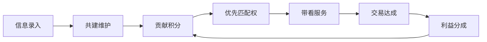

# Fori 共建共赢裂变机制设计

> **版本**: 1.0 · 2026-07-02  
> **任务**: FORI-086  
> **依据**: 初始需求 §1.2.4 权责匹配、§3.4 四方共赢、评审项4

---

## 1. 机制总览



**核心原则**：谁维护、谁受益；信息越完整、匹配越优先；成交后按贡献链分配。

---

## 2. 参与主体与权限

| 主体 | 可维护范围 | 可评价 | 积分获取 | 分成资格 |
|------|-----------|--------|---------|---------|
| 经纪人（首建者） | L3-L5 全字段 | ✅ | 录入+维护+成交 | ✅ 维护佣金 |
| 经纪人（协作者） | L3-L5 指定字段 | ✅ | 修订+核验通过 | ✅ 协作佣金 |
| 业主（卖方） | 自有房源字段纠错 | ✅ 经纪人 | 纠错采纳 | ❌ |
| 购房人 | 字典纠错、带看评价 | ✅ | 有效纠错+评价 | ❌ |
| 平台管理员 | 全字段审核 | — | — | 平台服务费 |
| 门店管理员 | 门店辖区字典 | ✅ | 门店汇总 | ✅ 门店管理费 |

---

## 3. 贡献积分规则

### 3.1 积分事件

| 事件 | 积分 | 条件 | 上限 |
|------|------|------|------|
| 首建小区字典 | +100 | 审核通过 | 1次/小区 |
| 首建单套档案 | +50 | 审核通过 | 1次/单套 |
| 字段修订采纳 | +5~20 | 按字段重要度 | 无 |
| 纠错被采纳（非经纪人） | +10 | 业主/买家 | 5次/月 |
| 带看完成评价 | +3 | 双方确认 | — |
| 成交贡献 | +200 | 该房源成交 | 1次/成交 |
| 推广素材被使用 | +15 | 带来有效线索 | 10次/月 |

### 3.2 积分用途

- **优先匹配**：片区积分 Top10 经纪人获 P1 客源优先推送
- **曝光加权**：字典列表「活跃维护者」标签
- **分成加成**：积分档位影响维护佣金系数（1.0x ~ 1.3x）

---

## 4. 首建者与 Top3 权益

### 4.1 首建者标签

- 显示：「首建者 · {经纪人名} · {日期}」
- 权益：该小区/单套 **永久维护优先权**（他人修订需首建者确认或 72h 无响应自动合并）
- 首建者离职/注销：权益转移至积分最高协作者

### 4.2 Top3 维护者

每个小区维护排行榜（近 90 天积分）：

| 排名 | 权益 |
|------|------|
| #1 | P1 客源该小区定向推送 + 分成系数 1.3x |
| #2 | P2 优先 + 1.2x |
| #3 | 列表「推荐维护」标签 + 1.1x |

---

## 5. 成交利益分成模型

### 5.1 可分配池

```
成交总服务费（买卖双方约定或平台标准费率）
├── 平台服务费（8%）          → 平台
├── 推广传播费（5%）          → 素材制作者 + 分发渠道
├── 信息贡献费（12%）         → 字典维护链
├── 带看服务费（25%）         → 带看经纪人
├── 全程服务费（45%）         → 主成交经纪人
└── 公证合规费（5%，另计）    → 第三方公证
```

### 5.2 信息贡献费拆分（12%）

| 贡献类型 | 比例 | 受益人 |
|---------|------|--------|
| 首建字典 | 40% | 首建者 |
| 协作者（按积分权重） | 35% | Top3 维护者 |
| 纠错贡献 | 10% | 业主/买家（转为平台券） |
| 推广线索 | 15% | 素材制作者 |

### 5.3 分成 waterfall UI 规格

交易详情页 `/transaction/[id]` 展示：

```
┌─ 成交服务费 ¥30,000 ─────────────────┐
│ 平台服务费    ¥2,400  (8%)   → 平台    │
│ 推广传播费    ¥1,500  (5%)   → 张三    │
│ 信息贡献费    ¥3,600  (12%)  → 维护链  │
│   ├ 首建者    ¥1,440  (40%)  → 李四    │
│   ├ 协作者    ¥1,260  (35%)  → Top3    │
│   └ ...                               │
│ 带看服务费    ¥7,500  (25%)  → 王五    │
│ 全程服务费   ¥13,500  (45%)  → 王五    │
└───────────────────────────────────────┘
```

---

## 6. 信息公正与摩擦最小化

1. **版本透明**：所有修订可追溯，用户可查看变更历史
2. **冲突合并**：自动合并非冲突字段；冲突字段人工仲裁（48h SLA）
3. **评价机制**：带看后双方互评，影响经纪人信用分
4. **脱敏规则**：分成明细对公众不可见；参与方仅看己方份额

---

## 7. 数据模型（API Schema 草案）

```typescript
interface ContributionRecord {
  id: string;
  entityType: "community" | "unit" | "listing";
  entityId: string;
  contributorId: string;
  contributorRole: "agent" | "seller" | "buyer" | "staff";
  action: "create" | "update" | "correct" | "review";
  fieldKeys: string[];
  points: number;
  status: "pending" | "approved" | "rejected";
  createdAt: string;
}

interface CommissionSplit {
  transactionId: string;
  totalFee: number;
  lineItems: Array<{
    category: string;
    amount: number;
    percent: number;
    beneficiaryId: string;
    beneficiaryRole: string;
  }>;
}
```

---

## 8. 原型实现任务（FORI-087/088）

| 任务 | 页面 | 要素 |
|------|------|------|
| FORI-087 | dict detail/edit | 贡献账本列表、首建者标签、Top3 排行 |
| FORI-088 | transaction/[id] | 分成瀑布图 Mock、各方份额卡片 |

---

*FORI-086 · 共建共赢裂变机制*
