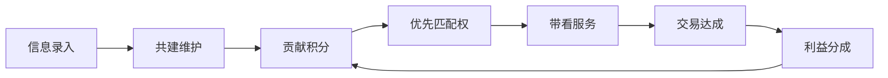

# Fori 共建共赢裂变机制设计

> **版本**: 1.0 · 2026-07-02  
> **任务**: FORI-086  
> **依据**: 初始需求 §1.2.4 权责匹配、§3.4 四方共赢、评审项4

---

## 1. 机制总览



**核心原则**：谁维护、谁受益；信息越完整、匹配越优先；成交后按贡献链分配。

---

## 2. 参与主体与权限

| 主体 | 可维护范围 | 可评价 | 积分获取 | 分成资格 |
|------|-----------|--------|---------|---------|
| 经纪人（首建者） | L3-L5 全字段 | ✅ | 录入+维护+成交 | ✅ 维护佣金 |
| 经纪人（协作者） | L3-L5 指定字段 | ✅ | 修订+核验通过 | ✅ 协作佣金 |
| 业主（卖方） | 自有房源字段纠错 | ✅ 经纪人 | 纠错采纳 | ❌ |
| 购房人 | 字典纠错、带看评价 | ✅ | 有效纠错+评价 | ❌ |
| 平台管理员 | 全字段审核 | — | — | 平台服务费 |
| 门店管理员 | 门店辖区字典 | ✅ | 门店汇总 | ✅ 门店管理费 |

---

## 3. 贡献积分规则

### 3.1 积分事件

| 事件 | 积分 | 条件 | 上限 |
|------|------|------|------|
| 首建小区字典 | +100 | 审核通过 | 1次/小区 |
| 首建单套档案 | +50 | 审核通过 | 1次/单套 |
| 字段修订采纳 | +5~20 | 按字段重要度 | 无 |
| 纠错被采纳（非经纪人） | +10 | 业主/买家 | 5次/月 |
| 带看完成评价 | +3 | 双方确认 | — |
| 成交贡献 | +200 | 该房源成交 | 1次/成交 |
| 推广素材被使用 | +15 | 带来有效线索 | 10次/月 |

### 3.2 积分用途

- **优先匹配**：片区积分 Top10 经纪人获 P1 客源优先推送
- **曝光加权**：字典列表「活跃维护者」标签
- **分成加成**：积分档位影响维护佣金系数（1.0x ~ 1.3x）

---

## 4. 首建者与 Top3 权益

### 4.1 首建者标签

- 显示：「首建者 · {经纪人名} · {日期}」
- 权益：该小区/单套 **永久维护优先权**（他人修订需首建者确认或 72h 无响应自动合并）
- 首建者离职/注销：权益转移至积分最高协作者

### 4.2 Top3 维护者

每个小区维护排行榜（近 90 天积分）：

| 排名 | 权益 |
|------|------|
| #1 | P1 客源该小区定向推送 + 分成系数 1.3x |
| #2 | P2 优先 + 1.2x |
| #3 | 列表「推荐维护」标签 + 1.1x |

---

## 5. 成交利益分成模型

> **Canonical 口径**：与 `docs/PRD.md` §5.3 一致。四方固定为买方、卖方、经纪人、平台；公证 5% 从平台服务费列支，非第五分配主体。

### 5.1 用户面向分配（经纪服务费 100%）

以成交总价 100 万、服务费 1%（¥10,000）为例：

| 分配方 | 比例 | 金额 | 说明 |
|--------|------|------|------|
| 买方 | 成本承担 0.5% | ¥5,000 | 不参与服务费收入分配 |
| 卖方 | 成本承担 0.5% | ¥5,000 | 不参与服务费收入分配 |
| 一线经纪人 | 80% | ¥8,000 | 直接服务经纪人 |
| 平台净服务 | 15% | ¥1,500 | 技术/运营/风控 |
| 公证存证（代付） | 5% | ¥500 | 从平台份额列支给公证机构 |

### 5.2 平台内部结算（非用户面向收费桶）

信息贡献、推广、带看等权益通过 **经纪人 80% 份额内的二次分配** 与 **优先匹配积分** 实现，不另设用户可见收费类别：

| 内部激励项 | 结算来源 | 受益人 |
|-----------|---------|--------|
| 字典首建/维护积分 | 优先匹配权 + 成交后积分加成系数 | 维护经纪人 |
| 推广素材线索 | 经纪人自行协商或门店协议 | 素材制作者 |
| 带看服务 | 含于经纪人 80% 服务佣金 | 带看经纪人 |
| 业主/买家纠错 | 平台券（非现金分成） | 纠错贡献者 |

### 5.3 分成 waterfall UI 规格

交易详情页 `/transaction/[id]` 展示 **用户面向** 瀑布图：

```
┌─ 经纪服务费 ¥10,000（买卖双方各承担 0.5%）─────┐
│ 买方承担      ¥5,000                            │
│ 卖方承担      ¥5,000                            │
│ ─── 服务费分配 ───                              │
│ 一线经纪人    ¥8,000  (80%)  → 王五             │
│ 平台净服务    ¥1,500  (15%)  → Fori 平台        │
│ 公证存证代付  ¥500    (5%)   → XX 公证处        │
└─────────────────────────────────────────────────┘
[展开] 经纪人内部分配说明（维护积分加成，非额外收费）
```

---

## 6. 信息公正与摩擦最小化

1. **版本透明**：所有修订可追溯，用户可查看变更历史
2. **冲突合并**：自动合并非冲突字段；冲突字段人工仲裁（48h SLA）
3. **评价机制**：带看后双方互评，影响经纪人信用分
4. **脱敏规则**：分成明细对公众不可见；参与方仅看己方份额

---

## 7. 数据模型（API Schema 草案）

```typescript
interface ContributionRecord {
  id: string;
  entityType: "community" | "unit" | "listing";
  entityId: string;
  contributorId: string;
  contributorRole: "agent" | "seller" | "buyer" | "staff";
  action: "create" | "update" | "correct" | "review";
  fieldKeys: string[];
  points: number;
  status: "pending" | "approved" | "rejected";
  createdAt: string;
}

interface CommissionSplit {
  transactionId: string;
  totalFee: number;
  lineItems: Array<{
    category: string;
    amount: number;
    percent: number;
    beneficiaryId: string;
    beneficiaryRole: string;
  }>;
}
```

---

## 8. 原型实现任务（FORI-087/088）

| 任务 | 页面 | 要素 |
|------|------|------|
| FORI-087 | dict detail/edit | 贡献账本列表、首建者标签、Top3 排行 |
| FORI-088 | transaction/[id] | 分成瀑布图 Mock、各方份额卡片 |

---

*FORI-086 · 共建共赢裂变机制*
