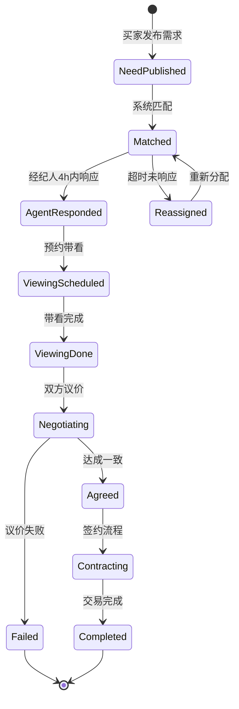

# Fori 定价评估与撮合机制

> **版本**: 1.0 · 2026-07-02  
> **任务**: FORI-089  
> **依据**: 模块五全文、模块二 §2.3、评审项6

---

## 1. 设计原则

- **公正中立**：算法透明、因子可拆解、人工可纠偏
- **心理关怀**：区间价而非点价；买卖双方均看到「公平区间」
- **利益兼顾**：减少议价摩擦、缩短成交周期
- **先方案后实现**：本文档为 R2 原型与 D4 API 的单一依据

---

## 2. 在地分层定价模型

### 2.1 分层流程

```
房源定位 → 微观片区 + A/B/C/D 层级 → 基准价曲线 → 个体修正 → 区间输出
```

### 2.2 片区层级（A/B/C/D）

| 层级 | 特征 | 置信度 | UI 处理 |
|------|------|--------|---------|
| A | 改善圈层、资源稀缺 | 高 | 正常展示 |
| B | 品质刚需 | 中高 | 正常展示 |
| C | 普通刚需 | 中 | 标注样本量 |
| D | 老旧/边缘 | 低 | **警示条**（已实现） |

### 2.3 个体修正因子

| 因子 | 权重范围 | 数据来源 |
|------|---------|---------|
| 楼层 | -5% ~ +8% | 字典 |
| 朝向 | -3% ~ +5% | 字典 |
| 装修 | -10% ~ +15% | 挂牌/实勘 |
| 产权 | -20% ~ 0% | 证照 |
| 税费 | 计入到手价 | 政策库 |
| 稀缺度 | -5% ~ +10% | 供需比 |

### 2.4 输出格式

```typescript
interface PriceAssessment {
  communityId: string;
  unitId?: string;
  tier: "A" | "B" | "C" | "D";
  basePricePerSqm: number;
  adjustedPricePerSqm: number;
  totalRange: { low: number; mid: number; high: number };
  factors: Array<{ name: string; impactPercent: number; explanation: string }>;
  confidence: "high" | "medium" | "low";
  generatedAt: string;
}
```

---

## 3. 三方差异化输出

### 3.1 买家视角（FORI-090）

| 信息块 | 内容 | 目的 |
|--------|------|------|
| 公允区间 | 「该房源公允价 ¥280-320 万」 | 议价锚点 |
| 性价比指数 | 与同层级对比 | 决策辅助 |
| 议价建议 | 「建议出价 ¥295 万 ±5%」 | 减少犹豫 |
| 隐藏 | 卖家底价、佣金细节 | 保护卖方 |

### 3.2 卖家视角

| 信息块 | 内容 | 目的 |
|--------|------|------|
| 挂牌建议 | 「建议挂牌 ¥310-330 万」 | 合理定价 |
| 竞品对比 | 同小区在售 3 套 | 市场感知 |
| 成交周期预测 | 「预计 45-60 天」 | 预期管理 |
| 隐藏 | 买家最高预算 | 保护买方 |

### 3.3 经纪人视角

| 信息块 | 内容 | 目的 |
|--------|------|------|
| 完整因子拆解 | 全部权重 | 专业沟通 |
| 买卖双方区间 | 双方可见范围 | 撮合空间 |
| 佣金预估 | 按分成模型 | 动力激励 |
| 调价历史 | 片区走势 | 趋势判断 |

---

## 4. 撮合状态机



### 4.1 状态定义

| 状态 | 触发 | 超时 | 用户可见 |
|------|------|------|---------|
| `need_published` | 买家提交需求 | — | 「匹配中」 |
| `matched` | 算法分配经纪人 | — | 经纪人卡片 |
| `agent_responded` | 经纪人确认 | 4h 从 matched 起 | 倒计时 |
| `viewing_scheduled` | 双方确认时间 | 24h 确认 | 日历 |
| `viewing_done` | 签到完成 | — | 评价入口 |
| `negotiating` | 任一方出价 | 7d | 议价记录 |
| `agreed` | 双方确认价 | 3d 签约 | 合同准备 |
| `contracting` | 进入交易流程 | — | transaction 页 |
| `completed` | 过户完成 | — | 分成结算 |
| `failed` | 议价失败/取消 | — | 重新匹配 |

### 4.2 4 小时响应窗口（FORI-091）

- **起算**：P1 客源推送到达经纪人时刻
- **UI**：`剩余 3:45` 倒计时 + 红色 pulse（<30min）
- **超时**：自动转分配 + 原经纪人扣信用分 5 分
- **豁免**：经纪人提前标记「休假」则不分配

### 4.3 匹配 API Schema

```typescript
interface MatchRecord {
  id: string;
  buyerNeedId: string;
  listingId?: string;
  agentId: string;
  priority: "P1" | "P2" | "P3";
  status: MatchStatus;
  responseDeadline: string;
  createdAt: string;
  timeline: Array<{ status: string; at: string; actor: string }>;
}
```

---

## 5. 撮合与定价联动

1. 匹配时附带 **公允价区间** 供经纪人开场
2. 议价阶段实时刷新区间（因子变化时）
3. 达成一致价偏离区间 >15% 时提示「偏离市场较多，建议复核」

---

## 6. 原型实现（FORI-090/091）

| 文件 | 变更 |
|------|------|
| `prototype/app/price/[communityId]/page.tsx` | 三角色 Tab 切换差异化信息块 |
| `prototype/app/match/page.tsx` | 状态机步骤条 + 4h 倒计时 Mock |
| `prototype/lib/viewer-role.ts` | 扩展 `priceView` 角色维度 |

---

## 7. D4 API 衔接

- FORI-043 定价 API 实现 `PriceAssessment` schema
- FORI-044 定价 Agent 契约对齐因子权重
- FORI-060~062 匹配 Wave 3 实现 `MatchRecord` 状态机

---

*FORI-089 · 定价与撮合机制*
