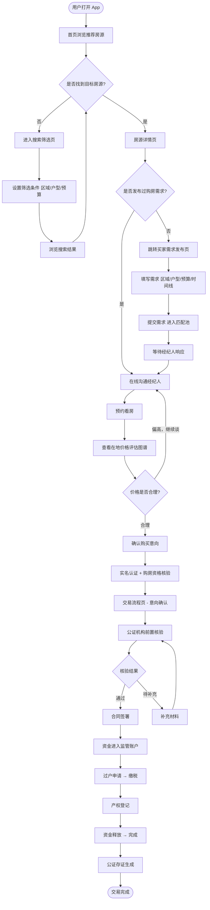
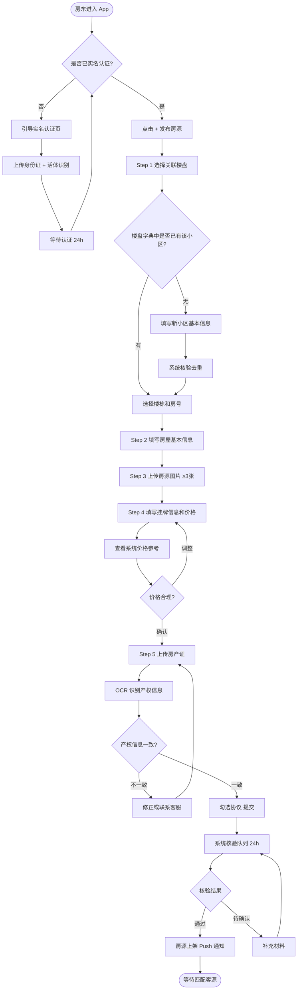
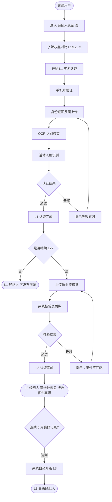
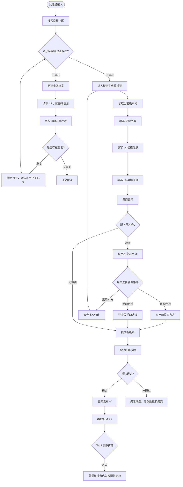
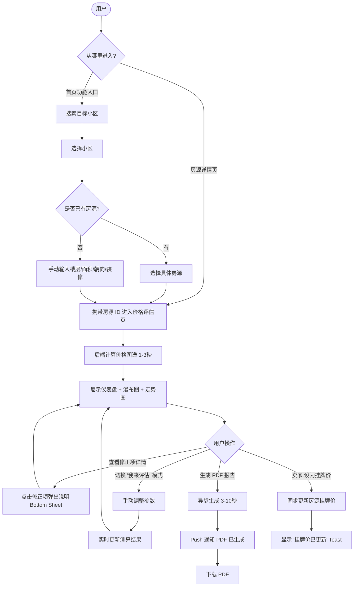
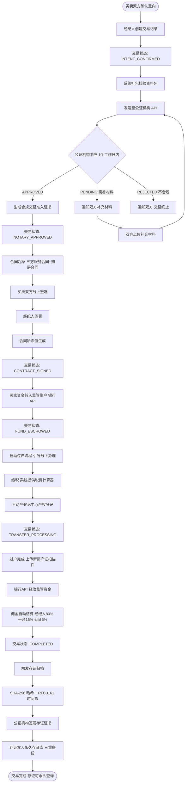

# Fori 房产交易中介生态平台・移动端 Web App UI/UX 设计文档

> **版本**：v1.0.0  
> **撰写日期**：2026-07-01  
> **文档状态**：正式版  
> **设计基准**：移动端 375px 宽度，响应式扩展至桌面端  
> **依据文档**：`docs/PRD.md` v1.0.0、`docs/ARCHITECTURE.md` v1.0.0

> **修订 R2（2026-07-02）**：FORI-082 字典 SUUMO 披露见 §六；角色交互见 `docs/ROLE_UX_MATRIX.md`；付费见 §七。原型已实现：`viewer-role.ts`、`ViewModeToggle.tsx`、`AgentAssistFab.tsx`（字典页）。

---

## 目录

1. [信息架构](#一信息架构)
2. [全局设计规范](#二全局设计规范)
3. [核心页面设计](#三核心页面设计)
4. [关键交互流程](#四关键交互流程)
5. [移动端特有交互](#五移动端特有交互)

---

## 一、信息架构

### 1.1 全局导航结构

Fori 平台采用**底部 Tab 主导航 + 侧滑抽屉菜单**的双层导航体系。底部 Tab 覆盖高频核心场景，侧滑抽屉承载次级功能与账户管理。

#### 底部 Tab 导航（5 个主 Tab）

```
┌─────────────────────────────────────────────────────┐
│  [首页]   [找房]   [+发布]   [工作台]   [我的]      │
│  house    search   plus      briefcase  person      │
└─────────────────────────────────────────────────────┘
```

| Tab | 图标 | 核心功能 | 可见角色 |
|-----|------|---------|---------|
| 首页 | house | 房源推荐流、平台动态、价格快讯 | 全部角色 |
| 找房 | search | 搜索筛选、地图找房、楼盘字典 | 全部角色 |
| + 发布 | plus（主色填充，凸出设计） | 发布房源、发布需求 | 房东、经纪人 |
| 工作台 | briefcase | 经纪人工作台、门店管理 | 经纪人、门店管理员 |
| 我的 | person | 个人中心、信用档案、交易记录 | 全部角色 |

**游客态处理**：未登录用户可查看首页、找房、楼盘字典；点击发布、工作台、我的时跳转登录页；底部 Tab 中"+"按钮变为灰色。

#### 侧滑抽屉菜单（从左侧滑出）

```
┌────────────────────────────────┐
│ 用户头像 / 姓名 / 认证标签      │
│ ─────────────────────────────  │
│  📋 我的交易                   │
│  🔖 已收藏房源                 │
│  📢 推广管理                   │
│  🏦 公证存证                   │
│  💰 收益结算                   │
│  🏢 门店管理                   │
│  ─────────────────────────    │
│  ⚙️  设置                      │
│  📞 联系客服                   │
│  ❓ 帮助中心                   │
│  🚪 退出登录                   │
└────────────────────────────────┘
```

抽屉宽度：屏幕宽度的 80%（最大 320px）。遮罩层透明度 0.5，点击遮罩关闭。

---

### 1.2 页面层级树

```
Fori App（根）
├── 认证流程
│   ├── 启动页 / 引导页                /onboarding
│   ├── 登录 / 注册页                  /auth/login
│   └── 实名认证页                     /auth/kyc
│
├── 首页（Tab 1）                      /home
│   └── 平台公告详情                   /home/notice/:id
│
├── 找房（Tab 2）                      /explore
│   ├── 搜索筛选页                     /explore/search
│   │   └── 高级筛选面板               /explore/search/filter
│   ├── 地图找房页                     /explore/map
│   ├── 楼盘字典浏览页（列表）          /explore/dict
│   │   ├── 楼盘字典详情（小区级）      /explore/dict/:community_id
│   │   │   ├── 楼栋列表               /explore/dict/:community_id/buildings
│   │   │   └── 单套详情               /explore/dict/:community_id/units/:unit_id
│   │   └── 楼盘字典编辑页             /explore/dict/:community_id/edit
│   ├── 房源详情页                     /listing/:listing_id
│   │   └── 在地分层房价评估页          /listing/:listing_id/price
│   └── 在地价格评估（独立入口）        /price
│       └── 价格评估结果页             /price/result
│
├── 发布（Tab 3）
│   ├── 发布房源页（房东）              /publish/listing
│   └── 买家需求发布页                 /publish/buyer-need
│
├── 工作台（Tab 4）                    /workspace
│   ├── 经纪人工作台                   /workspace/agent
│   │   ├── 客源管理                   /workspace/agent/buyers
│   │   ├── 房源管理                   /workspace/agent/listings
│   │   └── 成交统计                   /workspace/agent/stats
│   ├── 智能匹配推荐页                 /workspace/agent/matches
│   ├── 自媒体推广素材生成页           /workspace/media/generate
│   ├── 自媒体推广管理页               /workspace/media/manage
│   └── 门店管理页                    /workspace/store
│       └── 门店成员管理               /workspace/store/members
│
├── 我的（Tab 5）                      /profile
│   ├── 个人中心                       /profile/me
│   ├── 信用档案页                     /profile/credit
│   ├── 经纪人入驻 / 认证页             /profile/agent-cert
│   ├── 我的交易                       /profile/transactions
│   │   └── 交易流程页（全链路）        /profile/transactions/:tx_id
│   │       └── 公证存证页             /profile/transactions/:tx_id/evidence
│   ├── 我的收藏                       /profile/favorites
│   ├── 收益结算                       /profile/settlement
│   └── 设置页                        /profile/settings
│
└── 全局模块
    └── 消息中心                       /messages
        ├── 系统通知                   /messages/system
        ├── 客源推送                   /messages/matches
        └── 交易进度                   /messages/transactions
```

---

### 1.3 用户角色与页面权限矩阵

| 页面 / 功能区 | 游客 | 普通用户（买家） | 房东 | 认证经纪人 | 门店管理员 |
|-------------|------|--------------|------|-----------|----------|
| 首页 | ✅ 只读 | ✅ | ✅ | ✅ | ✅ |
| 搜索筛选 | ✅ | ✅ | ✅ | ✅ | ✅ |
| 楼盘字典浏览 | ✅（基础字段）| ✅ | ✅ | ✅（含历史成交价） | ✅ |
| 楼盘字典编辑 | ❌ | ❌（仅纠错） | ❌ | ✅（L3-L5） | ✅（L2-L5） |
| 房源详情 | ✅ | ✅ | ✅ | ✅ | ✅ |
| 在地价格评估 | ✅（有限） | ✅ | ✅ | ✅（完整） | ✅ |
| 发布房源 | ❌ | ❌ | ✅ | ✅ | ✅ |
| 买家需求发布 | ❌ | ✅ | ❌ | ❌ | ❌ |
| 经纪人工作台 | ❌ | ❌ | ❌ | ✅ | ✅ |
| 智能匹配推荐 | ❌ | ❌ | ❌ | ✅ | ✅ |
| 自媒体素材生成 | ❌ | ❌ | ✅（有限）| ✅ | ✅ |
| 推广管理 | ❌ | ❌ | ✅（己方） | ✅ | ✅ |
| 门店管理 | ❌ | ❌ | ❌ | ❌（查看己方门店） | ✅ |
| 交易流程 | ❌ | ✅（己方）| ✅（己方） | ✅（关联交易）| ✅ |
| 公证存证 | ❌ | ✅（己方）| ✅（己方） | ✅（关联）| ✅ |
| 经纪人入驻认证 | ❌ | ✅（申请入口）| ✅（申请）| ✅（查看档案） | ✅ |
| 信用档案 | ❌（公开部分）| ✅（己方） | ✅（己方）| ✅ | ✅ |
| 消息中心 | ❌ | ✅ | ✅ | ✅ | ✅ |
| 个人中心 | ❌ | ✅ | ✅ | ✅ | ✅ |
| 设置 | ❌ | ✅ | ✅ | ✅ | ✅ |

---

### 1.4 PRD 模块到页面覆盖矩阵

本矩阵用于确保 UI 设计完整覆盖 PRD 六大模块；移动端形态统一为 **PWA + 响应式 Web**，桌面端仅做同一信息架构的响应式扩展，不以 MVP 降级方式删减功能。

| PRD 模块 | PRD 功能点 | 对应页面 / 入口 | 覆盖状态 | 产品决策 |
|---------|-----------|----------------|---------|---------|
| 模块一：全国全层级楼盘字典共建共享体系 | 城市 / 片区 / 小区 / 楼栋 / 单套住宅五级数据浏览 | `/explore/dict`、`/explore/dict/:community_id`、`/explore/search`、`/explore/map` | 已覆盖 | 面向全角色只读浏览，字段按角色分级展示 |
| 模块一：全国全层级楼盘字典共建共享体系 | 经纪人共建维护、版本历史、冲突合并、Top3 贡献权益 | `/explore/dict/:community_id/edit`、`/workspace/agent`、`/workspace/store` | 已覆盖 | L2+ 经纪人和门店管理员可写，普通用户仅纠错入口 |
| 模块二：房源客源甄别流存与智能精准匹配体系 | 房源发布、房源真实性核验、重复房源合并、下架重激活 | `/publish/listing`、`/workspace/agent/listings`、`/listing/:listing_id` | 已覆盖，需结合非核心页规格 | 房源留存永久归档，前台仅展示在售 / 可恢复状态 |
| 模块二：房源客源甄别流存与智能精准匹配体系 | 买家需求发布、客源甄别、客源池流存、跟进状态 | `/publish/buyer-need`、`/workspace/agent/buyers`、`/workspace/agent/matches` | 已覆盖，需结合非核心页规格 | 客源联系方式按跟进授权逐级解锁 |
| 模块二：房源客源甄别流存与智能精准匹配体系 | 定向优先匹配、P1/P2/P3 推送、4 小时响应窗口 | `/workspace/agent/matches`、`/messages/matches`、`/workspace/agent` | 已覆盖 | P1 未响应自动降级，拒绝后不重复推送给同一经纪人 |
| 模块三：全链路信用认证与第三方公证合规交易体系 | 登录注册、实名认证、买卖双方认证、购房资格核验 | `/auth/login`、`/auth/kyc`、`/profile/me`、`/profile/agent-cert` | 已覆盖，需结合非核心页规格 | 所有发布、交易、精准匹配前置实名认证 |
| 模块三：全链路信用认证与第三方公证合规交易体系 | 经纪人 / 门店认证、信用评分、信用档案公开展示 | `/profile/agent-cert`、`/profile/credit`、`/workspace/store` | 已覆盖 | 信用档案分公开部分和本人 / 管理员完整视图 |
| 模块三：全链路信用认证与第三方公证合规交易体系 | 交易状态机、合同签署、资金监管、缴税过户、佣金结算 | `/profile/transactions/:tx_id`、`/profile/settlement`、`/messages/transactions` | 已覆盖 | 官方办理环节采用 App 指引 + 外部系统状态回传 |
| 模块三：全链路信用认证与第三方公证合规交易体系 | 公证前置核验、电子存证、纠纷材料调取 | `/profile/transactions/:tx_id/evidence`、交易流程页内公证节点 | 已覆盖 | 公证机构端不提供独立人工 UI；机构通过 API 接收任务、回传结果、导出纠纷材料，平台运营后台仅做接口监控和异常工单 |
| 模块四：自媒体智能房源推广营销体系 | AI 生成视频 / 图文 / 文案 / 口播脚本 | `/workspace/media/generate`、房源详情推广入口 | 已覆盖 | 图片不足可走仅文案模式，但不移除完整素材能力 |
| 模块四：自媒体智能房源推广营销体系 | 多平台授权、定时分发、发布状态追踪、数据统计 | `/workspace/media/manage`、`/workspace/agent` | 已覆盖 | 单平台授权失败不阻塞其他平台分发 |
| 模块五：独创在地分层动态房价评估体系 | 房源详情内价格图谱、历史走势、因素拆解、PDF 报告 | `/listing/:listing_id/price`、`/price/result` | 已覆盖 | 认证角色可见完整成交明细，游客可见有限结果 |
| 模块五：独创在地分层动态房价评估体系 | 独立价格评估入口、小区搜索、手动参数评估 | `/price`、`/price/result`、首页价格评估入口 | 已覆盖，需结合非核心页规格 | 无目标房源时支持手动录入，不降级为仅详情页入口 |
| 模块六：Agent 原生智能化技术底座体系 | Agent 编排、任务调度、异步素材生成、核验队列、价格计算 | 各业务页后台能力：发布房源、字典编辑、素材生成、价格评估、交易流程 | 已覆盖为后台能力 | 无独立用户 UI；普通用户不可见技术底座，平台运营后台可监控任务队列、重试、熔断和告警 |
| 模块六：Agent 原生智能化技术底座体系 | 框架适配、版本同步、高并发稳定性、运维监控 | 非用户端运营后台 / 监控系统 | 产品决策明确 | 不纳入移动 PWA 主导航；仅后台管理和可观测性系统呈现，不作为房产交易用户流程页面 |

---

## 二、全局设计规范

### 2.1 设计原则

**P1 · 移动优先**  
以 375px × 812px（iPhone SE/12 Mini 物理尺寸）为基准设计，所有交互元素最小点击面积 44×44px，核心内容在不滚动情况下可见。

**P2 · 单手操作**  
主操作区（CTA 按钮、Tab Bar）位于屏幕下半部（距离底部 0-280px），避免大拇指需要过度延伸。列表项操作（收藏、拨号、分享）优先使用横滑手势，并与屏幕左边缘返回手势保持触发区域隔离。

**P3 · 信息密度控制**  
房源列表卡片每屏最多完整显示 2 张，第 3 张露出约 40px 形成"可继续滑动"的视觉引导。详情页采用渐进式信息展示：核心信息优先（价格、面积、位置），次级信息折叠于"更多"区块。

**P4 · 信任优先**  
认证标签（实名认证、房源核验、公证存证）始终高亮展示，绿色对勾图标在视觉上形成"已保障"的安全感。价格数字使用大字号粗体，避免用户对关键信息产生遗漏。

**P5 · 专业感与亲和力并重**  
主色系偏沉稳深蓝，传达专业与信任；辅助色用暖金，传达价值感；圆角值 12px，界面整体圆润不生硬；插图风格写实轻简约，避免卡通化。

---

### 2.2 色彩系统

#### 主色（Primary）—— 信任蓝

| 色阶 | 色值 | 用途 |
|------|------|------|
| Primary-900 | `#0D2B4E` | 深色背景（启动页、导航栏深色模式） |
| Primary-700 | `#1A4B82` | 主要文字链接、激活 Tab |
| **Primary-500（品牌色）** | `#2563EB` | 主按钮、强调标签、可交互元素 |
| Primary-300 | `#93C5FD` | 背景着色、轻强调 |
| Primary-100 | `#DBEAFE` | 浅色背景块、输入框 focus |

#### 辅色（Secondary）—— 价值金

| 色阶 | 色值 | 用途 |
|------|------|------|
| Gold-600 | `#B45309` | 金色文字（深色背景上） |
| **Gold-500（品牌金）** | `#D97706` | 价格标签、VIP 徽章、成交激励 |
| Gold-200 | `#FDE68A` | 轻度强调背景 |

#### 语义色（Semantic）

| 类型 | 色值 | 用途 |
|------|------|------|
| 成功 / 认证通过 | `#16A34A` | 核验通过、已签约、存证完成 |
| 危险 / 警告 | `#DC2626` | 价格异常、核验失败、纠纷 |
| 警告 / 待处理 | `#D97706` | 待核验、待激活、价格偏高提醒 |
| 信息 / 进行中 | `#0284C7` | 交易进行中、核验中 |

#### 中性色（Neutral）

| 色阶 | 色值 | 用途 |
|------|------|------|
| Gray-900 | `#111827` | 主标题、重要正文 |
| Gray-700 | `#374151` | 次级正文、标签 |
| Gray-500 | `#6B7280` | 辅助说明文字、placeholder |
| Gray-200 | `#E5E7EB` | 分隔线、边框 |
| Gray-100 | `#F3F4F6` | 页面背景、卡片背景 |
| White | `#FFFFFF` | 卡片底色、弹窗背景 |

---

### 2.3 字体系统

**字体栈**：`-apple-system, 'PingFang SC', 'Hiragino Sans GB', 'Microsoft YaHei', sans-serif`

| 层级 | 用途 | 字号 | 行高 | 字重 |
|------|------|------|------|------|
| Display | 启动页大标题 | 32px | 40px | 700（Bold） |
| H1 | 页面主标题 | 24px | 32px | 700 |
| H2 | 卡片标题、模块标题 | 20px | 28px | 600（SemiBold） |
| H3 | 列表项标题、区块标题 | 17px | 24px | 600 |
| Body-L | 正文（描述性内容） | 16px | 24px | 400（Regular） |
| Body-M（默认） | 正文（列表信息） | 15px | 22px | 400 |
| Body-S | 辅助说明、标签文字 | 13px | 20px | 400 |
| Caption | 时间戳、版权信息 | 12px | 16px | 400 |
| Price-L | 价格主展示 | 28px | 36px | 700 |
| Price-M | 价格次展示（均价/㎡） | 20px | 28px | 600 |

**特别规则**：
- 价格数字禁止使用系统字体，统一使用数字专用字体（tabular nums）确保对齐；
- 金额单位"万元"字号为价格主字号的 70%；
- 超过 2 行的描述性正文显示省略号，提供"展开"链接。

---

### 2.4 间距系统（4px 基准网格）

| 间距令牌 | 数值 | 典型用途 |
|---------|------|---------|
| spacing-1 | 4px | 行内元素间距、图标与文字间距 |
| spacing-2 | 8px | 标签内部 padding、小组件间距 |
| spacing-3 | 12px | 列表项内 icon 间距 |
| spacing-4 | 16px | 卡片内边距（标准）、表单项间距 |
| spacing-5 | 20px | 区块间距（中等）|
| spacing-6 | 24px | 页面左右边距、大区块间距 |
| spacing-8 | 32px | 页面节标题上方间距 |
| spacing-10 | 40px | 大屏页首空白 |

**页面左右边距**：`16px`（主内容区），关键 CTA 按钮距屏幕边缘 `16px`。

**安全区域**：底部 Tab 上方留出 `env(safe-area-inset-bottom)` + `8px`；顶部状态栏区域使用 `env(safe-area-inset-top)`。

---

### 2.5 组件库

#### 按钮（Button）

| 类型 | 样式描述 | 高度 | 圆角 | 用途 |
|------|---------|------|------|------|
| Primary | 主色填充，白色文字 | 52px | 12px | 页面主行动（立即看房、提交） |
| Secondary | 主色描边，主色文字 | 52px | 12px | 次级操作（收藏、分享） |
| Ghost | 无背景无边框，主色文字 | 44px | 8px | 文字按钮、链接型操作 |
| Danger | 红色填充，白色文字 | 52px | 12px | 删除、下架等破坏性操作 |
| Floating | 主色圆形，白色图标 | 56px 直径 | 全圆 | 悬浮发布按钮 |
| Tag | 浅色背景，深色文字 | 28px | 14px | 标签选择、筛选项 |

**按钮状态**：Normal → Hover（亮度+5%）→ Active（亮度-10%）→ Disabled（透明度 40%）→ Loading（替换为 Spinner）

#### 输入框（Input）

- 默认高度：52px；圆角：10px；边框：1px solid Gray-200
- Focus 状态：边框变为 Primary-500，外发光 `0 0 0 3px rgba(37,99,235,0.2)`
- Error 状态：边框变为红色，下方显示错误文字（红色，13px）
- 内置 placeholder 文字颜色：Gray-500
- 清除按钮（×）在有内容且 focus 时显示

#### 卡片（Card）

**房源卡片**（列表模式）：
```
┌─────────────────────────────────┐
│  [封面图 343×200px]              │
│  [已核验]标签  [高性价比]标签    │
├─────────────────────────────────┤
│  ¥ 280万                        │
│  精装 3室2厅 | 92㎡ | 8/18层    │
│  中关村科技园 中关村小区         │
│  ─────────────────────────      │
│  [经纪人头像][张某]  ❤ 收藏     │
└─────────────────────────────────┘
```
- 宽度：343px（屏幕宽 375px - 左右各 16px）
- 圆角：16px；阴影：`0 2px 12px rgba(0,0,0,0.08)`
- 封面图比例：16:9.3（约 343×200px）
- 多图时左下角显示图片数量 badge

**楼盘字典卡片**（紧凑模式）：高度约 88px，左侧小图（80×80px），右侧三行信息（名称/均价/维护人数）。

#### 列表（List）

- 普通列表项高度：64px（图标+主文字+次文字）
- 分组标题：大写灰色标题 + 灰色分割线
- 列表项左右对齐：左侧图标/头像，右侧 Chevron 或金额

#### 标签（Tag/Badge）

| 类型 | 背景色 | 文字颜色 | 用途 |
|------|-------|---------|------|
| 已核验 | `#DCFCE7` | `#16A34A` | 房源认证通过 |
| 核验中 | `#FEF9C3` | `#854D0E` | 核验进行中 |
| 价格偏高 | `#FEE2E2` | `#DC2626` | 价格提醒 |
| 高性价比 | `#DBEAFE` | `#1D4ED8` | 算法推荐 |
| VIP经纪人 | 金色渐变 | 深棕 | 高级认证 |
| 满5年 | `#F3F4F6` | `#374151` | 过户优惠 |

#### 弹窗（Modal / Bottom Sheet）

- **全屏弹窗**：0.3s ease 向上滑出，覆盖顶部状态栏，有关闭按钮（右上角）
- **底部弹窗（Bottom Sheet）**：从屏幕底部 0.25s ease-out 滑出，最大高度 80vh，顶部拖动条（宽40px×4px灰色）；可下拖关闭（threshold 80px）
- **居中弹窗（Dialog）**：圆角 20px，最大宽度 343px，遮罩点击关闭（非危险操作）

#### Toast 提示

- 位置：顶部安全区域下方 16px（成功/失败提示）或底部 Tab 上方（轻提示）
- 高度：48px；圆角：10px；最大宽度 343px
- 显示时长：3 秒（成功），5 秒（错误），手动关闭（重要通知）
- 成功：绿色背景 + 对勾图标；错误：红色背景 + 叉号图标

#### 骨架屏（Skeleton）

- 首屏加载时显示骨架屏，而非 Loading Spinner
- 骨架形状与实际内容布局一致（卡片骨架、列表骨架）
- 动画：从左到右渐变扫光（shimmer），周期 1.5s

#### 下拉刷新

- 下拉阈值：60px
- 下拉过程：弹性阻尼效果（实际移动量 = 拉取量 × 0.4）
- 触发刷新：Spinner 居中显示 + "正在刷新"文字
- 完成：Toast "已更新" + 列表平滑更新

#### 无限滚动

- 距底部 200px 时触发加载下一页
- 加载中：底部显示三点 Loading
- 到达末尾：灰色提示"已加载全部 X 条"
- 加载失败：红色"加载失败，点击重试"

#### 业务组件扩展

| 组件 | 组成 | 状态 | 使用页面 |
|------|------|------|---------|
| Stepper 分步表单 | 顶部进度条、步骤标题、上一步 / 下一步、草稿提示 | 未开始 / 进行中 / 已完成 / 校验失败 / 离线已暂存 | 发布房源、楼盘字典编辑、经纪人认证、实名认证 |
| Tab / Segmented Control | 顶部 Tab、横向滚动 Tab、胶囊分段控件、未读 badge | 默认 / 激活 / 禁用 / 有 badge / 加载中 | 楼盘详情、消息中心、门店管理、推广管理、匹配推荐 |
| 筛选 Bottom Sheet | 拖动条、筛选分组、已选条件 chips、重置与确认按钮 | 展开 / 半屏 / 全屏 / 条件变更 / 加载结果数失败 | 搜索筛选、客源管理、房源管理、成交统计 |
| 上传 / OCR 组件 | 拍照入口、相册入口、文件卡、上传进度、OCR 结果确认区 | 待上传 / 上传中 / 识别中 / 识别成功 / 识别失败 / 需重拍 | 发布房源、实名认证、经纪人认证、公证补材料 |
| 地图房源气泡 | 价格气泡、聚合数字、选中态高亮、底部房源卡联动 | 默认 / 选中 / 聚合 / 加载中 / 无数据 | 地图找房、搜索筛选、小区定位 |
| 图表卡 | 标题、周期切换、图表容器、图例、数据更新时间 | 骨架 / 有数据 / 无数据 / 计算失败 / 权限受限 | 价格评估、成交统计、门店报表、工作台 |
| 交易时间线 | 竖向节点、状态图标、时间戳、材料链接、当前 CTA | 已完成 / 当前进行中 / 待处理 / 被驳回 / 终止 | 交易流程、公证存证 |
| 证书卡 | 机构 Logo、证书编号、哈希、时间戳、签名、下载按钮 | 有效 / 验签中 / 验签失败 / 已撤销 / 下载失败 | 公证存证、交易准入证书、信用档案 |
| 权限提示 | 锁图标、受限原因、解锁条件、主 CTA、次级返回 | 未登录 / 未实名 / 层级不足 / 非关联交易 / 门店权限不足 | 全局权限受限场景 |
| 空状态 | 业务插图、标题、原因说明、主 CTA | 无数据 / 筛选无结果 / 首次使用 / 已清空 | 列表、消息、客源、房源、报表 |
| 错误状态 | 错误标题、错误码、重试按钮、联系客服入口 | 网络错误 / 服务失败 / 计算失败 / 资源不存在 / 已下架 | 全局异常页和局部卡片 |
| 离线队列提示 | 顶部横条、待同步数量、查看队列、立即同步按钮 | 离线 / 同步中 / 同步成功 / 同步冲突 / 同步失败 | 楼盘字典编辑、发布房源、买家需求、补充材料 |
| 时间选择器 | 日历、多时段选择、不可选说明、确认按钮 | 可选 / 已选 / 冲突 / 已过期 / 加载失败 | 预约看房、可看房时间、定时分发、免打扰设置 |

**业务组件通用约束**：
- 所有组件最小点击面积 44×44px，PWA 触控体验优先；桌面响应式仅增加信息密度，不改变核心流程。
- 组件必须暴露空、加载、错误、权限受限四类状态，不允许只依赖 Toast 表达关键失败原因。
- 表单型组件支持本地草稿与离线队列；涉及资金、合同、身份认证的操作禁止离线提交，只允许离线填写草稿。

---

### 2.6 图标系统

使用 **Lucide Icons**（开源）作为基础图标库，按需引入 SVG，统一规格：

| 场景 | 尺寸 | 颜色 |
|------|------|------|
| Tab Bar 图标 | 24×24px | 默认 Gray-500，激活 Primary-500 |
| 列表项前缀图标 | 20×20px | Gray-700 |
| 功能入口 icon | 24×24px | Primary-500 |
| 状态标识图标 | 16×16px | 语义色 |
| 大型插图 | 64×64px 或 SVG | 主色系 |

**定制图标**（需设计师产出）：
- Fori Logo（竖版 + 横版）
- 楼盘字典专属图标
- 在地分层价格图谱图标
- 四方共赢图示

---

## 三、核心页面设计

### 页面 01：启动页 / 引导页

**路径**：`/onboarding`  
**所属模块**：认证流程  
**页面目的**：品牌曝光 + 新用户功能亮点快速介绍，引导进入注册/登录  
**适用用户**：首次安装或 PWA 首次启动的所有用户

#### 布局描述

**启动页（Splash）**：全屏深蓝色背景（Primary-900），居中展示 Fori Logo（白色，80px高），品牌 Slogan "真实·合规·共赢的房产新生态"（白色，18px），持续 2 秒后进入引导页。

**引导页（Onboarding）**：三屏横向滑动，每屏全屏布局：
- 顶部 60%：竖版插图（SVG 动画）
- 中部：大标题（24px Bold）+ 副标题（16px Regular，Gray-300）
- 底部：页面指示点 + "下一步"按钮（Primary Fill）+ "跳过"链接（Ghost）

| 屏序 | 插图主题 | 标题 | 副标题 |
|------|---------|------|-------|
| 1/3 | 楼盘字典可视化图 | 全国楼盘数据共建共享 | 经纪人协同维护，买卖双方共享真实数据 |
| 2/3 | 价格图谱可视化 | 科学定价，透明可拆解 | 在地分层价格体系，告别盲目定价 |
| 3/3 | 公证合同图示 | 全链路公证保障 | 第三方存证，合规极简，交易无后顾之忧 |

第三屏按钮变为"立即开始"，点击跳转登录/注册页。

#### 交互流程

1. 首次加载 → Splash 2 秒 → 自动跳入 Onboarding 屏 1
2. 横向滑动或点击"下一步"前进
3. 点击"跳过"直接跳至登录页
4. 点击第三屏"立即开始"跳至登录页
5. 已登录用户：跳过 Splash 直接进入首页

#### 状态处理

- 网络异常：引导页完全本地化，无网络依赖
- 重复访问：记录 localStorage `onboardingDone=true`，再次进入 App 直接跳过

---

### 页面 02：首页（房源推荐流）

**路径**：`/home`  
**所属模块**：首页  
**页面目的**：个性化房源推荐 + 平台核心功能入口聚合  
**适用用户**：全部角色

#### 布局描述

**顶部区域（固定，总高 100px）**：
- 状态栏（系统）
- 搜索框（圆角，Gray-100 背景）：点击跳转搜索页，不在首页直接输入
- 右侧：消息 Bell 图标（带 badge 数字）+ 城市切换（"北京 ˅"）

**中部轮播区域（高度 190px）**：
- 主推素材轮播（3-5 张，每 4 秒自动切换）
- 底部指示点，支持手动拖动

**功能宫格区域（高度 110px）**：
- 横向 4 图标入口：楼盘字典 / 价格评估 / 经纪人认证 / 发布房源
- 每个图标：40×40px 圆角图标卡 + 14px 标签文字

**推荐房源流（无限滚动）**：
- 区块标题："为你推荐" + "换一批"链接（Ghost 样式）
- 房源卡片列表（纵向，每张全宽卡片）
- 卡片间距：12px
- 穿插"片区热度"信息卡（灰色背景，非点击型）

**价格快讯横幅（每隔 5 张房源插入一次）**：
- 背景：Primary-100，"今日价格快讯"
- 展示 2-3 个片区近期涨跌趋势，点击进入价格评估页

#### 数据展示内容

每张房源推荐卡片展示：封面图、价格（万元）、面积+户型+楼层、小区名+区域、核验状态标签、经纪人头像+名字、发布时间（"3 天前"）、收藏心形。

#### 交互元素

- 下拉刷新：刷新推荐流
- 点击卡片：跳转房源详情页
- 长按卡片：底部弹出快捷操作（收藏、查看经纪人、举报）
- 点击收藏心形：直接收藏，Toast "已加入收藏"
- 城市切换：底部弹出城市选择 Sheet

#### 空状态

- 无推荐房源：显示"暂无推荐，换个城市试试？"+ 城市选择按钮

---

### 页面 03：房源详情页

**路径**：`/listing/:listing_id`  
**所属模块**：找房  
**页面目的**：完整展示一套房源的全部信息，驱动用户联系经纪人或进入交易流程  
**适用用户**：买家、房东（查看自己房源）、经纪人

#### 布局描述

**顶部：沉浸式图片区域（高度 260px）**：
- 多图横向轮播（支持双指捏合放大）
- 左上角返回按钮（白色圆形半透明背景）
- 右上角：收藏（心形）+ 分享（外链图标）
- 右下角：图片计数（"3/8"）
- 底部渐变覆盖层，展示小区名

**核心信息区（白色卡片，圆角顶部圆角切入）**：
- 价格行：`¥ 280万` (Price-L) + `总价` + `均价 30,400元/㎡`
- 三要素行：`精装` + `92㎡` + `南北通透`
- 房型标签行：`3室2厅1卫` / `8层/共18层` / `2010年建成`
- 认证状态行：`✅ 实名核验房源` + `✅ 公证机构备案`

**区域模块（Accordion 折叠式）**：

1. **房屋详情**：建筑面积、套内面积、容积率、车位、物业费、装修情况、产权年限、是否满 2 年/满 5 年、共有产权情况
2. **户型图**：标准化户型图（可放大，双指缩放）
3. **在地价格评估入口**：横向 Banner，"该房源价格评估：合理偏低 3%"，点击进入完整价格评估页
4. **小区信息**：小区名、开发商、物业公司、绿化率、建成年份、周边配套标签（地铁/学校/医院）+ 地图定位按钮
5. **交易信息**：税费预估（契税/增值税/个税）、资金监管说明、过户周期预估
6. **经纪人信息**：经纪人头像、姓名、认证级别（L1/L2/L3 徽章）、信用评分、成交件数、近期活跃时间
7. **楼盘历史成交**（认证用户可见）：近 6 个月成交价格折线图，近 3 条成交记录（脱敏）

**底部固定操作栏（高度 80px + safe-area）**：
```
[ 电话联系经纪人 ]  [ 在线沟通 ]  [ 立即预约看房 ]
```
- 三个按钮平分宽度，"电话联系"为 Secondary 样式，"预约看房"为 Primary 样式

#### 交互流程

1. 进入页面 → 骨架屏 → 图片加载完成后渐显内容
2. 向上滚动 → 顶部图片区域收缩（Parallax 效果），标题栏固定显示房源标题
3. 点击价格评估入口 → 跳转价格评估页（携带房源 ID）
4. 点击"预约看房" → 弹出时间选择 Bottom Sheet → 确认后提交预约并通知经纪人
5. 点击"在线沟通" → 跳转消息中心，与经纪人的对话页
6. 经纪人查看自己发布的房源 → 底部操作栏变为"编辑房源"+"生成推广素材"

---

### 页面 04：搜索筛选页

**路径**：`/explore/search`  
**所属模块**：找房  
**页面目的**：多维度精准筛选目标房源  
**适用用户**：买家、经纪人（找房推荐客户）

#### 布局描述

**顶部搜索栏（固定）**：
- 搜索框激活，键盘自动弹出
- 搜索词建议（小区名、地址、关键词），下拉列表实时更新
- 右侧取消按钮

**近期搜索 & 热门小区**（搜索词为空时显示）：
- 近期搜索记录标签（最多 10 条），右上角"清除"
- 热门小区推荐（3 × 2 网格，带小图）

**搜索结果区**（有搜索词后显示）：
- 结果数量提示："找到 128 套房源"
- 排序切换行：最新 / 价格↑ / 价格↓ / 面积↑ / 面积↓
- **筛选入口**：横向滑动的快速筛选标签（区域/户型/价格/更多）
- 房源列表（卡片模式 ↔ 地图模式切换，右上角图标切换）

**高级筛选面板（Bottom Sheet，点击"更多筛选"弹出）**：

分区展示筛选项，每区可折叠：

| 筛选区 | 选项 |
|-------|------|
| 区域 | 城市片区树状选择 |
| 户型 | 1室/2室/3室/4室+，多选 |
| 价格区间 | 双端滑块（区间输入 + 滑动条） |
| 面积区间 | 双端滑块 |
| 楼层 | 低楼层/中楼层/高楼层/顶层 |
| 装修 | 毛坯/简装/精装/豪装 |
| 产权 | 满2年/满5年/70年产权 |
| 核验状态 | 已核验/核验中/全部 |
| 特殊标签 | 学区房/近地铁/独立产权/不限购 |

底部固定：重置按钮（Ghost）+ 确认按钮（Primary，显示"查看 N 套"）

#### 交互流程

1. 首页点击搜索框 → 跳转搜索页，键盘弹起
2. 输入关键词 → 实时展示候选（防抖 300ms）
3. 选中建议 / 回车 → 展示搜索结果
4. 地图模式：房源以气泡形式叠加在高德地图上，气泡显示价格，点击气泡展开房源卡片
5. 筛选条件改变 → 结果列表平滑更新（顶部显示当前有效筛选条件标签，可单独删除）

---

### 页面 05：楼盘字典浏览页

**路径**：`/explore/dict`、`/explore/dict/:community_id`  
**所属模块**：找房 / 楼盘字典  
**页面目的**：浏览、搜索全国楼盘字典数据，查阅小区详情  
**适用用户**：全部角色（权限分级展示）

#### 布局描述（小区列表页）

**顶部**：搜索框（"搜索小区名、地址"）+ 城市筛选 + 按片区筛选 Tabs

**小区列表**（纵向列表）：
每条记录显示：小区缩略图（60×60px 圆角）、小区名、片区名、层级标签（A/B/C/D）、均价区间、维护经纪人数、最近更新时间。

#### 布局描述（小区详情页）

**顶部英雄区**：小区实拍图轮播（可选）+ 小区名 + 层级标签 + 坐落地址

**基础信息 Tab**（共 4 个 Tab）：

**Tab 1 - 小区概览**：
- 信息网格（2 列）：开发商、物业公司、建成年份、总楼栋、总户数、容积率、绿化率、车位比、物业费
- 配套设施标签云：地铁、学区、商场、医院
- 高德地图缩略图（点击进入全屏地图）
- 维护者信息：Top 3 维护经纪人头像列表

**Tab 2 - 在售房源**：
- 该小区当前在售房源列表（精简卡片模式）
- 历史成交汇总：套数、均价趋势折线图

**Tab 3 - 价格图谱**（需认证）：
- 跳转/嵌入价格评估图谱（见页面 07）

**Tab 4 - 楼栋信息**：
- 楼栋列表（可展开）：楼栋号、层数、单元数、建筑类型、电梯
- 每个楼栋可展开查看已录入的单套信息

**底部固定操作**：
- 普通用户："收藏小区" + "查看在售房源"
- 经纪人：加 "维护 / 编辑楼盘字典"

#### 交互流程

1. 找房 Tab → 楼盘字典入口 → 列表页
2. 搜索或按片区筛选 → 实时过滤列表
3. 点击小区卡片 → 进入小区详情页
4. 小区详情 Tab 切换 → 无跳转，切换内容区
5. 经纪人点击"维护楼盘字典" → 跳转楼盘字典编辑页

---

### 页面 06：楼盘字典编辑页（共建）

**路径**：`/explore/dict/:community_id/edit`  
**所属模块**：楼盘字典  
**页面目的**：认证经纪人共建维护楼盘数据，保存版本历史  
**适用用户**：认证经纪人（L2+）、门店管理员

#### 布局描述

**顶部**：导航栏"维护楼盘字典" + 关闭按钮 + 历史版本入口（右上角时钟图标）

**当前版本提示条**（橙色背景）：
"当前版本 v12 · 由张某某于 3 小时前更新 · 5 人共同维护"

**分步编辑（Stepper 模式，共 4 步）**：

**Step 1 - 基础信息**：
- 小区名（必填，带搜索去重校验）
- 开发商、物业公司（支持已有数据联想）
- 建成年份（年份选择器）
- 总楼栋数、总户数（数字键盘输入）

**Step 2 - 物业配置**：
- 容积率、绿化率、车位比（小数输入）
- 物业费区间（双端输入）
- 物业品质评分（星级打分，1-5 星）
- 配套设施标签多选（地铁/学区/商场/医院/游泳池/健身房等）

**Step 3 - 地理位置**：
- 地址输入（带地图 pin 确认）
- 在地图上拖动 pin 精确定位门口坐标
- 片区归属（系统自动匹配，支持手动修正）

**Step 4 - 层级评定**（仅系统 AI 建议，人工可覆盖）：
- AI 自动评估建议层级（A/B/C/D）及各指标得分
- 经纪人可手动调整，需填写调整理由
- 显示同片区其他小区的层级分布参考

**提交前校验**：
- 自动检查必填字段完整性
- 与已有数据对比，标记差异字段
- 版本号冲突检测（若他人刚提交，弹出冲突对比界面）

**冲突处理 UI**：
```
┌─────────────────────────────────┐
│ ⚠️ 版本冲突                     │
│ 你的修改          他人版本       │
│ 绿化率: 28%  ←→  绿化率: 32%   │
│ [保留我的]  [采用对方]  [手动合并]│
└─────────────────────────────────┘
```

#### 交互流程

1. 进入编辑页 → 系统自动加载当前最新版本数据
2. 逐步填写（Step 1→4，支持任意步骤跳转）
3. 提交时：系统校验 → 乐观锁版本号比对 → 无冲突则保存 → Toast "提交成功，核验中"
4. 版本冲突：显示冲突对比界面，用户选择合并策略 → 重新提交
5. 提交成功：维护积分 +X 点，Badge 显示"首建者"或"维护者"标签

---

### 页面 07：在地分层房价评估页

**路径**：`/listing/:listing_id/price` 或 `/price/result`  
**所属模块**：在地分层价格评估  
**页面目的**：可视化展示某房源/小区的科学定价图谱，为买卖双方提供价格锚点  
**适用用户**：全部用户（细节权限分级）

#### 布局描述

**顶部**：导航"价格图谱" + 房源简要标题 + 分享按钮

**层级定位标语**（蓝色信息卡）：  
"该小区位于 [中关村北区] · B 级中端圈层 · 参考均价 ¥32,000-38,000 元/㎡"

**模块 1：价格区间仪表盘**：
- 圆弧仪表盘（ECharts Gauge），指针指向当前房源挂牌价相对合理区间的位置
- 三色区间：偏低（绿色左区）、合理（蓝色中区）、偏高（红色右区）
- 当前挂牌价格标注：`¥ 280万（30,400元/㎡）`
- 评估结论文字："该房源估价合理，偏低约 3%"

**模块 2：价格因素拆解瀑布图**：
```
基准价: 35,000 元/㎡         ████████████████████
楼层修正 +3%:  +1,050        ████
朝向修正 +2%:  +700          ██
装修修正 +8%:  +2,800        ████████
税费修正 -3%:  -1,050        ██（红色向左）
稀缺度修正 +2%: +700         ██
─────────────────────────────────
测算价: 39,200 元/㎡         ████████████████████████
```
- 点击每个修正项 → 底部弹出说明面板（该修正的详细依据）

**模块 3：片区历史价格走势图**：
- 折线图（ECharts Line），展示近 24 个月该片区 × 层级的月度中位价走势
- 两条线：B 层级（当前）、C 层级（对比参考）
- X 轴：月份；Y 轴：元/㎡
- 可拖动时间轴缩放
- 交叉参考线：显示具体月份的价格数据

**模块 4：市场热度仪表盘**（横向 3 格统计卡）：
- 近 30 天成交套数：12 套（↑ 同比 +20%）
- 平均成交周期：45 天
- 当前在售套数：28 套

**模块 5：近期成交参考**（脱敏处理）：
- 列表展示近 3-5 笔同层级成交记录：面积、楼层、成交价、成交时间
- 提供成交单价对比基准

**底部 CTA**（经纪人可见）：
- "生成价格评估报告 PDF" → 异步生成，完成后推送通知

#### 交互流程

1. 点击房源详情中的"价格评估"入口
2. 页面加载：先显示 Loading（预计 1-3 秒，后端计算）
3. 仪表盘动画：指针从 0 扫到结果位置（0.8s ease-out）
4. 用户可切换"我来评估"模式：手动输入面积/楼层/装修，实时更新测算结果
5. 卖家视角：看到"设为挂牌价"按钮，一键同步定价

---

### 页面 08：发布房源页（房东）

**路径**：`/publish/listing`  
**所属模块**：房源客源甄别  
**页面目的**：房东或经纪人发布真实核验的房源信息  
**适用用户**：房东（实名认证后）、认证经纪人

#### 布局描述（分 5 步 Stepper）

**进度条**：顶部固定线性进度条，标记 5 步

**Step 1 - 选择关联楼盘**：
- 搜索框：搜索楼盘字典中已有小区（输入小区名）
- 候选列表：小区名 + 片区名 + 建成年份
- 选中后：展示该小区基本信息确认卡
- 填写楼栋号 + 室号（下拉选择已有楼栋/输入新楼栋）
- 若楼盘字典无此小区：触发"新增小区"流程（内嵌，非跳转）

**Step 2 - 房屋基本信息**：
- 建筑面积（数字键盘输入，单位㎡）
- 套内面积（可选）
- 楼层（数字输入）/ 总层数（数字）
- 户型：室数 + 厅数 + 卫数（步进器 +/- 操作）
- 朝向（下拉选择：南/北/东/西/南北通透/东西通透）
- 装修情况（单选：毛坯/简装/精装/豪装）
- 产权年限（单选：70年/50年/40年）

**Step 3 - 房源图片**：
- 上传至少 3 张，建议 8 张以上
- 上传框：点击 + 拍照或从相册选择
- 图片排序：长按拖拽排序
- 封面图标记（星形图标标记首图）
- 上传进度：每张图片上传进度条

**Step 4 - 挂牌信息**：
- 挂牌价（数字键盘，单位万元）
- 价格参考引导：灰色提示文字"当前片区参考均价 3.2-3.8 万/㎡"
- 税费承担方式（选择器：买家承担/卖家承担/各自承担）
- 可看房时间（日历多选）
- 联系方式（默认使用注册手机，可补充备用联系方式）

**Step 5 - 核验材料**：
- 房产证/不动产证上传（系统 OCR 自动识别关键字段）
- 识别结果展示（产权人、地址、面积、产权年限）→ 确认一致性
- 实名认证检查（未完成则提示先完成实名认证）
- 共有产权声明（若共有，须填写所有产权人）

**提交确认页**：
- 展示全部填写信息摘要
- 状态说明："提交后将进入核验队列，预计 24 小时内完成核验"
- 勾选"我同意平台发布协议" + "立即发布"按钮

#### 状态处理

- 草稿自动保存：每步完成后自动保存为草稿，5 天内可继续编辑
- 核验结果：通过 → Push 通知"您的房源已上架"；未通过 → 详细说明 + 修改入口

---

### 页面 09：买家需求发布页

**路径**：`/publish/buyer-need`  
**所属模块**：房源客源甄别  
**页面目的**：买家填写购房需求，进入平台精准匹配池  
**适用用户**：购房买家（实名认证后）

#### 布局描述（单页表单，带分组）

**区域意向**（必填）：
- 城市选择（已选城市默认填入）
- 目标片区（多选，最多 3 个片区）→ 可视化地图辅助选择

**户型偏好**（必填）：
- 户型多选标签：1室/2室/3室/4室+
- 面积区间（双端滑块，20-300㎡）

**预算范围**（必填）：
- 双端数字输入框（下限/上限，单位万元）
- 预算验证：若低于目标区域最低均价 50%，黄色提示

**购房时间线**（单选）：
- 1 个月内 / 3 个月内 / 半年内 / 一年内

**特殊要求**（多选，可选）：
- 学区 / 近地铁 / 满 5 年 / 不需要中间层 / 精装 / 车位

**购房资格说明**（可选，影响匹配质量）：
- 是否已核查限购资格（是/否/不清楚）
- 首付比例预计（30% / 40% / 50% / 全款）

**提交按钮**（底部固定 Primary 按钮）：
"提交需求，等待精准匹配"

#### 交互流程

1. 进入页面 → 检查实名认证状态，未认证则先引导认证
2. 填写表单 → 必填项未填时提交按钮禁用
3. 提交 → 系统校验需求合理性 → 入队匹配池 → 成功页（显示预计匹配时间）
4. 匹配成功 → Push 通知 → 进入智能匹配推荐页查看

---

### 页面 10：智能匹配推荐页

**路径**：`/workspace/agent/matches`  
**所属模块**：房源客源甄别 / 经纪人工作台  
**页面目的**：向经纪人推送与其维护楼盘匹配的优质客源  
**适用用户**：认证经纪人

#### 布局描述

**顶部 Tab**：全部客源 / P1 优先 / P2 待响应 / 历史记录

**匹配客源卡片**（P1 优先级用橙色左边框标注）：
- 买家需求摘要：区域 + 户型 + 预算区间
- 匹配度分数：进度条 + 数字（85%）
- 推送优先级标签：P1 优先 / P2 / P3
- 意向强度评分（系统计算）：高/中/低
- 剩余响应时间倒计时（P1：4 小时内响应）
- 操作按钮：接受跟进 / 暂不处理 / 拒绝

**接受跟进后**：
- 系统显示买家联系方式（脱敏手机号）
- 引导经纪人在平台内与买家建立沟通
- 自动关联房源，进入配对流程

#### 交互流程

1. 有新客源 Push 通知 → 点击进入本页
2. 查看 P1 优先客源（倒计时提醒紧迫感）
3. 点击"接受跟进" → 确认弹窗（说明响应后的流程）
4. 确认后 → 获得买家联系方式 → 进入消息中心与买家沟通
5. 4 小时未响应 P1 客源 → 自动降级为 P2，Toast 提醒

---

### 页面 11：经纪人入驻 / 认证页

**路径**：`/profile/agent-cert`  
**所属模块**：信用认证  
**页面目的**：引导用户完成经纪人资质认证，解锁全部经纪人权益  
**适用用户**：有意向成为经纪人的普通用户、已入驻经纪人（查看认证状态）

#### 布局描述

**当前认证状态卡**（顶部，不同状态不同颜色）：
- 未认证：灰色背景，"您尚未完成经纪人认证，认证后可维护楼盘、接收精准客源"
- L1 认证中：蓝色背景，"L1 实名认证审核中，预计 24 小时内完成"
- L2 已认证：绿色背景，"L2 执业认证 ✅ 2025-01-15 认证"

**权益对比表**（三列：L1 / L2 / L3）：
- 行：发布房源/维护楼盘/接收客源/优先匹配/信用徽章/匹配优先级
- 当前层级列高亮显示

**认证步骤 Stepper**（当前进行中的认证步骤展开显示）：

**L1 实名认证**：
1. 手机号验证（已完成）
2. 身份证正反面上传（OCR 识别）
3. 活体人脸识别（调用第三方 SDK）
4. 等待审核（24 小时）

**L2 执业资质认证**：
1. L1 基础上
2. 从业资格证上传（系统 OCR 识别证件号）
3. 证件核验（调用资质数据库接口）
4. 等待审核（1-3 个工作日）

**L3 高级认证**：
1. L2 基础上
2. 系统自动检查：连续 6 个月良好信用记录
3. 无需额外操作，满足条件后系统自动升级

#### 交互流程

1. 点击当前步骤"开始"按钮 → 进入对应操作流程
2. 上传证件：调用相机 / 相册 → 显示上传进度 → OCR 识别结果确认
3. 活体识别：全屏相机模式，引导"眨眼/张嘴/转头"等动作
4. 提交后：进入等待状态，可关闭页面
5. 审核完成：Push 通知 + 页面刷新

---

### 页面 12：信用档案页

**路径**：`/profile/credit`  
**所属模块**：信用认证  
**页面目的**：展示用户 / 经纪人 / 门店的完整信用档案，建立行业信任  
**适用用户**：所有已认证用户（公开部分）、本人（完整档案）

#### 布局描述

**顶部档案卡**（Primary 深蓝渐变背景）：
- 用户头像（圆形，80px）+ 姓名 + 认证层级徽章
- 信用评分大字（如 87/100），环形进度条
- 认证机构名称 + 认证时间

**评分构成卡**（折叠，点击展开）：
- 基础分：60 分（L2 认证）
- 成交评价分：18/20（好评率 90%）
- 活跃度分：8/10（近 30 天 X 次有效操作）
- 楼盘维护分：9/10（维护 X 个楼盘）

**成交记录**（时间倒序列表，已脱敏）：
- 成交日期、房源片区、成交价格区间、买卖双方评价星级

**客户评价**（最近 10 条）：
- 评价来源（买家 / 卖家）、星级、评价文字

**违规记录**（若有）：
- 违规类型、处理日期、影响说明

**信用认证机构说明卡**：
- 认证机构名称、核验时间、核验方式，链接至公证机构官网

---

### 页面 13：交易流程页（全链路）

**路径**：`/profile/transactions/:tx_id`  
**所属模块**：全链路合规交易  
**页面目的**：展示单笔交易的完整进度，驱动各方按步骤推进  
**适用用户**：买家、卖家、经纪人（关联该交易）

#### 布局描述

**顶部摘要卡**：
- 房源摘要（封面小图 + 标题）
- 成交价格：`¥ 280万`
- 交易编号：`FO-2026-001234`
- 当前状态标签（大字，彩色）

**状态机可视化轨迹**：
竖向时间线，每个步骤为一个节点：

```
✅ 1. 意向确认        2025-12-01 14:32
✅ 2. 公证机构核验    2025-12-02 09:15  [查看核验报告]
✅ 3. 合同签署        2025-12-03 15:00  [查看合同]
⏳ 4. 资金进入监管账户  进行中           [查看进度]
○  5. 过户申请
○  6. 缴税
○  7. 产权登记
○  8. 资金释放
○  9. 交易完成 + 存证归档
```

已完成步骤：绿色圆点 + 时间戳 + 操作文件链接  
进行中：蓝色脉冲动画圆点 + 状态说明  
未开始：灰色空心圆点

**每步骤点击展开详情**：
- 该步骤的操作说明
- 需要当前用户做什么（或等待对方）
- 所需材料清单
- 办理窗口信息（线下步骤）

**税费明细卡**（可折叠）：
- 契税、增值税、个人所得税分项列出，买卖双方各自承担金额

**底部操作**：
- 当前步骤需要该用户操作时，显示 Primary CTA（如"确认合同 → 提交网签"）
- 申请纠纷入口（24 个月内，右上角 ... 菜单）

---

### 页面 14：公证存证页

**路径**：`/profile/transactions/:tx_id/evidence`  
**所属模块**：第三方公证存证  
**页面目的**：展示交易存证详情，提供法律凭证查验  
**适用用户**：交易当事人（买家、卖家、经纪人）

#### 布局描述

**存证证书卡**（主体，模拟纸质证书样式）：
- 顶部：公证机构Logo + "电子存证证书"
- 存证编号：`ZC-2026-BJ-00012345`
- 交易信息摘要（脱敏处理）
- 内容哈希值（SHA-256，可复制）
- 时间戳：`2026-01-03T15:32:01+08:00 (RFC 3161)`
- 公证机构数字签名（截断显示 + "查看完整签名"链接）
- 公证机构盖章（PNG 印章图）

**存证内容清单**：
- 合同原文哈希 ✅
- 买卖双方签名时间戳 ✅
- 经纪人信用档案快照 ✅
- 资金监管流水编号 ✅
- 过户完成凭证哈希 ✅

**存证永久性说明**：
- "本存证数据三重备份，永久保存，依据《电子签名法》具有法律效力"

**操作区**：
- 下载存证证书 PDF
- 分享（生成只读链接）
- 申请纠纷（使用此存证作为依据）

---

### 页面 15：自媒体推广素材生成页

**路径**：`/workspace/media/generate`  
**所属模块**：自媒体智能营销  
**页面目的**：AI 自动生成房源推广素材（视频/图文/文案）  
**适用用户**：认证经纪人、房东

#### 布局描述

**房源选择区**：
- 搜索 / 选择要推广的房源（下拉列表）
- 显示已选房源简要信息卡

**素材类型选择**（多选 Card 网格，2×2）：
- 短视频（15-60秒）- 图标：播放三角
- 图文组图（9宫格）- 图标：图片
- 推广文案（3 套方向）- 图标：文字
- 经纪人口播脚本（文字版）- 图标：麦克风

**自定义参数**（折叠展开）：
- 目标人群（刚需/改善/投资客）
- 推广重点（学区/地铁/价格/户型/装修）多选
- 风格偏好（简约/商务/温馨）
- 平台适配（抖音/小红书/微信视频号）多选

**生成按钮**：Primary 大按钮"AI 一键生成"  
点击后显示进度说明：
- 图文/文案：约 30 秒
- 短视频：约 3-5 分钟，支持后台生成（可离开页面）

**生成结果展示**（列表，生成完成后显示）：
- 每种素材类型一个结果卡
- 支持预览（视频内嵌播放器，图文轮播，文案文本框）
- "使用此素材"按钮跳转推广管理页
- "重新生成"按钮（消耗一次生成次数）

#### 错误状态

- 图片不足 3 张：Toast 提示"请先为房源上传至少 3 张图片"+ 跳转编辑房源
- 生成超时（15 分钟）：通知"生成失败，请重试"
- API 频率超限（5 次/小时）：Toast"今日生成次数已达上限，明日重置"

---

### 页面 16：自媒体推广管理页（全渠道分发）

**路径**：`/workspace/media/manage`  
**所属模块**：自媒体智能营销  
**页面目的**：管理房源推广素材，一键分发至多平台，追踪分发状态  
**适用用户**：认证经纪人、房东

#### 布局描述

**顶部 Tab**：我的素材 / 待分发 / 已发布 / 数据统计

**素材列表**（我的素材 Tab）：
- 每条素材卡：缩略图（视频/图文首图）+ 素材类型标签 + 关联房源名 + 创建时间 + 状态
- 状态：草稿 / 待分发 / 分发中 / 已发布
- 操作：预览 / 分发 / 编辑 / 删除

**分发管理面板**（点击"分发"打开 Bottom Sheet）：
- 平台选择（多选，带各平台 Logo）：抖音/微信视频号/小红书/微博/今日头条
- 分发时间：立即发布 / 定时发布（日期时间选择器）
- 平台授权状态检查：未授权的平台显示"需要授权"链接
- 确认按钮："一键发布到 3 个平台"

**分发状态跟踪（已发布 Tab）**：
- 每个平台一行：平台 Logo + 发布时间 + 状态（成功✅/失败❌/审核中⏳）
- 失败的平台显示失败原因 + "重试"按钮

**数据统计 Tab**：
- 各平台曝光量汇总折线图（近 7 天）
- 互动数据：点赞、评论、转发（若平台 API 提供）
- 转化数据：来自推广的线索数量

---

### 页面 17：经纪人工作台

**路径**：`/workspace/agent`  
**所属模块**：经纪人工作台  
**页面目的**：经纪人日常工作的综合管理中心  
**适用用户**：认证经纪人

#### 布局描述

**顶部概览卡**（信息密度卡）：
- 本月成交：X 套 / 佣金 Y 万元
- 待处理：N 个客源推送 + M 个交易待操作
- 我的信用评分：87/100（带颜色环）

**快捷入口宫格**（2×3，6 个功能）：
- 新客源推送（带 badge）/ 我的客源库 / 我的房源 / 维护楼盘字典 / 生成推广素材 / 成交记录

**客源管理区**（核心区块）：
- 标题"我的客源"+ "全部"链接
- 展示最近 3 个高优先级客源摘要卡（意向强度条 + 预算 + 区域）
- 每个卡片：状态标签（待跟进/跟进中/已成交/已失效）+ 最近互动时间

**我的房源区**：
- 展示最近 3 个维护房源摘要（封面缩略图 + 状态 + 最近刷新时间）
- 到期提醒：房源 30 天未更新时橙色提示

**今日待办**：
- 系统生成的今日任务清单（未响应 P1 客源/交易待操作步骤/楼盘字典提交待审核）

**成交统计区**（可点击进入完整统计页）：
- 近 6 个月成交折线图（简略版）
- 本月与上月对比

---

### 页面 18：门店管理页

**路径**：`/workspace/store`  
**所属模块**：门店管理  
**页面目的**：门店管理员管理团队成员、查看业绩报表  
**适用用户**：门店管理员（Store Admin 角色）

#### 布局描述

**顶部门店信息卡**：
- 门店 Logo + 门店名称 + 认证状态标签 + 信用评级
- 成员总数 + 本月总成交套数 + 总佣金

**Tab 导航**：成员管理 / 楼盘字典 / 业绩报表 / 门店设置

**成员管理 Tab**：
- 成员列表（头像 + 姓名 + 认证层级 + 本月成交 + 状态）
- 新增成员按钮：输入邀请码 / 手机号邀请
- 长按成员：踢出门店 / 调整权限
- 搜索成员框

**楼盘字典 Tab**：
- 门店维护的楼盘列表（按片区分组）
- 各楼盘维护进度 + 优先匹配状态

**业绩报表 Tab**：
- 月/季/年 切换
- 成交套数折线图 + 佣金柱状图
- 成员业绩排行榜（姓名 + 成交数 + 佣金额）
- 可导出 Excel（触发下载）

---

### 页面 19：消息中心

**路径**：`/messages`  
**所属模块**：全局  
**页面目的**：统一管理所有通知、推送和消息  
**适用用户**：所有已登录用户

#### 布局描述

**顶部 Tab**（三个 Tab + 未读 badge）：
- 系统通知 / 客源推送 / 交易进度

**系统通知 Tab**（列表）：
- 图标（类型颜色区分）+ 通知标题 + 摘要 + 时间
- 类型：认证结果 / 楼盘核验 / 平台公告 / 促销活动
- 已读/未读视觉区分（未读左侧蓝色圆点）

**客源推送 Tab**（仅经纪人可见）：
- 按优先级 P1/P2/P3 分组
- P1 倒计时剩余时间高亮
- 操作内联：接受 / 拒绝（右滑/左滑手势）

**交易进度 Tab**：
- 按交易编号分组，每条交易最新状态变更
- 点击跳转具体交易流程页

**全局功能**：
- 顶部"全部已读"按钮
- 按日期分组（今天/昨天/更早）
- 下拉刷新

---

### 页面 20：个人中心

**路径**：`/profile/me`  
**所属模块**：我的  
**页面目的**：用户信息汇总、快速访问个人功能  
**适用用户**：所有已登录用户

#### 布局描述

**顶部用户卡**（Primary 渐变背景，高度 200px）：
- 头像（圆形 80px，点击更换）
- 姓名 + 手机号（脱敏）+ 认证层级徽章
- 信用评分环形图（小尺寸）
- 编辑资料按钮（右上角铅笔图标）

**功能卡组 1 - 房源相关**：
- 我发布的房源 → 管理列表
- 我收藏的房源 → 收藏列表
- 我的购房需求 → 需求详情 + 修改入口

**功能卡组 2 - 交易相关**：
- 我的交易（正在进行/已完成）
- 公证存证记录
- 收益结算（经纪人）

**功能卡组 3 - 身份认证**：
- 实名认证状态 → 点击查看 / 升级
- 经纪人认证 → 点击申请 / 查看
- 信用档案 → 点击查看完整档案

**功能入口列表（常规列表样式）**：
- ⚙️ 设置
- 📞 联系客服
- ❓ 帮助中心
- 📋 关于 Fori

---

### 页面 21：设置页

**路径**：`/profile/settings`  
**所属模块**：我的  
**页面目的**：用户偏好设置、账户管理、通知管理  
**适用用户**：所有已登录用户

#### 布局描述

**账户设置**：
- 修改手机号（需短信验证）
- 修改头像 / 昵称
- 密码设置（第三方登录用户首次设置）
- 绑定微信 / 支付宝

**通知设置**：
- 推送通知开关（总开关）
- 分类开关：客源推送 / 交易进度 / 系统公告 / 营销通知
- 免打扰时段设置（22:00-08:00）

**隐私与安全**：
- 手机号可见设置（仅经纪人 / 脱敏 / 不可见）
- 账户注销（底部红色文字，点击需二次确认）

**外观与语言**：
- 深色 / 浅色模式切换（暂跟随系统）
- 语言：简体中文（暂唯一）

**缓存与数据**：
- 缓存大小显示 + "清除缓存"
- 离线数据管理（已下载的楼盘字典数据）

**关于**：
- 版本号 + 更新日志
- 用户协议 / 隐私政策
- 经纪服务协议

---

### 3.1 21 个核心页面统一规格模板补齐

下表为页面规格验收清单，补齐每个核心页面必须具备的字段；上文逐页描述仍作为布局与内容细节的主说明。

| 页面名称 | 路径 | 所属模块 | 页面目的 | 适用角色 | 布局 | 数据展示 | 交互元素 | 交互流程 | 空状态 | 加载状态 | 错误状态 | 权限状态 | 跳转关系 |
|---------|------|---------|---------|---------|------|---------|---------|---------|--------|---------|---------|---------|---------|
| 页面 01 启动页 / 引导页 | `/onboarding` | 认证流程 | 介绍核心价值并引导登录 | 首次访问用户、游客 | Splash + 三屏横向引导 | Logo、Slogan、三类价值说明 | 下一步、跳过、立即开始、横滑 | 首次打开进入引导，完成后写入本地标记 | 无网络时仍显示本地引导 | 本地静态资源骨架 / Logo 先行 | 静态资源失败时展示重试按钮 | 已登录用户自动跳过 | `/auth/login`、`/home` |
| 页面 02 首页 | `/home` | 首页 / 多模块入口 | 聚合推荐房源和核心入口 | 全部角色 | 顶部搜索 + 轮播 + 功能宫格 + 推荐流 | 推荐房源、价格快讯、城市、消息数 | 搜索、城市切换、收藏、换一批、下拉刷新 | 打开后加载推荐，点击入口进入对应模块 | 无推荐显示城市切换和搜索入口 | 房源卡片骨架、轮播占位 | 推荐服务失败显示重试和缓存数据 | 游客点击发布 / 工作台 / 我的跳登录 | `/explore/search`、`/listing/:id`、`/price`、`/publish/listing` |
| 页面 03 房源详情页 | `/listing/:listing_id` | 找房 / 房源交易 | 展示房源详情并促成联系 / 看房 | 游客、买家、房东、经纪人 | 图片轮播 + 核心信息 + 折叠模块 + 底部操作栏 | 房源参数、核验标签、税费、经纪人、小区、成交 | 预约、电话、沟通、收藏、分享、价格评估 | 进入加载详情，查看模块，发起看房或交易意向 | 房源无图片用户型 / 小区占位图 | 图片渐进加载 + 信息骨架 | 下架 / 不存在显示原因、相似房源、返回 | 未实名可浏览但不能预约 / 交易；非关联经纪人不可编辑 | `/listing/:id/price`、`/messages`、`/profile/transactions/:tx_id`、`/workspace/media/generate` |
| 页面 04 搜索筛选页 | `/explore/search` | 找房 | 多维度筛选房源 | 全部角色 | 顶部搜索 + 建议 / 结果 + 筛选 Sheet + 列表 / 地图切换 | 搜索建议、结果数、筛选条件、房源卡 | 输入、排序、筛选、地图切换、删除条件 | 输入关键词，选条件，更新列表或地图 | 搜索无结果显示放宽条件和订阅提醒 | 建议列表骨架、结果卡骨架 | 搜索服务失败显示重试和热门小区 | 游客可搜索，联系 / 收藏需登录 | `/listing/:id`、`/explore/map`、`/explore/dict/:id` |
| 页面 05 楼盘字典浏览页 | `/explore/dict`、`/explore/dict/:community_id` | 楼盘字典 | 浏览小区与楼栋单套数据 | 全部角色 | 列表页 + 小区详情 Tab | 小区信息、在售房源、成交趋势、楼栋信息 | 搜索、筛选、Tab、收藏、维护入口 | 搜索小区，进入详情，切换 Tab，查看楼栋 | 无小区显示新建 / 纠错引导 | 小区卡和图表骨架 | 字典服务失败显示缓存版本和重试 | 游客看基础字段；历史成交和编辑按认证层级限制 | `/explore/dict/:id/edit`、`/listing/:id`、`/price/result` |
| 页面 06 楼盘字典编辑页 | `/explore/dict/:community_id/edit` | 楼盘字典 | 共建维护楼盘数据 | L2+ 经纪人、门店管理员 | 顶部版本提示 + 4 步 Stepper + 冲突对比 | 现有字段、AI 层级建议、版本差异 | 表单、地图 Pin、历史版本、提交、合并策略 | 加载当前版本，分步编辑，校验，提交，核验 | 无可编辑字段显示权限说明和返回 | 表单骨架、保存中进度 | 版本冲突 / 核验失败显示逐字段修复 | 非 L2+ 只读并提示认证升级 | `/explore/dict/:id`、`/profile/agent-cert`、`/workspace/agent` |
| 页面 07 在地分层房价评估页 | `/listing/:listing_id/price`、`/price/result` | 价格评估 | 展示科学定价图谱 | 全部角色，认证角色完整 | 顶部摘要 + 仪表盘 + 瀑布图 + 折线图 + 成交参考 | 估价区间、修正因素、趋势、成交参考 | 修正项说明、我来评估、PDF、设为挂牌价 | 进入后计算，展示图谱，调整参数或生成报告 | 无足够成交样本显示扩大周期和可信度提示 | 计算中进度和图表骨架 | 计算失败显示重试、保存参数、联系客服 | 游客仅看有限结果；设为挂牌价仅房东 / 维护经纪人 | `/price`、`/publish/listing`、`/listing/:id` |
| 页面 08 发布房源页 | `/publish/listing` | 房源客源甄别 | 发布并核验真实房源 | 房东、认证经纪人 | 5 步 Stepper + 提交确认 | 楼盘、房屋参数、图片、挂牌、材料 | 搜索楼盘、上传、OCR、草稿、提交 | 选楼盘，填信息，上传材料，确认发布 | 无草稿显示新建；无小区可内嵌新增 | 草稿恢复中、上传进度 | OCR 失败、材料驳回、重复房源显示修复路径 | 未登录 / 未实名跳登录或 KYC；经纪人层级不足提示认证 | `/auth/kyc`、`/explore/dict/:id/edit`、`/listing/:id` |
| 页面 09 买家需求发布页 | `/publish/buyer-need` | 房源客源甄别 | 录入买家需求进入匹配池 | 实名买家 | 分组单页表单 + 底部 CTA | 区域、户型、预算、时间线、资格 | 多选、滑块、地图选择、提交 | 填写需求，校验预算，提交入池，等待匹配 | 无历史需求显示创建引导 | 表单选项加载骨架 | 预算不合理 / 重复需求显示修改路径 | 未实名不可入池，跳 KYC | `/auth/kyc`、`/workspace/agent/matches`、`/messages` |
| 页面 10 智能匹配推荐页 | `/workspace/agent/matches` | 房源客源甄别 / 经纪人工作台 | 经纪人响应匹配客源 | 认证经纪人 | 顶部 Tab + 客源卡列表 | 匹配度、优先级、倒计时、需求摘要 | 接受、拒绝、暂不处理、筛选 Tab | 查看推送，确认接受，解锁联系，进入沟通 | 无客源显示维护楼盘和开启推送引导 | 客源卡骨架、倒计时占位 | 接受失败 / 客源过期显示刷新和原因 | 未认证或 L2 不足提示认证升级 | `/messages`、`/workspace/agent/buyers`、`/profile/agent-cert` |
| 页面 11 经纪人入驻 / 认证页 | `/profile/agent-cert` | 信用认证 | 完成经纪人层级认证 | 普通用户、经纪人、门店成员 | 状态卡 + 权益表 + 认证 Stepper | 认证层级、权益、审核状态、驳回原因 | 上传证件、OCR、活体、重新提交 | 从 L1 到 L2/L3 提交并等待审核 | 无申请记录显示开始认证 | 上传 / OCR / 审核中状态 | 证件不匹配、活体失败、审核驳回显示原因 | 未登录跳登录；门店子账号显示所属门店限制 | `/auth/kyc`、`/profile/credit`、`/workspace/agent` |
| 页面 12 信用档案页 | `/profile/credit` | 信用认证 | 展示信用和交易评价 | 已认证用户、公开访客有限 | 顶部档案卡 + 评分构成 + 成交 / 评价 / 违规 | 信用分、认证机构、成交、评价、违规 | 展开评分、查看证明、分享公开档案 | 查看评分构成，进入证明或交易记录 | 无成交 / 无评价显示累积信用建议 | 档案卡和列表骨架 | 信用数据同步失败显示最近更新时间和重试 | 非本人仅看公开字段；未认证提示去认证 | `/profile/agent-cert`、`/profile/transactions`、`/profile/me` |
| 页面 13 交易流程页 | `/profile/transactions/:tx_id` | 全链路合规交易 | 推进单笔交易状态 | 买家、卖家、关联经纪人 | 摘要卡 + 交易时间线 + 步骤详情 + 底部 CTA | 状态、材料、合同、税费、资金监管 | 当前步骤 CTA、查看报告、上传材料、纠纷入口 | 按状态机逐步推进，失败回到当前步骤修复 | 无交易记录显示返回我的交易 | 时间线骨架、材料上传进度 | 材料驳回、状态不同步、交易终止显示处理路径 | 非关联用户不可见；当前步骤只对责任角色开放 | `/profile/transactions/:tx_id/evidence`、`/messages/transactions` |
| 页面 14 公证存证页 | `/profile/transactions/:tx_id/evidence` | 第三方公证存证 | 查询和导出法律存证 | 交易当事人、关联经纪人 | 证书卡 + 内容清单 + 操作区 | 编号、哈希、时间戳、签名、材料清单 | 复制哈希、下载 PDF、分享、申请纠纷 | 打开验签，查看清单，下载或发起纠纷 | 无存证显示交易未完成和时间线入口 | 验签中、证书骨架 | 验签失败 / 下载失败显示重试和客服 | 非关联交易不可见；分享链接只读脱敏 | `/profile/transactions/:tx_id`、客服 / 纠纷流程 |
| 页面 15 自媒体推广素材生成页 | `/workspace/media/generate` | 自媒体智能营销 | 生成推广素材 | 认证经纪人、房东 | 房源选择 + 类型网格 + 参数折叠 + 结果列表 | 房源摘要、素材类型、生成进度、预览 | 选择房源、生成、预览、重新生成、使用素材 | 选房源和类型，提交生成，后台完成后通知 | 无可推广房源显示去发布 / 管理房源 | 生成进度、后台任务状态 | 图片不足、超时、频率超限显示恢复路径 | 非房源拥有者不可生成；未认证房东仅有限功能 | `/workspace/media/manage`、`/publish/listing`、`/workspace/agent/listings` |
| 页面 16 自媒体推广管理页 | `/workspace/media/manage` | 自媒体智能营销 | 管理分发和数据统计 | 认证经纪人、房东 | Tab + 素材列表 + 分发 Sheet + 数据图表 | 素材、平台授权、发布状态、曝光互动 | 预览、编辑、删除、分发、授权、重试 | 选择素材，检查授权，发布并跟踪状态 | 无素材显示生成素材入口 | 列表 / 图表骨架、分发中状态 | 授权过期、平台审核拒绝、发布失败显示重试 | 仅素材所有者和门店管理员可管理 | `/workspace/media/generate`、平台授权页、`/listing/:id` |
| 页面 17 经纪人工作台 | `/workspace/agent` | 经纪人工作台 | 聚合经纪人日常任务 | 认证经纪人 | 概览卡 + 快捷入口 + 客源 / 房源 / 待办 / 统计区 | 成交、佣金、待办、信用、客源、房源 | 快捷入口、全部链接、任务 CTA | 登录后加载待办，进入子页面处理 | 新经纪人无数据显示首个任务引导 | 各区块骨架 | 工作台汇总失败显示局部重试 | 未认证显示认证引导；门店成员按权限展示 | `/workspace/agent/buyers`、`/workspace/agent/listings`、`/workspace/agent/stats` |
| 页面 18 门店管理页 | `/workspace/store` | 门店管理 / 信用认证 | 管理团队和门店业绩 | 门店管理员 | 门店信息卡 + Tab + 成员 / 楼盘 / 报表 | 成员、权限、楼盘维护、成交、佣金 | 邀请、调整权限、导出、周期切换 | 管理成员，查看楼盘进度，导出报表 | 无成员 / 无报表显示邀请和初始化引导 | 表格 / 图表骨架 | 邀请失败、导出失败、报表计算失败显示重试 | 非管理员只可查看己方门店摘要 | `/workspace/store/members`、`/workspace/agent/stats`、`/profile/credit` |
| 页面 19 消息中心 | `/messages` | 全局消息 | 聚合通知和业务消息 | 已登录用户 | 三 Tab + 分组列表 + 未读 badge | 系统通知、客源推送、交易进度 | 全部已读、接受 / 拒绝、下拉刷新、滑动操作 | 打开分类，处理通知，Deep Link 到业务页 | 无消息显示通知设置入口 | 列表骨架 | 拉取失败显示重试和本地缓存 | 游客不可见；客源 Tab 仅经纪人可见 | `/workspace/agent/matches`、`/profile/transactions/:id`、`/profile/settings` |
| 页面 20 个人中心 | `/profile/me` | 我的 | 汇总账户和个人功能 | 已登录用户 | 顶部用户卡 + 功能卡组 + 常规列表 | 头像、认证、信用、房源、交易、收益 | 编辑资料、换头像、进入功能卡 | 查看状态并进入具体功能 | 新用户显示完善资料和认证引导 | 用户卡骨架 | 资料拉取失败显示重试和退出登录 | 未登录跳登录；收益等功能按角色显示 | `/profile/settings`、`/profile/credit`、`/profile/agent-cert`、`/profile/transactions` |
| 页面 21 设置页 | `/profile/settings` | 我的 / 系统设置 | 管理账户偏好和安全 | 已登录用户 | 分组列表 + 开关 + 危险操作区 | 账户、安全、通知、隐私、缓存、版本 | 开关、修改手机号、清缓存、注销 | 修改设置即时保存，敏感操作二次确认 | 无离线数据 / 无绑定账号显示空行说明 | 保存中行内 Spinner | 保存失败回滚开关并提示重试 | 未登录不可访问；注销需本人二次验证 | `/auth/login`、用户协议、隐私政策、`/messages` |

---

### 3.2 非核心但必需页面设计

以下页面不替换 21 个核心页面，但属于登录、认证、独立评估和经纪人沉淀的必需原型页面。

#### 必需页面 A：登录 / 注册页

**页面名称**：登录 / 注册页
**路径**：`/auth/login`
**所属模块**：认证流程 / 全局账户
**页面目的**：完成手机号验证码登录、注册和第三方登录，作为游客态进入受限功能的统一关口。
**适用角色**：游客、退出登录用户、登录态失效用户。

**布局**：顶部 Fori Logo 与一句价值主张；中部手机号输入、验证码输入、获取验证码按钮；底部主按钮"登录 / 注册"、微信 / 支付宝登录入口、用户协议和隐私政策勾选；右上角保留"游客浏览"。

**数据展示**：国家区号、手机号脱敏回显、验证码倒计时、第三方账号授权状态、最近登录方式提示。

**交互元素**：手机号输入、验证码按钮、协议勾选、第三方登录、游客浏览、找回 / 设置密码入口。

**交互流程**：输入手机号 → 获取验证码 → 勾选协议 → 登录成功后回到原目标页；首次手机号自动创建账户并进入实名认证提示页；登录态过期时保留原 Deep Link。

**空状态**：无历史账号时不展示最近登录方式。
**加载状态**：获取验证码和登录按钮显示行内 Loading。
**错误状态**：验证码错误、发送过频、账号冻结、第三方授权失败均显示可恢复原因。
**权限状态**：游客可继续浏览公开页面，但发布、工作台、我的、交易、收藏均回到本页。
**跳转关系**：成功后返回来源页；可跳 `/auth/kyc`、`/home`、用户协议和隐私政策。

#### 必需页面 B：实名认证页

**页面名称**：实名认证页
**路径**：`/auth/kyc`
**所属模块**：信用认证
**页面目的**：完成身份证 OCR、活体识别、手机号一致性校验，为发布、匹配、交易提供前置资格。
**适用角色**：普通用户、房东、买家、经纪人申请者。

**布局**：认证说明卡 + 三步 Stepper（身份证上传、OCR 信息确认、活体识别）+ 底部提交按钮；审核中时展示状态卡。

**数据展示**：姓名、身份证号脱敏、证件有效期、手机号、审核状态、驳回原因、重试次数。

**交互元素**：拍摄身份证正反面、OCR 结果修正、活体识别启动、补充材料上传、重新提交。

**交互流程**：上传证件 → OCR 识别 → 用户确认 → 活体识别 → 提交审核 → 成功后回到被拦截的业务页。

**空状态**：未开始时展示认证权益和数据安全说明。
**加载状态**：OCR 和活体识别显示全屏进度和预计耗时。
**错误状态**：证件模糊、姓名不一致、活体失败、审核驳回均给出重拍 / 补充入口。
**权限状态**：未完成认证不能进入精准匹配池、发布房源、创建交易或查看完整成交数据。
**跳转关系**：`/publish/listing`、`/publish/buyer-need`、`/profile/agent-cert`、`/profile/transactions/:tx_id`。

#### 必需页面 C：独立价格评估入口页

**页面名称**：独立价格评估入口页
**路径**：`/price`
**所属模块**：在地分层价格评估
**页面目的**：支持用户不依赖具体房源，从首页入口发起小区 / 手动参数评估。
**适用角色**：全部角色。

**布局**：顶部搜索小区；中部最近评估、热门片区和"手动评估"卡；底部参数表单 Bottom Sheet。

**数据展示**：小区候选、片区层级、最近评估记录、手动参数（面积、楼层、朝向、装修、产权）。

**交互元素**：小区搜索、选择房源、手动录入、清空历史、开始评估。

**交互流程**：搜索小区 → 若有在售 / 历史房源则选择房源 → 若无则输入参数 → 跳转结果页计算。

**空状态**：无搜索结果时提供手动录入与提交小区纠错。
**加载状态**：候选小区和近期记录骨架。
**错误状态**：价格服务不可用时保存参数并提示稍后重试。
**权限状态**：游客可获得有限区间；完整成交参考需登录 / 认证。
**跳转关系**：`/price/result`、`/explore/dict/:community_id`、`/auth/login`。

#### 必需页面 D：客源管理页

**页面名称**：客源管理页
**路径**：`/workspace/agent/buyers`
**所属模块**：房源客源甄别流存
**页面目的**：管理经纪人的客源库、跟进记录、状态流转和历史流存。
**适用角色**：认证经纪人、门店管理员（门店范围）。

**布局**：顶部统计卡 + 状态 Tab（待跟进 / 跟进中 / 已成交 / 已失效 / 全部）+ 筛选 Sheet + 客源列表。

**数据展示**：需求摘要、意向评分、预算、区域、来源、最近跟进、负责人、状态、脱敏联系方式。

**交互元素**：筛选、搜索、接受 / 放弃、添加跟进记录、设为成交、设为失效、导出（管理员）。

**交互流程**：进入列表 → 筛选客源 → 查看详情 → 更新跟进 → 状态变更写入永久流存。

**空状态**：无客源时提示维护楼盘和开启推送。
**加载状态**：列表卡骨架和统计卡骨架。
**错误状态**：联系方式解锁失败、状态冲突、客源已被降级时显示最新状态并刷新。
**权限状态**：非负责人仅可看门店共享字段；联系方式需接受跟进后解锁。
**跳转关系**：`/workspace/agent/matches`、`/messages`、`/workspace/agent/stats`。

#### 必需页面 E：房源管理页

**页面名称**：房源管理页
**路径**：`/workspace/agent/listings`
**所属模块**：房源客源甄别流存
**页面目的**：管理经纪人 / 房东维护的房源、核验状态、上下架和历史留存。
**适用角色**：房东、认证经纪人、门店管理员。

**布局**：顶部状态统计 + Tab（在售 / 待核验 / 已下架 / 已成交 / 草稿）+ 房源列表 + 批量操作。

**数据展示**：房源摘要、核验状态、曝光、线索数、最近刷新、价格异常、材料驳回原因。

**交互元素**：编辑、刷新、下架、重激活、补材料、生成推广素材、查看匹配客源。

**交互流程**：查看状态 → 对异常房源补材料或调价 → 上架后进入匹配和推广。

**空状态**：无房源显示发布房源入口。
**加载状态**：房源卡骨架。
**错误状态**：下架失败、重复房源合并、核验驳回显示处理入口。
**权限状态**：仅房源所有者、维护经纪人、门店管理员可操作；普通买家不可访问。
**跳转关系**：`/publish/listing`、`/listing/:id`、`/workspace/media/generate`、`/price/result`。

#### 必需页面 F：成交统计页

**页面名称**：成交统计页
**路径**：`/workspace/agent/stats`
**所属模块**：经纪人工作台 / 门店管理
**页面目的**：展示经纪人或门店的成交、佣金、转化和信用趋势。
**适用角色**：认证经纪人、门店管理员。

**布局**：周期选择 + 指标卡 + 折线 / 柱状图 + 漏斗转化 + 成交明细列表。

**数据展示**：成交套数、佣金、客源转化率、平均成交周期、楼盘贡献、信用评分趋势。

**交互元素**：月 / 季 / 年切换、指标筛选、导出、查看明细、成员筛选。

**交互流程**：选择周期 → 查看汇总 → 钻取成员 / 楼盘 / 客源来源 → 导出报表。

**空状态**：无成交显示指标解释和首单行动建议。
**加载状态**：图表卡骨架。
**错误状态**：报表计算失败、导出失败显示重试和异步通知。
**权限状态**：经纪人看个人数据；门店管理员看门店范围；普通用户不可访问。
**跳转关系**：`/workspace/agent`、`/workspace/store`、`/profile/transactions/:tx_id`。

---

## 四、关键交互流程

### 4.1 买家购房全流程



---

### 4.2 卖房发布全流程



---

### 4.3 经纪人入驻认证流程



---

### 4.4 楼盘字典共建流程



---

### 4.5 房价评估查询流程



---

### 4.6 交易 + 公证全流程



---

### 4.7 关键流程节点映射表

#### 4.7.1 买家购房全流程映射

| 流程节点 | 页面 / 组件 | 角色 | 失败 / 回退路径 |
|---------|------------|------|----------------|
| 首页浏览推荐房源 | `/home` 推荐房源流 | 买家 / 游客 | 推荐为空 → 城市切换或搜索页；服务失败 → 缓存推荐 + 重试 |
| 搜索筛选房源 | `/explore/search`、筛选 Bottom Sheet、地图气泡 | 买家 / 游客 | 无结果 → 放宽筛选；搜索失败 → 热门小区兜底 |
| 房源详情 | `/listing/:listing_id` | 买家 / 游客 | 房源下架 / 不存在 → 相似房源 + 返回搜索 |
| 发布购房需求 | `/publish/buyer-need` | 买家 | 未登录 → `/auth/login`；未实名 → `/auth/kyc`；预算不合理 → 回表单修正 |
| 在线沟通 / 预约看房 | `/messages`、房源详情预约 Sheet | 买家、经纪人 | 经纪人不可联系 → 更换经纪人 / 留资；时间冲突 → 重新选时段 |
| 查看价格评估 | `/listing/:id/price`、图表卡 | 买家 | 计算失败 → 重试或保存参数；权限不足 → 登录 / 认证 |
| 确认购买意向 | `/profile/transactions/:tx_id` 意向确认节点 | 买家、卖家、经纪人 | 未实名 / 资格未通过 → `/auth/kyc` 或补资格材料 |
| 公证前置核验 | 交易流程页公证节点、公证 API 状态卡 | 买家、卖家、经纪人 | `PENDING` → 补充材料；`REJECTED` → 交易终止说明 |
| 合同 / 资金 / 过户 | 交易时间线、合同签署组件、资金监管卡 | 买家、卖家、经纪人 | 签署拒绝 / 资金失败 / 材料驳回 → 回当前节点修复 |
| 存证生成 | `/profile/transactions/:tx_id/evidence` 证书卡 | 交易当事人 | 存证生成失败 → 交易页显示异步重试和客服工单 |

#### 4.7.2 卖房发布全流程映射

| 流程节点 | 页面 / 组件 | 角色 | 失败 / 回退路径 |
|---------|------------|------|----------------|
| 实名认证检查 | `/auth/kyc`、权限提示 | 房东 | 认证失败 → 重拍 / 补材料；取消 → 返回首页 |
| 点击发布房源 | `/publish/listing` Stepper | 房东、经纪人 | 未登录 → `/auth/login`；草稿恢复失败 → 新建草稿 |
| 选择关联楼盘 | 楼盘搜索组件、楼盘字典卡 | 房东、经纪人 | 无小区 → 内嵌新增小区；重复 → 复用已有小区 |
| 填写房屋与图片 | 发布房源 Step 2-3、上传组件 | 房东、经纪人 | 图片少于 3 张 / 上传失败 → 停留当前步骤重传 |
| 填写挂牌价并查看参考 | 发布房源 Step 4、价格提示卡 | 房东、经纪人 | 价格异常 → 提示确认或跳 `/price/result` |
| 上传房产证 OCR | 发布房源 Step 5、上传 / OCR 组件 | 房东、经纪人 | OCR 失败 / 产权不一致 → 重拍、修正或联系客服 |
| 提交核验队列 | 提交确认页、离线队列提示 | 房东、经纪人 | 离线 → 草稿暂存；核验待确认 → 补材料 |
| 房源上架 | `/listing/:id`、消息通知 | 房东、经纪人 | 核验未通过 → `/workspace/agent/listings` 查看原因并修改 |

#### 4.7.3 经纪人入驻认证流程映射

| 流程节点 | 页面 / 组件 | 角色 | 失败 / 回退路径 |
|---------|------------|------|----------------|
| 查看权益对比 | `/profile/agent-cert` 权益表 | 普通用户 / 经纪人 | 未登录 → `/auth/login` |
| L1 实名认证 | `/auth/kyc`、认证 Stepper | 申请者 | 证件 / 活体失败 → 回上传或活体步骤 |
| 上传执业资格证 | `/profile/agent-cert` 上传 / OCR 组件 | 申请者 | 证件不匹配 → 显示原因并重新上传 |
| 资质审核 | 经纪人认证状态卡 | 申请者 | 审核超时 → 客服工单；驳回 → 补充材料 |
| L2 权益解锁 | `/workspace/agent`、`/explore/dict/:id/edit` | 经纪人 | 权限缓存未刷新 → 手动刷新认证状态 |
| L3 自动升级 | 信用档案 / 经纪人认证页 | 经纪人 | 条件不足 → 展示缺口指标和达成路径 |

#### 4.7.4 楼盘字典共建流程映射

| 流程节点 | 页面 / 组件 | 角色 | 失败 / 回退路径 |
|---------|------------|------|----------------|
| 搜索目标小区 | `/explore/dict` 搜索框 | 经纪人 | 无结果 → 新建小区档案入口 |
| 新建 / 编辑小区 | `/explore/dict/:id/edit` Stepper | L2+ 经纪人、门店管理员 | 权限不足 → `/profile/agent-cert` |
| 去重校验 | 楼盘编辑提交校验组件 | 经纪人 | 重复 → 合并提示并回小区详情 |
| 更新 L3-L5 字段 | 楼盘编辑表单、地图 Pin、楼栋列表 | 经纪人 | 必填缺失 → 锚定到错误字段 |
| 版本冲突 | 冲突对比 UI | 经纪人 | 采用对方 → 返回最新版本；手动合并 → 回提交校验 |
| 系统核验 | 核验状态 Tag、消息通知 | 经纪人 | 未通过 → 问题清单 + 回编辑页 |
| Top3 权益 | 工作台权益提示、匹配推荐页 | 经纪人 | 未进入 Top3 → 展示贡献排名和提升建议 |

#### 4.7.5 房价评估查询流程映射

| 流程节点 | 页面 / 组件 | 角色 | 失败 / 回退路径 |
|---------|------------|------|----------------|
| 入口选择 | `/home` 功能宫格、`/listing/:id` 价格入口、`/price` | 全部角色 | 权限不足仅影响明细，不阻塞基础评估 |
| 搜索目标小区 | `/price` 小区搜索 | 全部角色 | 无小区 → 手动录入或提交纠错 |
| 选择房源 / 手动参数 | `/price` 房源选择卡、参数 Sheet | 全部角色 | 参数缺失 → 留在 Sheet 标红 |
| 后端计算图谱 | `/price/result` 图表卡 | 全部角色 | 计算失败 → 重试 / 保存参数 / 联系客服 |
| 查看修正项详情 | 修正项 Bottom Sheet | 全部角色 | 数据缺失 → 展示计算依据不可用原因 |
| 生成 PDF | 价格评估页 PDF CTA | 经纪人、房东 | 异步失败 → 消息中心重试入口 |
| 设为挂牌价 | 价格评估页卖家 CTA | 房东、维护经纪人 | 无房源权限 → 权限提示；更新失败 → 回发布 / 管理页 |

#### 4.7.6 交易 + 公证全流程映射

| 流程节点 | 页面 / 组件 | 角色 | 失败 / 回退路径 |
|---------|------------|------|----------------|
| 创建交易记录 | `/profile/transactions/:tx_id`、交易摘要卡 | 经纪人 | 买卖双方未实名 → 发起认证邀请 |
| 打包核验资料 | 交易流程页资料清单 | 系统、经纪人 | 材料缺失 → 当前节点显示补齐清单 |
| 公证机构 API 核验 | 交易公证节点、后台 API 状态 | 公证机构 API、交易当事人 | API 不可达 → 备用机构 / 人工跟进；`PENDING` → 补材料 |
| 合同签署 | 合同签署组件、交易时间线 | 买家、卖家、经纪人 | 任一方拒签 → 回合同草稿修改或终止 |
| 资金监管 | 资金监管状态卡 | 买家、银行 API | 入账失败 / 超时 → 重新发起或联系客服 |
| 过户缴税登记 | 官方办理清单、税费卡 | 买家、卖家、经纪人 | 材料驳回 → 回当前线下步骤补材料 |
| 佣金结算 | 收益结算入口、交易完成节点 | 经纪人、平台 | 结算失败 → 幂等重试和财务工单 |
| 存证归档 | `/profile/transactions/:tx_id/evidence` 证书卡 | 买家、卖家、经纪人、公证机构 API | 签名 / 验签失败 → 标记异常并发起公证机构复核 |

---

## 五、移动端特有交互

### 5.1 手势设计

#### 5.1.1 全局手势

| 手势 | 触发区域 | 行为 |
|------|---------|------|
| 边缘右滑返回（屏幕左边缘 20px 向右滑） | 任何二级及更深页面 | 返回上一页（iOS 风格，取代物理返回键） |
| 长按（500ms）房源卡片 | 首页/搜索结果/工作台 | 弹出快捷操作菜单（收藏/分享/联系经纪人/举报） |
| 双击封面图 | 房源详情页图片区 | 收藏（心形动画），已收藏则取消收藏 |
| 下拉（首屏顶部） | 首页/搜索结果/客源列表 | 触发刷新（弹性阻尼感） |
| 上滑到底部 | 所有列表页 | 触发无限滚动加载下一页 |

#### 5.1.2 特定页面手势

**地图找房页**：
- 双指张开（Pinch-out）：地图放大，看精细街道
- 双指捏合（Pinch-in）：地图缩小，显示更大范围
- 单指拖拽：移动地图视口
- 单击气泡：展开房源卡片（底部 Bottom Sheet）
- 底部卡片上滑：全屏显示（下滑关闭）

**房源图片区**：
- 双指捏合放大：图片放大至全屏查看
- 放大后单指拖拽：移动查看细节
- 双击缩小：恢复正常比例
- 横向滑动：切换多张图片

**消息中心**：
- 右滑消息项：标记已读（显示绿色"已读"操作）
- 左滑消息项：删除（显示红色"删除"操作，宽度 80px）

**客源推送列表**：
- 右滑至 50%：接受跟进（绿色背景）
- 左滑至 50%：拒绝（红色背景）
- 阈值内放开：回弹，不触发操作

**楼盘字典编辑页**：
- 照片上传区双击：从相册选图
- 长按已上传图片：进入排序模式（可拖动重新排序）

#### 5.1.3 手势冲突规则

| 冲突场景 | 优先级 | 触发规则 | 回退行为 |
|---------|--------|---------|---------|
| 图片轮播横滑 vs 边缘右滑返回 | 边缘返回优先 | 起点在屏幕左边缘 20px 内且向右位移超过 40px，触发返回；起点在图片区内部非边缘，触发轮播 | 若图片已放大，优先拖动图片；双击还原后才允许边缘返回 |
| 列表项横滑操作 vs 边缘右滑返回 | 边缘返回优先 | 列表项横滑起点必须在左边缘 24px 之外；边缘内统一视为返回手势 | 一级 Tab 页面禁用返回手势，避免误退出 PWA |
| Bottom Sheet 下滑关闭 vs Sheet 内列表滚动 | 列表滚动优先 | Sheet 内列表 `scrollTop > 0` 时垂直滑动只滚动列表；`scrollTop = 0` 且向下拖动超过 80px 才关闭 Sheet | 未达阈值回弹到原高度 |
| 地图拖动 vs 页面滚动 | 地图拖动优先 | 手势起点在地图容器内，单指拖动只移动地图；地图容器外才滚动页面 | 地图上方 / 下方保留 16px 页面滚动安全区 |
| 地图双指缩放 vs 浏览器页面缩放 | 地图缩放优先 | 双指起点均在地图容器内时阻止页面缩放，执行地图 Pinch | 容器外保持浏览器默认行为 |
| 客源卡左右滑操作 vs 垂直列表滚动 | 方向锁定 | 初始 12px 位移内判断方向；横向位移大于纵向 1.5 倍锁定卡片操作，否则锁定列表滚动 | 阈值内释放不触发操作并回弹 |

---

### 5.2 页面转场动画规范

| 场景 | 动画类型 | 时长 | 缓动函数 |
|------|---------|------|---------|
| 标准页面前进（列表→详情） | 向左推入 | 300ms | `ease-out` |
| 标准页面返回 | 向右滑出 | 250ms | `ease-in` |
| Tab 切换 | 淡入淡出 | 200ms | `linear` |
| Bottom Sheet 弹出 | 向上滑入 | 300ms | `cubic-bezier(0.4, 0, 0.2, 1)` |
| Bottom Sheet 关闭 | 向下滑出 | 250ms | `ease-in` |
| 全屏弹窗（引导/认证） | 向上滑入（全屏） | 400ms | `spring(damping: 0.8)` |
| 筛选面板展开/收起 | 高度展开 | 250ms | `ease-out` |
| 图片查看器 | 淡入 + 轻微放大（scale 0.95→1） | 200ms | `ease-out` |
| Toast 出现/消失 | 向下淡入 / 向上淡出 | 200ms | `ease` |
| 骨架屏→真实内容 | 透明度渐变（Fade） | 300ms | `ease` |

**注意事项**：
- 低功耗模式下，操作系统若启用"减少动态效果"，所有动画退化为即时切换（0ms）
- 首屏加载（LCP）目标 ≤ 2.5 秒，不得因动画导致内容渲染延迟
- 转场过程中禁止重复触发（手势锁定，动画结束后解锁）

---

### 5.3 离线缓存策略

基于 PWA Service Worker 实现分层缓存，确保经纪人在弱网（3G 或无网）下仍可操作楼盘字典。

#### 5.3.1 缓存分层

| 缓存层 | 内容 | 策略 | 过期时间 |
|-------|------|------|---------|
| **静态资源缓存** | JS Bundle / CSS / 字体 / 图标 | Cache First（预缓存，install 阶段写入） | 版本更新时刷新 |
| **HTML Shell 缓存** | App Shell（主框架 HTML） | Stale While Revalidate | 永久缓存，后台更新 |
| **楼盘字典数据缓存** | 经纪人深耕片区的楼盘数据 | Network First（有网优先）+ 离线降级 | 24 小时 |
| **房源列表缓存** | 最近浏览的 50 条房源 | Stale While Revalidate | 5 分钟 |
| **房源图片缓存** | CDN 下发的房源图片 | Cache First | 7 天 |
| **用户操作队列** | 离线提交的楼盘编辑/表单 | IndexedDB 持久化，恢复网络后 Background Sync | 最多 72 小时 |

#### 5.3.2 离线模式 UI

- 网络断开检测：`navigator.onLine` + `fetch` 失败监听，判断离线
- 离线标识条：页面顶部显示橙色横条"当前离线，显示缓存数据"（高度 32px）
- 离线功能降级：
  - 可用：查看已缓存房源详情、楼盘字典（已缓存片区）
  - 不可用：搜索（需服务端）、提交房源（会入离线队列）、支付操作
  - 写操作离线队列：经纪人填写楼盘字典后提交，自动写入 IndexedDB 队列；恢复网络后弹出"您有 X 条待提交内容，是否立即同步？"

#### 5.3.3 预缓存触发时机

- 经纪人登录后：自动预缓存其维护的前 3 个片区的楼盘字典数据
- 用户查看房源详情：该房源数据 + 相关小区数据自动缓存
- WiFi 环境下：低优先级后台预缓存（Service Worker Background Fetch）

---

### 5.4 推送通知策略

#### 5.4.1 通知类型与优先级

| 通知类型 | 触发事件 | 优先级 | 免打扰时段豁免 |
|---------|---------|-------|-------------|
| **P1 客源推送** | 高优先级客源分配，4 小时响应窗口 | 紧急 | 否（用户可关闭） |
| **交易状态变更** | 公证结果、合同签署请求、资金到账 | 高 | 否 |
| **房源核验结果** | 审核通过/拒绝 | 中 | 是 |
| **楼盘字典审核** | 提交的字典数据审核结果 | 中 | 是 |
| **系统通知** | 平台公告、功能更新 | 低 | 是 |
| **营销推送** | 精选房源、平台活动 | 最低 | 是（可完全关闭） |

#### 5.4.2 通知内容规范

每条推送通知必须包含：
- **标题**（最多 25 字）：简明说明事件
- **正文**（最多 50 字）：核心信息（房源地址/价格/经纪人名字）
- **操作按钮**（最多 2 个，iOS 最多支持 4 个）
- **Deep Link**：点击通知直达对应页面（不进首页再跳转）

示例：
```
🏠 新客源推送 [P1 优先]
客源意向: 中关村 3室2厅 预算 280-350 万
[立即响应 (剩余3:45)]  [查看详情]
```

#### 5.4.3 通知请求时机

- **不在首屏请求**：用户首次进入 App 不立即弹出通知权限请求弹窗
- **情境化请求时机**：
  - 用户完成 L2 经纪人认证成功后："开启推送，第一时间接收客源推送"
  - 用户提交购房需求后："开启推送，经纪人联系时第一时间收到通知"
  - 用户主动进入消息中心时：底部展示请求横幅（非弹窗）

#### 5.4.4 通知角标管理

- App 角标数字 = 未读通知总数（消息中心 Tab badge）
- 分类 badge：Tab Bar 的消息图标显示总未读数；进入消息中心后按分类显示各 Tab 的未读数
- 已读后立即更新角标（无需重启 App）

---

## 附录：页面设计核心指标总结

| 页面 | 首屏目标加载时间 | 关键 CTA | 最短操作路径（达成目标） |
|------|--------------|---------|----------------------|
| 首页 | ≤ 2.5s | 查看房源详情 | 0 步（直接展示） |
| 搜索筛选 | ≤ 1s（即时响应）| 查看结果 | 1 步（输入关键词） |
| 房源详情 | ≤ 2s | 预约看房 | 1 步（点击底部按钮） |
| 价格评估 | ≤ 3s（含计算）| 查看图谱 | 0 步（自动展示） |
| 发布房源 | ≤ 1s | 提交房源 | 5 步（5 步 Stepper）|
| 经纪人认证 | ≤ 1s | 开始认证 | 1 步（点击开始）|
| 交易流程 | ≤ 2s | 推进下一步 | 1 步（点击操作按钮）|
| 公证存证 | ≤ 2s | 下载证书 | 1 步（点击下载）|
| 素材生成 | ≤ 1s（生成需等待）| AI 一键生成 | 2 步（选房源→生成）|

---

---

## 六、字典 SUUMO 式披露规范（FORI-082）

参照日本 SUUMO 房源信息披露结构，中文化五组字段模板：

### 6.1 字段分组

| 分组 | 字段示例 | 公开(guest) | 手机(phone) | 实名(kyc) | 经纪人(agent) | 工作人员(staff) |
|------|---------|-------------|-------------|-----------|---------------|-----------------|
| **基本情報** | 小区名、区域、建筑年代、总户数 | ✅ | ✅ | ✅ | ✅ | ✅ |
| **価格・費用** | 挂牌价、均价、物业费、税费参考 | 区间 | 挂牌价 | 估价参考 | 成交价历史 | 完整 |
| **建物・設備** | 户型、面积、楼层、朝向、装修 | 户型概览 | +面积 | +楼层朝向 | +梯户比 | 完整 |
| **立地・交通** | 地铁、学区、配套 | ✅ | ✅ | ✅ | ✅ | ✅ |
| **管理・維持** | 物业公司、维护记录、贡献者 | 物业名 | +维护人数 | +最近更新 | +维护备注 | +审核入口 |

### 6.2 保密隔离字段

- **单元号/门牌**：kyc+ 可见，guest 显示「实名后可见」
- **业主联系方式**：agent+ 可见
- **历史成交明细**：agent+ 可见
- **佣金分成**：agent+ 可见

### 6.3 三态呈现

| 模式 | 组件 | 切换 |
|------|------|------|
| 卡片 | 默认，88px 紧凑卡 | ViewModeToggle |
| 列表 | 表格式，信息密度高 | 同上 |
| 地图 | `/explore/map` 或内嵌地图视图 | 同上 |

### 6.4 详情页布局

```
[首图轮播]
[基本情報卡片]
[価格・費用卡片] ← 角色脱敏
[建物・設備卡片]
[立地・交通 · 地图缩略]
[管理・維持 · 贡献者 Top3]
[Agent 助手 FAB]
```

---

## 七、付费场景与分成 UI 规范

### 7.1 登录分级（FORI-085 ✅）

| 级别 | 验证方式 | 可见范围 |
|------|---------|---------|
| 游客 | 无 | 公开字段、区间价 |
| 手机验证 | 短信 OTP | +挂牌价、基础户型 |
| 实名认证 | 身份证+人脸 | +楼层朝向、估价参考 |
| 经纪人认证 | 资质审核 | +成交价、维护记录、分成 |
| 平台工作人员 | 内部 SSO | 全字段+审核 |

### 7.2 付费场景

| 场景 | 定价 | 触发页 | 交互 |
|------|------|--------|------|
| 深度估价报告 | ¥29 | `/price` | 支付→PDF |
| 加急房源核验 | ¥99 | publish | 支付→优先队列 |
| 推广素材包 | ¥49/套 | media/generate | 支付→高清导出 |
| VIP 客源包 | ¥199/月 | workspace | 订阅→P1 加权 |

### 7.3 分成可视化

交易页 `/transaction/[id]` 展示瀑布图（见 `CO_CREATION_FISSION.md` §5.3）。参与方仅可见己方份额；staff 可见全量。

---

*本文档依据 PRD v1.0.0 和 ARCHITECTURE v1.0.0 编写，版权归 Fori 平台所有。设计实现请以本文档为基准，具体视觉细节（组件间距精度、动画曲线参数）在开发阶段与设计师确认后锁定。*
