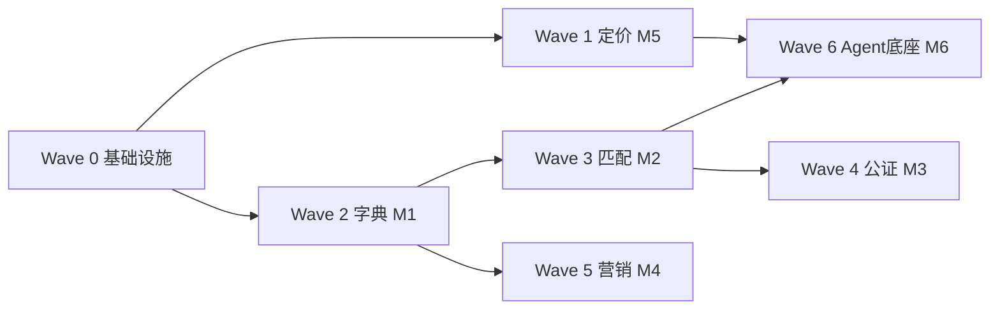

# ForI MVP 实施切片（实施顺序，非范围削减）

> **任务**: FORI-040  
> **阶段**: D4 MVP 开发  
> **Owner**: Cursor  
> **分支**: `cursor/fori-040-mvp-slice`  
> **版本**: 1.0 · 2026-07-02

## 1. 文档目的

本文档定义 Fori **全量 PRD** 在 D4 阶段的**实施顺序与垂直切片策略**。

- ✅ **实施顺序**：先做什么、后做什么、依赖关系
- ❌ **不是范围削减**：六大模块全部保留（SPEC §5.3 / PRD 开篇承诺）
- 用词：**MVP 切片** = Minimum **Viable Path**（最小可行路径），非 Minimum Viable Product 砍功能

## 2. 切片原则

| 原则 | 说明 |
|------|------|
| **差异化优先** | 先落地平台独有能力：在地分层定价、匹配闭环、公证存证 |
| **数据底座先行** | 模块一（楼盘字典）为模块二–五的数据依赖 |
| **Agent 底座并行** | 模块六与业务模块螺旋迭代，非一次性 Big Bang |
| **原型可迁移** | `prototype/` → `apps/web` 按 ADR-007 一次性迁移，避免双维护 |
| **分级门禁** | L0–L4 见 `QUOTA_ROUTING.md` §11；小改不走完整四阶段 |
| **worktree-per-task** | FORI-042 起每个 Codex 任务独立 worktree + `codex/*` 分支 |

## 3. 仓库目标结构（FORI-041/042 产出）

```
Fori/
├── apps/
│   ├── web/          # Next.js 生产前端（自 prototype 迁移）
│   └── api/          # FastAPI 主 API
├── packages/
│   ├── shared/       # 类型、DTO、常量
│   └── ui/           # 共享组件（自 prototype/components 抽取）
├── services/
│   ├── agents/       # 六个业务 Agent 实现
│   └── workers/      # 异步任务、Kafka 消费者
├── prototype/        # 保留至 apps/web 接线完成，后归档
├── docs/
└── tests/
```

## 4. 实施波次（Waves）

### Wave 0 — 基础设施（FORI-041 ~ 042）

| ID | 任务 | Owner | 产出 | 门禁 |
|----|------|-------|------|------|
| FORI-041 | `src/` 结构 + ADR-009 原型→生产迁移 | Claude/epix | `docs/adr/ADR-009-*.md`、`docs/ARCHITECTURE.md` 增补 | L2 评审 PASS |
| FORI-042 | Monorepo 初始化 | Codex/woot | `apps/`、`packages/` 脚手架、CI 骨架 | L1 build PASS |

**依赖**：FORI-040（本文档）  
**配额**：Claude ~30 msg；Codex ~60 min

### Wave 1 — 垂直切片 A：在地分层定价（模块五）⭐ 首切片

**选型理由**（REVIEW-030 + 重设计文档）：
- 平台核心差异化（PRD §3.5）
- 原型已有 `prototype/app/price/` 可迁移
- 可 Mock 估价模型，不阻塞合规长链路
- 演示价值高：买家/卖家/经纪人三方赋能

| ID | 任务 | Owner | 模块 | 产出 |
|----|------|-------|------|------|
| FORI-043 | 定价 API + 数据模型 | Codex | M5 | `apps/api` 定价端点、PG schema |
| FORI-044 | 定价 Agent 任务契约 | Claude | M6 | Agent I/O schema、状态机 |
| FORI-045 | 定价前端接线 | Codex | M5 | `apps/web` `/price` 路由 + ChartCard |
| FORI-046 | 定价模块验证 | Hermes | — | 单测 >80%、build PASS |

**依赖**：Wave 0 完成  
**原型对照**：`prototype/app/price/[communityId]/page.tsx`

### Wave 2 — 数据底座（模块一）

| ID | 任务 | Owner | 产出 |
|----|------|-------|------|
| FORI-050 | 五级字典 schema + 只读 API | Codex | 城市→单套层级 |
| FORI-051 | 字典维护 Agent + 协同编辑 | Claude 设计 → Codex 实现 | 版本留存、冲突合并 |
| FORI-052 | 字典浏览 UI 迁移 | Codex | `/explore/dict` 生产版 |

**依赖**：Wave 0；与 Wave 1 可部分并行（只读 API 先）

### Wave 3 — 匹配闭环（模块二）

| ID | 任务 | Owner | 产出 |
|----|------|-------|------|
| FORI-060 | 房源/客源发布 API | Codex | 发布、甄别、流存 |
| FORI-061 | 匹配 Agent + P1/P2/P3 推送 | Claude + Codex | 4h 响应窗口 |
| FORI-062 | 工作台 UI | Codex | `/workspace/agent/*` |

**依赖**：Wave 2 字典只读 API

### Wave 4 — 信用与公证（模块三）— L4 门禁

| ID | 任务 | Owner | 产出 |
|----|------|-------|------|
| FORI-070 | 认证体系 API | Codex | KYC、经纪人/门店认证 |
| FORI-071 | 交易状态机 + 存证 | Claude 设计 | 公证前置、电子存证 |
| FORI-072 | 交易 UI + 证据链 | Codex | `/profile/transactions` |

**依赖**：Wave 3；**Human 合规必审**（L4）

### Wave 5 — 营销（模块四）

| ID | 任务 | Owner | 产出 |
|----|------|-------|------|
| FORI-080 | 内容生成 Agent | Codex | 视频/图文/文案 |
| FORI-081 | 分发与统计 API | Codex | 授权发布、合规渠道 |
| FORI-082 | 营销工作台 UI | Codex | `/workspace/media/*` |

### Wave 6 — Agent 底座完善（模块六）

| ID | 任务 | Owner | 产出 |
|----|------|-------|------|
| FORI-090 | OpenClaw 集成层 | Codex | ADR-006 落地 |
| FORI-091 | Hermes 兜底 + DLQ | Hermes + Codex | 任务恢复、死信 |
| FORI-092 | 六 Agent 统一监控 | Codex | 运营后台骨架 |

**说明**：Wave 1–5 每波已含局部 Agent 契约；Wave 6 统一治理。

## 5. 依赖图（简图）



## 6. 30 天滚动里程碑（建议）

| 周 | 目标 | 验收 |
|----|------|------|
| W1 | Wave 0 + Wave 1 启动 | monorepo build；定价 API 冒烟 |
| W2 | Wave 1 完成 + Wave 2 只读 | `/price` 生产页可演示 |
| W3 | Wave 2 + Wave 3 核心 | 字典浏览 + 房源发布 |
| W4 | Wave 3 匹配 + Wave 4 设计 | 匹配推送演示；合规设计 Human Gate |

## 7. 配额感知派发顺序

派发前执行 `quota-check.sh`。建议同一 5h 窗口内：

1. **Claude 窗口**：FORI-041 设计 → 评审（新会话）→ Wave 1 FORI-044 Agent 契约
2. **Codex 窗口**：FORI-042 脚手架 → FORI-043 定价 API → FORI-045 前端
3. **Layer A 耗尽**：`paused_quota`，handoff 续跑
4. **日界双限**：22:30–00:29 PDT 仅 Cursor 文档 / 轻量任务

## 8. 风险与缓解

| 风险 | 缓解 |
|------|------|
| prototype 与 src 双维护 | ADR-007 一次性迁移；prototype 冻结新功能 |
| 模块三合规阻塞 | Wave 4 并行 Human 法务 checklist |
| 配额耗尽中断 Wave | quota-ledger + handoff 断点 |
| 技术栈未 spike | Wave 1 定价 Mock 验证 FastAPI + PG |

## 9. 下一步 Handoff

| 任务 | Handoff 文件 | 前置 |
|------|-------------|------|
| FORI-041 | `.ai/handoffs/FORI-041.md` | 本文档 Cursor 确认 |
| FORI-042 | `.ai/handoffs/FORI-042.md` | FORI-041 设计 PASS |

---

*本文档为 D4 排期单一事实源；变更须经 Cursor Gate 并更新 manifest。*
