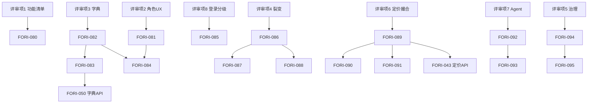

# Fori 人类原型评审 · Round 2 任务分解

> **来源**: `.ai/handoffs/Human/Fori平台原型评审意见.md`  
> **对照**: `.ai/handoffs/Human/Fori房地产智能中介交易平台初始需求.md`  
> **版本**: 2.0 · 2026-07-02（FORI-043 设计修订后更新）  
> **分支设计**: `claude/fori-043-human-review-design`  
> **分支实现**: `codex/fori-043-pricing-api`（待派发）

---

## 1. 执行摘要

人类评审指出：当前原型在**功能完整性、版面美化、交互体验**上与初始需求存在巨大差距。评审共 **8 条**顶层要求，分解为 **16 项可执行任务**（FORI-080 ~ FORI-095），按 **6 个波次**编排。

| 维度 | 数量 |
|------|------|
| 评审条目 | 8 |
| 分解任务 | 16 |
| P0（阻塞） | 7 |
| P1（重要） | 7 |
| P2（建议） | 2 |
| 已完成（设计+原型） | 15（FORI-080~094） |
| 剩余 | 1（FORI-095 复盘） |

**Round 2 设计完成**：FORI-080~082/086/089/092（Claude 设计文档全部产出）  
**Round 2 原型完成**：FORI-083/084/085（P0）+ FORI-087/088/090/091/093/094（P1/P2）  
**D4 Wave 1 就绪**：FORI-043 实现 handoff 已就绪，待 Codex 派发

**v2.0 更新**（2026-07-02）：
- 全部任务状态同步至 `PM_TASK_PLAN.md` 实际完成状态
- 新增 FORI-043 定价 API 实现条目（D4 Wave 1）
- 设计修订三条（R-1 信息隔离 / R-2 付费墙 / R-3 结算快照）记录于 `FORI-043_DESIGN.md`

---

## 2. 评审项逐项分析

### 评审项 1 — 完整功能清单

> **原文**：「对照初始需求，完整梳理并维护初始需求中提及的核心目标与模块功能，不得有任何遗漏，形成一份完整功能清单；对各功能所属模块及功能本身进行分级，不得删减任何功能……」

| 维度 | 内容 |
|------|------|
| **初始需求映射** | 全文六大模块 + 七大价值闭环 + 五类服务对象 |
| **原型缺口** | 无独立「主功能清单」文档；`PROTOTYPE_COMPLETION.md` 仅覆盖 36 路由，未逐条映射初始需求子功能 |
| **分类** | design doc update |
| **优先级** | P0 |
| **负责人** | Claude (design) |
| **依赖顺序** | Wave R2-0 · 无前置 |

---

### 评审项 2 — 全角色功能与交互清单

> **原文**：「从使用者角度出发……维护一份所有使用角色的功能与交互清单……版面的引导词、视觉感观及交互逻辑都必须针对使用者进行专门设计。」

| 维度 | 内容 |
|------|------|
| **初始需求映射** | §1.3 核心服务对象；模块二匹配、模块三交易 |
| **原型缺口** | 缺「平台工作人员」角色页面；引导文案未按角色分化；`REVIEW-UX-USER-PERSPECTIVE.md` 有 P1 项未落地 |
| **分类** | design doc update + prototype UI |
| **优先级** | P0 |
| **负责人** | Claude (design) → Cursor/Codex (prototype) |
| **依赖顺序** | Wave R2-0 → R2-1 |

---

### 评审项 3 — 房源字典核心模块

> **原文**：「房屋房源词典需支持地图式呈现、卡片及列表清单式呈现；针对不同使用者差异化呈现；部分房源信息保密隔离；参照 SUUMO 规范化模板化设计。」

| 维度 | 内容 |
|------|------|
| **初始需求映射** | 模块一 §1.1–1.4 五级字典、字段级权限 |
| **原型缺口** | `/explore/dict` 仅卡片；`/explore/map` 静态占位无高德；无角色脱敏；无 SUUMO 式字段分组模板 |
| **分类** | design doc + prototype UI + backend/API |
| **优先级** | P0 |
| **负责人** | Claude (SUUMO spec) + Cursor (原型) + Codex (API) |
| **依赖顺序** | FORI-082 → FORI-083/084 → FORI-050~052 |

---

### 评审项 4 — 共建共赢裂变机制

> **原文**：「包含经纪人初始录入、后续修订补充，以及业主、购房人、平台管理员参与……交易达成时对各环节利益清晰核算与分配……」

| 维度 | 内容 |
|------|------|
| **初始需求映射** | 模块一 §1.2.4 权责匹配；模块三 §3.4 四方共赢；模块四推广 |
| **原型缺口** | 字典编辑有共建 UI 但无贡献积分/首建者标签；交易页无分成明细；无业主/买家维护入口 |
| **分类** | design doc + prototype UI + architecture |
| **优先级** | P1 |
| **负责人** | Claude (design) → Codex (implement) |
| **依赖顺序** | Wave R2-2，依赖 FORI-082 |

---

### 评审项 5 — 设计开发过程管理

> **原文**：「对人类用户指令、多智能体协作过程进行完整分析；对文档、脚本与现行做法不一致的内容实施版本管理……长期维护设计开发经验集、技能集、需求集。」

| 维度 | 内容 |
|------|------|
| **初始需求映射** | 模块六 Agent 底座；项目治理 |
| **原型缺口** | ADR-009 vs handoff ADR-007 编号不一致；多份 routing 配置并行 |
| **分类** | architecture + copy/content |
| **优先级** | P2 |
| **负责人** | Cursor + Human |
| **依赖顺序** | Wave R2-5，可并行 |

---

### 评审项 6 — 定价评估与撮合机制

> **原文**：「对房源交易价格评估及撮合机制进行深入研究，并完成功能实现设计……先形成完整方案再进行功能实现。」

| 维度 | 内容 |
|------|------|
| **初始需求映射** | 模块五全文；模块二 §2.3 定向匹配 |
| **原型缺口** | 价格页缺买家/卖家/经纪人三视角；匹配页无 4h 响应窗口；缺撮合状态机 |
| **分类** | design doc + backend/API + prototype UI |
| **优先级** | P0（设计）/ P1（实现） |
| **负责人** | Claude (design) → Codex (FORI-043+) |
| **依赖顺序** | FORI-089 → FORI-090/091；与 Wave 1 定价切片衔接 |

---

### 评审项 7 — Agent 原生交互

> **原文**：「每一页、每一项功能均需考虑如何基于 OpenClaw Agent 框架实现，包括语音、文字、拍摄等输入方式。」

| 维度 | 内容 |
|------|------|
| **初始需求映射** | 模块六 §6.1–6.5；六大业务 Agent |
| **原型缺口** | 全站无统一 Agent 助手入口；无 per-page Agent 契约说明 |
| **分类** | design doc + prototype UI + architecture |
| **优先级** | P1 |
| **负责人** | Claude (spec) + Cursor (shell) |
| **依赖顺序** | Wave R2-4 |

---

### 评审项 8 — 收费获益体系

> **原文**：「用户注册登录分级设计……付费机制设计……利益分配设计……」

| 维度 | 内容 |
|------|------|
| **初始需求映射** | PRD §商业模式；模块三 §3.4 |
| **原型缺口** | 登录页缺分级矩阵（已补）；无付费墙/增值服务 UI；交易页无分成可视化 |
| **分类** | design doc + prototype UI |
| **优先级** | P0（登录分级）/ P1（付费与分成） |
| **负责人** | Claude + Cursor + Codex |
| **依赖顺序** | FORI-085（done）→ FORI-088 |

---

## 3. 可追溯矩阵

| 评审# | 初始需求锚点 | 任务 ID | 主要改动文件 | 验收标准 |
|-------|-------------|---------|-------------|----------|
| 1 | 六大模块全文 | FORI-080 | `docs/FEATURE_INVENTORY.md` | 初始需求 100% 条目映射，无删减，含 P0/P1/P2 分级 |
| 2 | §1.3 服务对象 | FORI-081 | `docs/ROLE_UX_MATRIX.md`, `docs/UI_DESIGN.md` | 四类使用者 + 平台工作人员，每角色 ≥10 条交互 |
| 3 | 模块一 §1.4 | FORI-082 | `docs/UI_DESIGN.md` §字典披露 | SUUMO 式字段分组 + 可见性矩阵 |
| 3 | 模块一 | FORI-083 | `prototype/app/explore/dict/*`, `map/*` | 卡片/列表/地图三态可切换 |
| 3 | 模块一 §1.4 | FORI-084 | `prototype/lib/viewer-role.ts`, dict/listing | 五档身份字段脱敏可演示 |
| 4 | §1.2.4, §3.4 | FORI-086 | `docs/CO_CREATION_FISSION.md` | 贡献→积分→优先匹配→成交分成全链路 |
| 4 | §1.2.4 | FORI-087 | `prototype/app/explore/dict/*/edit`, `transaction/*` | 贡献账本 + 首建者标签 UI |
| 4 | §3.4 | FORI-088 | `prototype/app/transaction/[id]/page.tsx` | 成交分成瀑布图 Mock |
| 5 | 治理 | FORI-094 | `docs/CANON.md`, `.ai/manifest.json` | 文档有效性单一事实源 |
| 5 | 治理 | FORI-095 | `docs/retro/HUMAN-REVIEW-R2.md` | 协作复盘 + Obsidian 同步 |
| 6 | 模块五、二 | FORI-089 | `docs/PRICING_MATCHING.md` | 定价+撮合状态机 + 三方输出 |
| 6 | 模块五 | FORI-090 | `prototype/app/price/*` | 买家/卖家/经纪人差异化信息块 |
| 6 | 模块二 | FORI-091 | `prototype/app/match/*` | 4h 窗口 + 意向确认草稿 |
| 7 | 模块六 | FORI-092 | `docs/AGENT_PAGE_CONTRACTS.md` | 36 路由 Agent I/O 摘要 |
| 7 | 模块六 | FORI-093 | `prototype/components/AgentAssistFab.tsx` | 关键页 Agent 入口 + 三模态输入 |
| 8 | PRD §商业模式 | FORI-085 | `prototype/app/auth/login/page.tsx` | 四级登录可见范围表 ✅ |
| 8 | PRD §商业模式 | FORI-088 | `docs/UI_DESIGN.md` §付费 | 付费场景 + 分成规则 UI 规格 |

---

## 4. 任务清单（FORI-080 ~ FORI-095）

### Wave R2-0 — 设计基线（P0，Claude 优先）

| ID | 标题 | Owner | P | 状态 | 产出文件 |
|----|------|-------|---|------|---------|
| FORI-080 | 主功能清单（无删减分级） | Claude | P0 | ✅ done | `docs/FEATURE_INVENTORY.md` |
| FORI-081 | 全角色功能与交互矩阵 | Claude | P0 | ✅ done | `docs/ROLE_UX_MATRIX.md` |
| FORI-082 | 字典 SUUMO 式披露规范 | Claude | P0 | ✅ done | `docs/UI_DESIGN.md` §字典 |
| FORI-089 | 定价与撮合机制完整方案 | Claude | P0 | ✅ done | `docs/PRICING_MATCHING.md` |

### Wave R2-1 — 原型 P0

| ID | 标题 | Owner | P | 状态 |
|----|------|-------|---|------|
| FORI-083 | 字典地图/卡片/列表三态 | Cursor | P0 | ✅ done |
| FORI-084 | 角色差异化字段脱敏 | Cursor | P0 | ✅ done |
| FORI-085 | 登录分级可见矩阵 | Cursor | P0 | ✅ done |

### Wave R2-2 — 共建裂变（P1）

| ID | 标题 | Owner | P | 状态 | 产出文件 |
|----|------|-------|---|------|---------|
| FORI-086 | 共建共赢裂变机制设计 | Claude | P1 | ✅ done | `docs/CO_CREATION_FISSION.md` |
| FORI-087 | 贡献账本与奖励 UI | Codex | P1 | ✅ done | `prototype/app/explore/dict/*/edit` |
| FORI-088 | 成交分成可视化 UI | Codex | P1 | ✅ done | `prototype/app/transaction/[id]` |

### Wave R2-3 — 定价撮合增强（P1）

| ID | 标题 | Owner | P | 状态 |
|----|------|-------|---|------|
| FORI-090 | 价格页三角色差异化 | Codex | P1 | ✅ done |
| FORI-091 | 匹配撮合流程增强 | Codex | P1 | ✅ done |

### Wave R2-4 — Agent 原生（P1）

| ID | 标题 | Owner | P | 状态 | 产出文件 |
|----|------|-------|---|------|---------|
| FORI-092 | 全站 Agent 页面契约 | Claude | P1 | ✅ done | `docs/AGENT_PAGE_CONTRACTS.md` |
| FORI-093 | Agent 助手交互壳 | Cursor/Codex | P1 | ✅ done | `prototype/components/AgentAssistFab.tsx` |

### Wave R2-5 — 治理与复盘（P2）

| ID | 标题 | Owner | P | 状态 |
|----|------|-------|---|------|
| FORI-094 | 文档有效性治理 CANON | Cursor | P2 | ✅ done |
| FORI-095 | Round 2 协作复盘 | Hermes | P2 | ⏳ queued |

### D4 Wave 1 — 定价 API 实现（接续）

| ID | 标题 | Owner | P | 状态 | 依赖 |
|----|------|-------|---|------|------|
| FORI-043 | 定价+撮合 API 实现 | Codex | P0 | ⏳ ready | FORI-042 ✅ |
| FORI-044 | PriceEvalAgent OpenClaw 接入 | Codex | P1 | queued | FORI-043 |
| FORI-045 | 付费验证模块 | Codex | P1 | queued | FORI-043 |

---

## 5. 依赖图



---

## 6. 与既有 D4 波次关系

| 既有任务 | Round 2 关系 |
|----------|-------------|
| FORI-043~046 定价切片 | FORI-089/090 补充设计后再接线 |
| FORI-050~052 字典 Wave 2 | FORI-082~084 为前置 UX/规范 |
| FORI-060~062 匹配 Wave 3 | FORI-091 扩展撮合原型 |
| PROTOTYPE_COMPLETION 97% | Round 2 后目标 100% 功能对齐（非仅路由） |

---

## 7. 验证

```bash
cd prototype && npm run build   # Wave R2-1 门禁
.ai/orchestration/scripts/quota-check.sh claude  # 派发 Claude 前
.ai/orchestration/scripts/quota-check.sh codex   # 派发 Codex 前
```

---

*生成：Cursor · Human Review Round 2 分解 · 2026-07-02*
