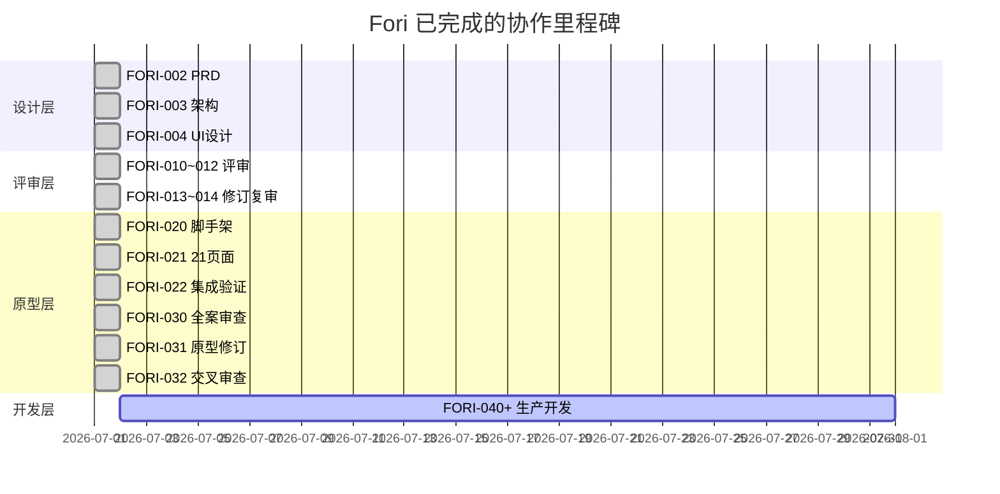
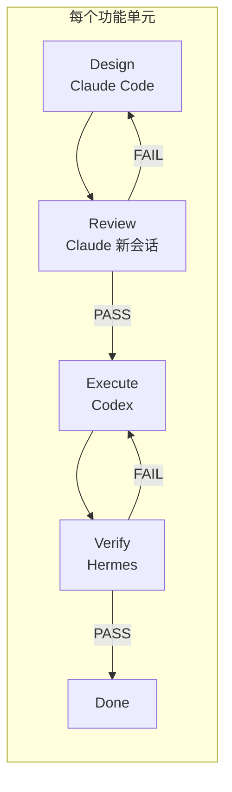
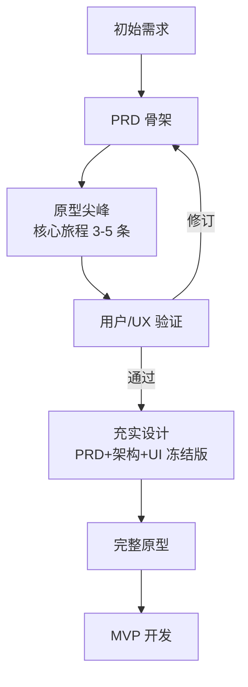
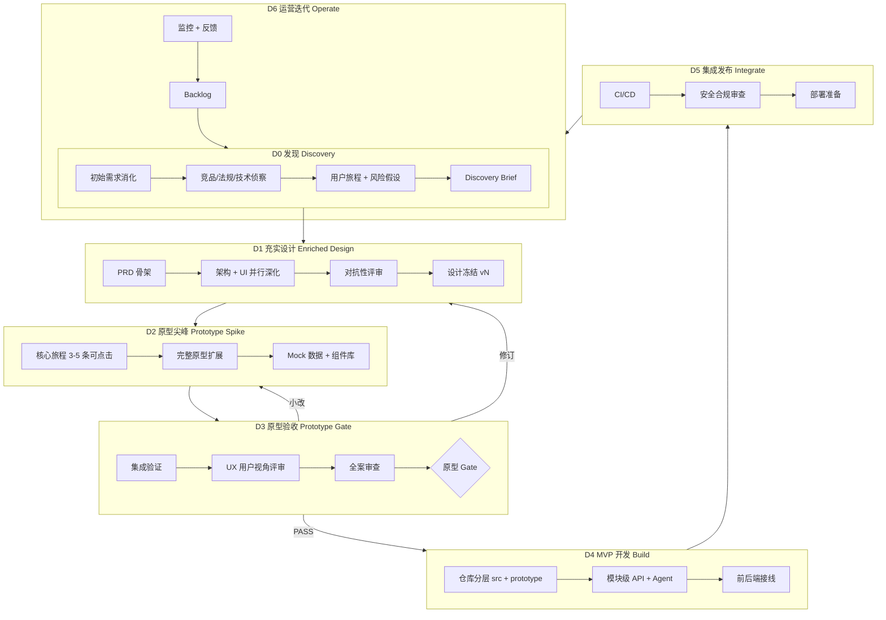
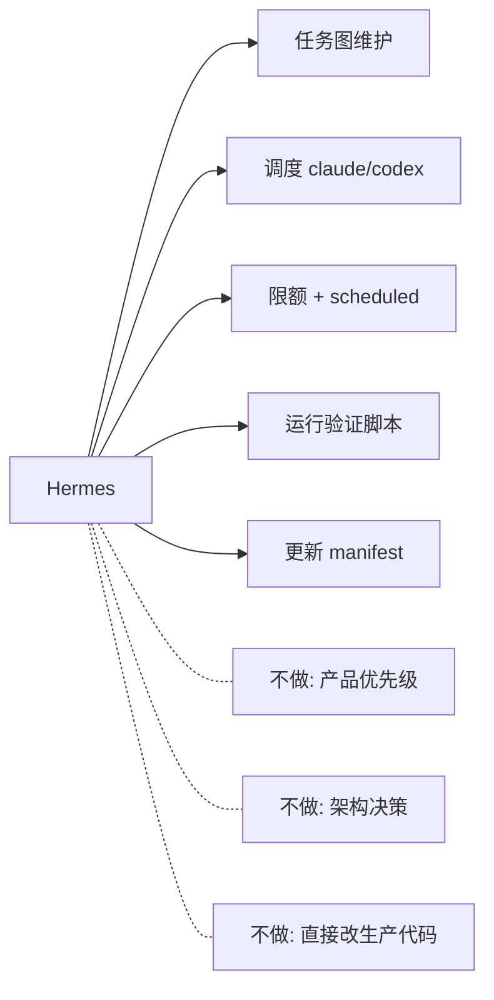
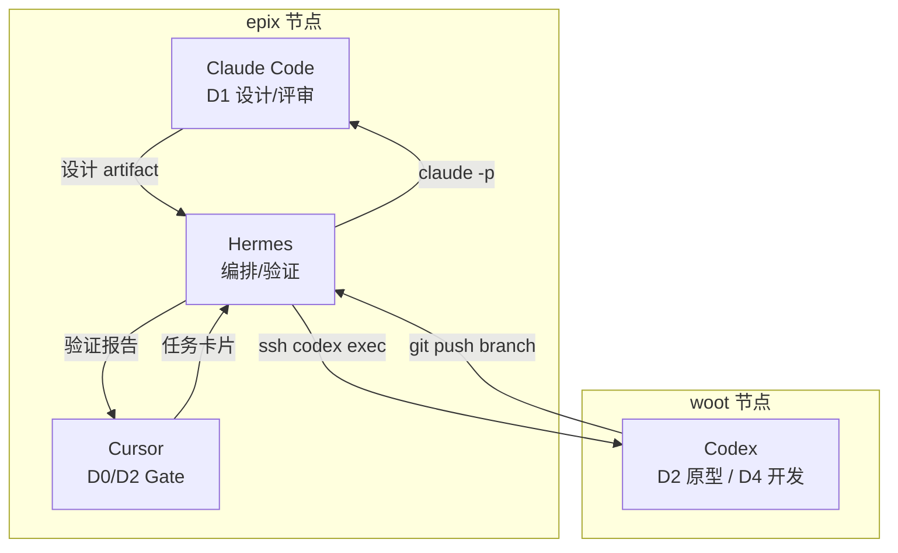
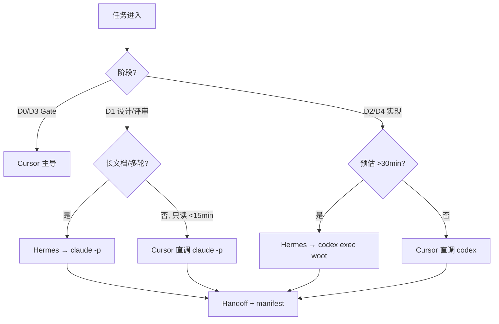
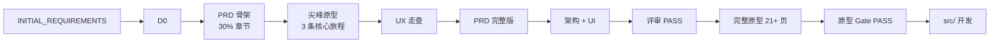
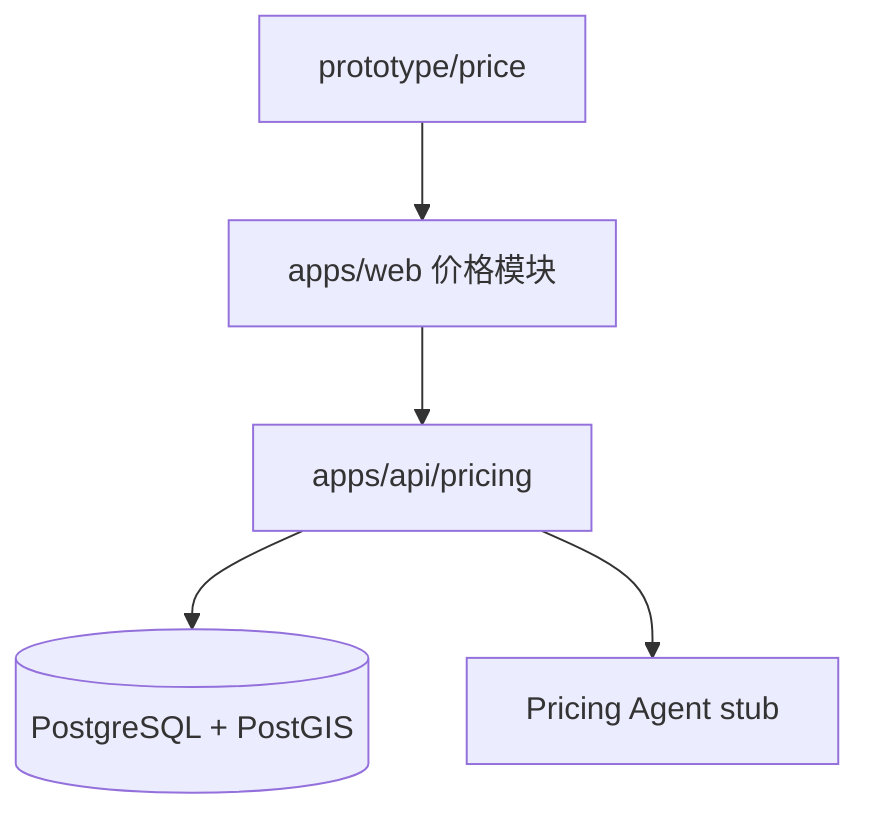

# Fori 多智能体协作模型评审与重设计

> **文档类型**：架构/策略评审  
> **撰写日期**：2026-07-01  
> **撰写角色**：Cursor（架构评审子任务）  
> **依据**：项目遍历、CAMA 协作协议、Fori 实际交付轨迹、2025–2026 Agent 工程最佳实践  
> **状态**：建议稿，待 Human/Cursor 确认后更新 `AGENTS.md` / `SPEC.md`

---

## 1. 执行摘要

### 1.1 评审结论

Fori 项目在**文档驱动 + 四阶段分工**框架下，已在约 1 天内完成从初始需求到 **1489 行 PRD、2420 行架构、1989 行 UI 设计、36+ 页可运行原型** 的端到端产出，证明多 Agent 协作在**大规模产品设计**上具备显著加速能力。当前模型在**质量门禁、角色专精、双节点并行、限额续跑**方面与 CAMA 协议基本一致，且已沉淀 `manifest.json`、评审 VERDICT 格式、任务编号体系等可复用资产。

然而，对照用户目标——**「完全响应初始需求 → 发挥多 Agent 想象/研究/设计/开发能力 → 补充产品完善度 → 实用原型 → 开发交付」**——当前模型存在三类结构性偏差：

| 偏差类型 | 表现 | 影响 |
|----------|------|------|
| **阶段错位** | 原型置于「全量设计冻结」之后，发现 UX/路由缺口时已难低成本回调 | REVIEW-030 暴露 8 项必修，FORI-031 返工 |
| **能力闲置** | 缺少显式 Discovery（研究/想象/竞品/用户旅程）阶段；Cursor 偏「合并者」而非产品负责人 | 用户视角评审（UX-01~15）晚至原型后 |
| **交付断层** | `src/` 为空，FORI-040+ 未切片；四阶段对「每个功能单元」一刀切，开发期摩擦将急剧上升 | 原型与生产代码之间无清晰迁移轨 |

### 1.2 重设计核心主张

**从「设计→评审→执行→验证」四段流水线，升级为「七段产品交付流水线」**：

```text
D0 发现 → D1 充实设计 → D2 原型尖峰 → D3 原型验收 → D4 MVP 开发 → D5 集成发布 → D6 运营迭代
```

**关键原则变化**：

1. **原型前置验证，设计后移冻结**：允许在 D2 用可点击原型验证假设，再回写 PRD/架构/UI（受控修订，非 MVP 降级）。
2. **阶段门禁分级**：Discovery / 原型尖峰用轻门禁；进入 `src/` 生产代码前用重门禁（测试、安全、合规）。
3. **角色按「认知深度 × 执行密度」分工**，而非按「写文档 vs 写代码」硬切。
4. **Hermes 专注编排与证据**，不替代 Cursor 的产品决策权，不替代 Claude/Codex 的专业产出。
5. **上下文契约升级**：每次 handoff 必须更新「三件套」——`manifest.json` + `current.md` + `STARTUP_BRIEF.md`，并追加结构化 handoff 文件。

### 1.3 对当前最佳实践的符合度（总评）

| 维度 | 当前 Fori 模型 | 2025–2026 最佳实践 | 符合度 |
|------|----------------|-------------------|--------|
| 对抗性审查（设计者不自审） | ✅ 强制新会话评审 | ✅ 行业共识 | **高** |
| 可验证产出（VERDICT + 验收标准） | ✅ 已落地 | ✅ Claude/Codex 官方强调 | **高** |
| 原型驱动交付 | ⚠️ 有原型但后置 | ✅ PRD→Prototype→MVP 为主流 | **中** |
| 产品发现先于设计冻结 | ❌ 缺失 | ✅ Continuous Discovery | **低** |
| Worktree 任务隔离 | ❌ 未用 | ✅ CAMA Playbook 强制 | **低** |
| 上下文跨 Agent 保持 | ⚠️ 靠 prompt 自包含 | ✅ Handoff artifact + ledger | **中** |
| Human-in-the-loop 分级 | ⚠️ Cursor 仅合并 | ✅ PO 门控 + Agent 执行 | **中** |
| 并行 vs 串行 | ✅ 双节点并行 | ✅ 文件级锁 + 任务图 | **中高** |

**结论**：当前「架构评审 vs 编程分工」**方向正确**，但**粒度过粗、阶段过少、产品发现缺位**，不完全符合 2025–2026 以**原型验证 + 持续发现 + 证据门禁**为核心的最佳实践。需演进，非推翻。

---

## 2. 项目现状与协作机制盘点

### 2.1 项目实现状态（截至 FORI-032）

| 层级 | 路径/产物 | 状态 | 说明 |
|------|-----------|------|------|
| 初始需求 | `docs/INITIAL_REQUIREMENTS.md` | ✅ 完成 | 六大模块、四方共赢、Agent 底座 |
| PRD | `docs/PRD.md`（1489 行） | ✅ 完成 | 覆盖矩阵 + I/O 契约 + 合规 |
| 架构 | `docs/ARCHITECTURE.md`（2420 行） | ✅ 完成 | ER、状态机、六大业务 Agent |
| UI 设计 | `docs/UI_DESIGN.md`（1989 行） | ✅ 完成 | 21 核心页 + 必需页 + 流程图 |
| 工程规范 | `docs/SPEC.md` | ✅ 完成 | 四阶段模型 + 技术栈锁定 |
| 任务分解 | `docs/TASK_BREAKDOWN.md` | ⚠️ 部分 | 至 FORI-030；FORI-040+ 占位 |
| 原型 | `prototype/`（Next.js 14） | ✅ 基本完成 | 36 页验证；REVIEW-031 CONDITIONAL_PASS |
| 生产代码 | `src/` | ❌ 空 | 开发阶段尚未启动 |
| 测试 | `tests/` | ❌ 空 | 待 FORI-040+ 建立 |

**里程碑时间线**（manifest.json / current.md）：



### 2.2 当前 STORM 角色映射

| STORM 角色 | 工具 | 节点 | 当前职责 |
|------------|------|------|----------|
| Moderator / 编排 | Hermes | epix | Kanban、Cron、限额续跑、验证 |
| Human I/O + 合并 | Cursor | epix | 人工审阅、kickoff、合并 main |
| Expert · 架构/深审 | Claude Code | epix（主）/ woot（备） | PRD/架构/UI 设计、评审、ADR |
| Expert · 实现 | Codex | woot（主）/ epix（备） | 原型编码、修订、未来生产代码 |

配置来源：`AGENTS.md`、`.ai/agent-routes.json`、CAMA `COLLABORATION-PROTOCOL.md`。

### 2.3 当前四阶段工作流



**伴随机制**：

- **分支策略**：`claude/*`、`codex/*`、`hermes/*`、`cursor/*` → 仅 Cursor/Human 合并 `main`
- **Handoff**：commit + 更新 manifest / current.md / STARTUP_BRIEF
- **并发**：不同文件可并行；同文件 manifest owner lock
- **限额**：双层配额（Layer A 5h 滚动主调度 + Layer B 日重置辅）；`paused_quota` / `scheduled_daily_reset` + quota-ledger + cron 续跑；禁止 Agent 角色互替

### 2.4 实际协作轨迹中的「非正式」实践

遍历 `manifest.json` 与评审文件，发现以下**已发生但未写入规范**的行为：

1. **Codex 参与文档修订**（FORI-013/014）：评审意见由 Codex 在 woot 落地修订，打破「只有设计者改文档」的纯理论分工，但提高了吞吐。
2. **Hermes + Codex 联合验证**（FORI-022）：验证者直接驱动修复，效率高于纯报告式验证。
3. **用户视角 UX 评审**（`REVIEW-UX-USER-PERSPECTIVE.md`）：由 Codex 执行、Hermes 发起，属于**产品发现类**活动，却发生在原型之后。
4. **Cursor 直调子 Agent 评审**（本任务）：短只读深审走 Cursor，符合 CAMA「<3min 直调」路由，但未纳入 Fori SPEC。

这些实践说明：**团队已在用更灵活的分工，但规范文档滞后于实践**。

---

## 3. 当前模型优缺点分析

### 3.1 优势

#### A. 质量与可追溯性

- **评审 VERDICT 格式**（PASS / CONDITIONAL_PASS / FAIL + FINDINGS + REQUIRED_CHANGES）形成清晰质量记录链。
- **需求覆盖矩阵**（PRD §1.5、REVIEW-030 矩阵）支持端到端追踪，适合强合规的房产交易平台。
- **禁止 MVP 降级**使产品愿景未被过早砍 scope，与 Fori「生态操作系统」定位一致。

#### B. 角色专精与对抗性审查

- Claude Code 专注长文设计/深审，Codex 专注批量实现，符合各工具官方最佳实践。
- 「设计者不自审」有效降低设计盲点；FORI-010~012 三次 CONDITIONAL_PASS 后修订至 PASS 证明了机制价值。

#### C. 工程化编排

- 双节点（epix/woot）并行 + 限额窗口管理，在 1 天内完成 21+ 页面原型，吞吐突出。
- `manifest.json` 作为状态单一事实源、任务 ID 编号（FORI-0XX）、cron 续跑，具备 CAMA 连续交付雏形。

#### D. 产物驱动而非聊天驱动

- 每个阶段有明确文件产出（PRD、ARCHITECTURE、UI_DESIGN、prototype/、reviews/），符合 CAMA Playbook「不以聊天结论为完成」原则。

### 3.2 劣势与摩擦点

#### A. 阶段顺序与「原型优先」目标错位

| 问题 | 证据 | 后果 |
|------|------|------|
| 全量设计冻结后才做原型 | TASK_BREAKDOWN：FORI-020 依赖 FORI-012 评审通过 | UI/路由问题延迟暴露 |
| 原型发现问题后大范围返工 | REVIEW-030：8 项 REQUIRED_CHANGES | FORI-031 专项修复，浪费一轮完整设计→原型周期 |
| UX 评审后置 | REVIEW-UX 在 FORI-021 之后 | P1 问题（交易发起责任、出价决策信息）未能在设计稿阶段消化 |

**判断**：当前模型是「**Big Design Up Front → Prototype**」，而非用户要求的「**Enriched Design → Practical Prototype → Delivery**」中的迭代式充实。

#### B. 四阶段「每功能单元必走」过重

SPEC §1.1 要求每个功能单元完整走完 Design→Review→Execute→Verify。对 **21 个页面原型**尚可；对 **六大模块后端 + Agent 底座 + 集成**将产生：

- 评审瓶颈（Claude 配额 / 会话数）
- Hermes 验证瓶颈（`git diff` 逐任务人工式检查）
- 设计文档与实现脱节（架构 2420 行尚未经任何运行时代码验证）

CAMA Playbook 的 **P0–P6 七阶段**按**产品生命周期**分段，而非按**每个功能**四段，更适合 Fori 下一阶段。

#### C. 上下文丢失与状态不一致

| 症状 | 实例 |
|------|------|
| STARTUP_BRIEF 过期 | 仍写「原型 9/21 页」「14:15 cron」，与 manifest 完成状态矛盾 |
| current.md 与 manifest 分叉 | current.md 写 FORI-031 进行中；manifest 写 FORI-032 已完成 |
| 跨 Agent 无结构化 handoff | 依赖 prompt 自包含 + 长文档，无 `execution/handoffs/<task-id>.md` |
| Codex 无跨会话记忆 | AGENT_BEST_PRACTICES 已指出，靠 Hermes 重复喂上下文 |

#### D. 角色边界模糊与 Cursor 欠活用

- **Cursor** 被定义为「合并 + kickoff」，未承担 CAMA P0「目标冻结」和 P2「任务切片」主责。
- **Hermes** 同时承担编排、验证、有时修复协调，易成单点瓶颈。
- **Codex 改设计文档**（FORI-013/014）与 SPEC「评审者不改设计」冲突，虽高效但破坏审计链。

#### E. 开发与原型断层

- `prototype/` 与未来 `src/` 关系未定义：是迁移、重写还是 monorepo 并存？
- 技术栈锁定（FastAPI、PG、Kafka 等）**未经原型或 spike 验证**，架构决策停留在纸面。
- FORI-040+ 仅占位一句，缺少模块级切片与依赖图。

### 3.3 刚性四阶段分工：帮助还是阻碍？

| 场景 | 帮助 | 阻碍 |
|------|------|------|
| PRD / 架构 / UI 首版生成 | ✅ 强制深度与评审 | — |
| 21 页面批量原型 | ✅ Codex 专注执行 | ⚠️ 每页若走完整四阶段过慢（实际采用了批量派发，已变相放宽） |
| 原型修订（FORI-031） | — | ❌ 8 项修复本可在一个 Execute+Verify 循环完成，却触发新一轮交叉审查 |
| 即将开始的 API/Agent 开发 | ✅ 安全/合规审查有价值 | ❌ 若每接口四阶段，30 天无法交付可用 MVP |
| 产品发现 / 用户研究 | — | ❌ 无对应阶段，只能「寄生」在 Review 里 |

**结论**：四阶段对**首版设计文档**和**高风险模块**有帮助；对**原型迭代**和**增量开发**阻碍大于帮助。应改为**分级门禁**，而非废除对抗性审查。

---

## 4. 与最佳实践对比

### 4.1 2025–2026 Agent 协作趋势摘要

| 最佳实践 | 来源 | Fori 现状 | 建议 |
|----------|------|-----------|------|
| Explore → Plan → Implement → Commit | Claude Code 官方 | 设计阶段有 Explore，但未独立成阶段 | 显式 D0 Discovery |
| Give Claude a way to verify its work | Claude Code 官方 | ✅ 验收标准 + 评审 | 保持；扩展到原型用户测试清单 |
| AGENTS.md 项目上下文 | Codex 官方 | ✅ 已建 | 增加阶段路由表 |
| Hermes-first 长任务 + worktree | CAMA Playbook | 长任务有 Hermes；无 worktree | FORI-040+ 强制 worktree |
| 主责 + 复核双 Agent | CAMA Playbook | 有角色分工；复核常省略 | 每阶段明确 reviewer |
| 额度账本 | CAMA Playbook | manifest limits 字段 | ✅ `quota-ledger.json` + QUOTA_LEDGER.md（v2.0 双层） |
| PRD → Prototype → MVP | 行业产品实践 | PRD → 全设计 → Prototype | 调整为螺旋式 |
| Continuous Discovery | 产品管理 | 缺失 | Cursor 主导轻量发现 |
| Human-in-the-loop 分级 | Agent 安全实践 | Cursor 仅合并点 | 增加 Gate 检查点 |
| 上下文 artifact 优于长 prompt | 工程经验 | 长 prompt + 大文档 | handoff 模板化 |

### 4.2 专门化 Agent vs 通用 Agent

| 任务类型 | 最优选择 | 理由 |
|----------|----------|------|
| 1489 行 PRD、架构 trade-off | Claude Code（Opus） | 长上下文推理、ADR |
| 21 页面 React 批量实现 | Codex（gpt-5.5） | 代码生成、测试、CI |
| 7×24 续跑、Cron、Kanban | Hermes | 不消耗 headless 配额 |
| 产品优先级、合并不确定项 | Cursor + Human | 意图消歧、风险承担 |
| 竞品扫描、法规摘要 | Claude 直调或 Hermes 委派 | 只读、可并行 |
| 原型点击流验证 | Codex + Playwright / Hermes | 可自动化 |

**Fori 当前路由基本正确**；需补充的是 **Cursor 在 P0/P2 的主导权** 和 **Discovery 轻量 Agent 调用**。

### 4.3 原型驱动开发（Prototype-Driven）

业界有效模式：



Fori **实际**走了 `PRD(完整) → 架构(完整) → UI(完整) → 原型(完整)`，跳过了 **尖峰验证环**。重设计应把 **FORI-020 类任务前移为「核心旅程尖峰」**，完整 21 页作为 D2 后半段。

### 4.4 并行 vs 串行

| 可并行 | 必须串行 |
|--------|----------|
| 不同页面原型（不同文件） | 数据库 schema 迁移 |
| PRD 模块撰写（分章节） | API 契约变更 + 前端类型生成 |
| 竞品研究 + 法规摘要 | 同一文件的 design/execute |
| Claude 深审 + Codex 原型（不同 worktree） | 合并到 main 前 |

Fori 的 `manifest.json owner lock` 正确；缺 **worktree-per-task** 导致并行时仍有工作区污染风险。

---

## 5. 重新设计的协作模型

### 5.1 设计目标

1. **完全响应** `INITIAL_REQUIREMENTS.md` 与 PRD，禁止 MVP 降级（保留 SPEC §5.3 精神）。
2. **发挥多 Agent 想象力**：Discovery 阶段允许发散研究、竞品、旅程地图、风险假设。
3. **补充产品完善度**：通过 UX 评审、原型走查、spike 验证回写设计。
4. **实用原型优先于生产代码**：原型可 Mock，但必须可演示核心差异化（在地分层定价、公证流、匹配闭环）。
5. **可落地**：沿用 `claude -p`、`codex exec`、Hermes Cron、Cursor 合并，不引入新框架。

### 5.2 七段产品交付流水线（Fori-PDP）



### 5.3 阶段定义、角色、产物、门禁

| 阶段 | 目标 | 主责 | 复核 | 关键产物 | 门禁（进入下一阶段） |
|------|------|------|------|----------|-------------------|
| **D0 发现** | 理解市场、用户、约束；提出设计假设 | **Cursor** | Claude 只读挑战 | `docs/discovery/DISCOVERY_BRIEF.md`、旅程图、开放问题表 | Human：范围与假设确认 |
| **D1 充实设计** | PRD/架构/UI 达到可实施颗粒度 | **Claude Code** | Claude 新会话 + Cursor | PRD、ARCHITECTURE、UI_DESIGN、ADR | 评审 VERDICT: PASS；无 TBD |
| **D2 原型尖峰** | 可演示、可点击、可收集反馈 | **Codex** | Hermes 构建验证 | `prototype/`、组件库、Mock | `npm run build` PASS；核心旅程可走通 |
| **D3 原型验收** | 确认原型满足 PRD 与 UX | **Hermes** 验证 + **Claude** 全案审查 | Cursor + UX 清单 | VERIFY-*.md、REVIEW-*.md | 全案 VERDICT: PASS；必修项清零 |
| **D4 MVP 开发** | 生产代码、真实 API、Agent 底座 | **Codex**（worktree） | Claude 深审（高风险模块） | `src/`、API、迁移、单测 | 模块单测 >80%；lint/type PASS |
| **D5 集成发布** | 可部署、可回滚 | **Cursor** + Codex | Claude 安全审查 | CI 日志、release note、rollback | staging 冒烟 PASS |
| **D6 运营迭代** | 数据驱动 backlog | **Cursor** | Hermes 排期 | 指标、反馈、新 FORI 任务 | — |

#### 与旧四阶段映射

| 旧阶段 | 新阶段 |
|--------|--------|
| Design | D0 + D1 |
| Review | D1 末 + D3 |
| Execute | D2 + D4 |
| Verify | D3 + D5 |

### 5.4 角色重新定义（RACI 精简版）

| 活动 | Cursor | Hermes | Claude Code | Codex | Human |
|------|--------|--------|-------------|-------|-------|
| 产品优先级 / Gate | **A/R** | C | C | I | **A** |
| Discovery 发起 | **R** | C | C | I | I |
| PRD/架构/UI 撰写 | C | I | **R** | I | I |
| 对抗性评审 | C | C | **R**（新会话） | I | I |
| 任务切片 / backlog | **R** | **R** | C | C | I |
| 原型/代码实现 | I | C | I | **R** | I |
| 自动化验证 | C | **R** | I | C | I |
| 全案/安全深审 | C | C | **R** | C | I |
| 合并 main | **R** | I | I | I | **A** |
| 限额续跑 | I | **R** | I | I | I |

*R=负责, A=批准, C=协商, I=知会*

**Hermes 编排角色（明确边界）**：



### 5.5 分级门禁：何时走完整四阶段

| 变更类型 | 门禁级别 | 流程 |
|----------|----------|------|
| 文案、Mock 数据、样式微调 | **L0** | Codex Execute → Hermes 自动 build |
| 新页面、路由、组件 | **L1** | Codex Execute → Hermes Verify → 抽样 UX |
| PRD/架构/UI 文档修订 | **L2** | Claude 修订 → Claude 新会话评审 → Cursor 确认 |
| API 契约、DB schema、Agent 接口 | **L3** | Claude 设计 → 评审 → Codex worktree 实现 → Claude 安全审查 → 集成测试 |
| 合规、资金、公证、隐私 | **L4** | L3 + Human 必审 + 合规 checklist |

**原则**：门禁级别与**失败成本**成正比，而非与「是否为一个功能单元」成正比。

### 5.6 并行工作流（推荐）



**并行规则（继承并扩展 AGENTS.md）**：

1. 标准并行对：epix Claude + woot Codex。
2. D4 起每个 FORI 任务独立 **worktree + 分支**（`codex/fori-040-listing-api`）。
3. `prototype/` 与 `src/` 分轨：D2–D3 只改 prototype；D4 起 API 在 `src/backend`，前端逐步从 prototype 抽离或共用 monorepo `apps/web`。
4. 文档修订与代码实现**不同轨**，可并行，但 API 契约变更必须串行。

### 5.7 上下文与 Handoff 契约（升级版）

每次 Agent 切换，**必须**完成：

| # | 动作 | 产物 |
|---|------|------|
| 1 | Git commit（含 `[agent]` 标签） | branch |
| 2 | 更新 `.ai/manifest.json` | `currentTask` |
| 3 | 更新 `.ai/plan/current.md` Breakpoint | 一致状态 |
| 4 | 更新 `.ai/startup/STARTUP_BRIEF.md` | 跨会话摘要 |
| 5 | **新增** `.ai/handoffs/FORI-XXX.md` | 结构化交接 |

**Handoff 模板**（`.ai/handoffs/FORI-XXX.md`）：

```markdown
## FORI-XXX Handoff
- **From / To**: claude → codex
- **Phase**: D2 Prototype Spike
- **Goal**: 实现 /workspace/agent/matches 页面
- **Inputs**: docs/UI_DESIGN.md §5.x, prototype/components/*
- **Done When**: [ ] build pass [ ] 路由符合 UI_DESIGN
- **Out of Scope**: 真实 API
- **Open Questions**: ...
- **Verify Command**: cd prototype && npm run build
```

### 5.8 路由决策（融合 CAMA + Fori）



---

## 6. 从 PRD 到原型的具体执行路径

### 6.1 若从零重跑（理想路径）

> 当前 Fori 已完成 D1–D3 大部分工作；本节描述**重设计后的标准路径**，供 FORI-040+ 及新项目复用。



**Fori 三条核心旅程（尖峰优先）**：

1. **买家**：搜索 → 房源详情 → 价格评估 → 意向（模块二 + 五）
2. **卖家**：发布房源 → 定价参考 → 推广素材（模块二 + 四 + 五）
3. **经纪人**：工作台 → 匹配推荐 → 交易/存证（模块二 + 三）

尖峰原型 **≤5 个工作日**；通过后再扩展至 21 页与必需页。

### 6.2 当前项目的实际路径与映射

| 已完成任务 | 重设计阶段 | 评价 |
|------------|------------|------|
| FORI-002~004 | D1 | ✅ 产出质量高 |
| FORI-010~014 | D1 评审 | ✅ 对抗性审查有效 |
| FORI-020~021 | D2 | ⚠️ 应在 D1 评审前做尖峰 |
| FORI-022 | D3 | ✅ |
| REVIEW-UX | D3（应部分前移至 D0/D2） | ⚠️ 晚 |
| FORI-030~032 | D3 | ✅ 全案审查到位 |
| FORI-040+ | D4 | ❌ 待启动 |

### 6.3 当前 → 开发的推荐执行路径（FORI-040+）

**前置**：FORI-031/032 剩余项（SW 背景同步、价格页置信度）关闭后，原型 Gate 升为 PASS。

| 步骤 | 任务 ID 建议 | 主责 | 产出 |
|------|-------------|------|------|
| 1 | FORI-040 | Cursor | `docs/execution/MVP_SLICE.md`：模块优先级、MVP 边界（非 MVP 降级，是**实施顺序**） |
| 2 | FORI-041 | Claude | `src/` 目录结构 + ADR-007 原型→生产迁移策略 |
| 3 | FORI-042 | Codex | monorepo 初始化：`apps/web`（自 prototype 迁移）、`apps/api`（FastAPI 骨架） |
| 4 | FORI-043~048 | Codex | 六大模块 API 垂直切片（每模块 L3 门禁） |
| 5 | FORI-049 | Claude | 安全/合规深审 |
| 6 | FORI-050 | Hermes + Codex | CI：lint、type、test、build |
| 7 | FORI-051 | Cursor | staging 部署 + Human 验收 |

**第一个垂直切片建议**：模块五「在地分层定价」— 差异化最强、原型已有 ChartCard、可独立演示价值。



### 6.4 多 Agent「想象力」注入点

| 阶段 | 活动 | Agent |
|------|------|-------|
| D0 | 竞品（贝壳、链家、安居客）流程拆解 | Claude 只读 + Cursor 汇总 |
| D0 | 公证/资金监管法规摘要 | Claude + 引用标注 |
| D1 | 四方共赢分配博弈推演 | Claude ADR |
| D2 | 原型交互创新（地图、分层可视化） | Codex 实现 + Cursor 选方案 |
| D3 | 五角色 UX 走查 | Codex REVIEW-UX 类 + Human 抽检 |
| D4 | Agent 底座 spike（OpenClaw 集成） | Codex POC + Claude 审查 |

---

## 7. 实施建议与迁移路径

### 7.1 文档与规范更新（第 1 周）

| 文件 | 变更 |
|------|------|
| `AGENTS.md` | 增加七段流水线、分级门禁、Cursor PO 职责 |
| `docs/SPEC.md` | 四阶段改为「分级门禁附录」；保留对抗性审查 |
| `docs/TASK_BREAKDOWN.md` | 补充 FORI-040~051；标注 D0–D6 |
| `.ai/handoffs/` | 新建目录与模板 |
| `docs/discovery/` | 新建；补写 `DISCOVERY_BRIEF.md`（可追溯 INITIAL_REQUIREMENTS） |

**无需推翻**现有评审文件与 PRD；采用**增补式迁移**。

### 7.2 流程迁移（第 1–2 周）


1. **立即**：修复 manifest / current.md / STARTUP_BRIEF 不一致；确立 manifest 为最高优先级。
2. **原型 Gate 关闭**：FORI-031/032 剩余 REQUIRED_CHANGES（SW 背景同步等）。
3. **Cursor 主持 FORI-040**：产出 MVP 切片与实施顺序（不是砍需求，是排期）。
4. **引入 worktree**：首个 Codex 开发任务试验 `git worktree add`。
5. **Handoff 试点**：FORI-041 起强制 `.ai/handoffs/`。

### 7.3 Hermes 编排改造

| 现有 | 改造 |
|------|------|
| fori-quota-watchdog | 保留；读 `quota-ledger.json`；Layer A 5h 续跑优先于日界 |
| fori-prototype-resume | 泛化为 `fori-task-resume` |
| 验证靠人工 diff | 增加脚本：`prototype-verify.sh`、`src-verify.sh` |
| Kanban 隐式 | 显式 `execution/board/fori-backlog.md` 或与 manifest 同步 |

### 7.3.1 配额路由修订（v2.0 · 2026-07-02）

**问题**：v1.0 编排以 Claude 22:30 / Codex 00:29 PDT「日重置」作为调度主依据。这些是 **Layer B 可观测日界**，不是订阅 primary limit。

**实际机制**：

| 层级 | Claude Pro | Codex Plus |
|------|------------|------------|
| **Layer A（主）** | ~45 msg / 5h 滚动（`-p` 经验值） | 5h usage quota（429 返回 `resets_at`） |
| **Layer B（辅）** | 22:30 PDT 日硬地板 | 00:29 PDT 日硬地板 |

**修订**：

- 调度、burst、mid-task 暂停/续跑 → **Layer A**
- 一日内多次 5h 耗尽 → `scheduled_daily_reset`（Layer B）
- CLI **无** quota status → `quota-ledger.json` + `quota-check.sh` + 429 解析
- 任务状态：`ready` | `running` | `paused_quota` | `scheduled_daily_reset`

详见 `.ai/orchestration/QUOTA_ROUTING.md` v2.0、CAMA `QUOTA_ROUTING_PLAYBOOK.md`。

### 7.4 Cursor 工作流建议

- **D0/D3 Gate**：每周 1 次 30min 产品同步（可异步看 VERIFY/REVIEW）。
- **合并 main**：仍仅 Cursor/Human；合并前检查 L3/L4 证据链。
- **短任务直调**：<15min 只读评审不绕 Hermes，符合 CAMA 路由。

### 7.5 成功标准（重设计落地验收）

| 指标 | 目标 |
|------|------|
| Handoff 三件套一致率 | 100% |
| D4 任务 worktree 使用率 | 100% |
| 原型 Gate 后 2 周内 `src/` 有可运行 API | 是 |
| 评审 VERDICT 可追溯 | 保持 |
| UX P1 项纳入 backlog 比例 | 100% 登记 |
| 双 Agent 限额空窗浪费 | <10% 日历时间 |

---

## 8. 风险与缓解措施

| 风险 | 概率 | 影响 | 缓解 |
|------|------|------|------|
| 七阶段过重，团队绕过分阶段 | 中 | 高 | 分级门禁 L0–L4；小改用 L0 |
| 设计与原型螺旋导致永不冻结 | 中 | 中 | D3 Gate 明确「冻结 vN」；变更走 ADR |
| worktree 学习成本 | 低 | 中 | 首任务 Cursor 文档 + Hermes 脚本模板 |
| Claude/Codex 双限耗尽 | 中 | 高 | Layer A `paused_quota` + Layer B cron；Paseo 兜底 |
| prototype 与 src 重复维护 | 高 | 高 | ADR-007 明确迁移：prototype → apps/web 一次性迁移 |
| 合规模块 L4 阻塞进度 | 中 | 极高 | 早期 Human 合规 review；并行法务 checklist |
| Hermes 单点瓶颈 | 中 | 中 | 验证脚本化；L0/L1 自动 PASS |
| 上下文仍丢失 | 中 | 中 | 强制 handoff 文件；压缩 STARTUP_BRIEF 为 50 行内 |
| 「禁止 MVP 降级」与「MVP 切片」语义冲突 | 中 | 中 | 用词改为「实施顺序」非「范围削减」 |
| 多 Agent 成本失控 | 中 | 中 | quota-ledger；L0 免评审 |

---

## 附录 A：推荐任务编号空间（FORI-0XX 扩展）

| 范围 | 阶段 | 示例 |
|------|------|------|
| FORI-001~009 | 环境与 D0 | 项目初始化、DISCOVERY_BRIEF |
| FORI-010~019 | D1 评审 | PRD/ARCH/UI 评审 |
| FORI-020~029 | D2 原型 | 脚手架、页面、尖峰 |
| FORI-030~039 | D3 验收 | 全案审查、UX、交叉审查 |
| FORI-040~059 | D4 MVP 开发 | API、Agent、DB |
| FORI-060~069 | D5 集成发布 | CI/CD、staging |
| FORI-070~079 | D6 运营 | 监控、反馈闭环 |

## 附录 B：与 CAMA 协议对齐检查表

- [x] Hermes-first 长任务入口（Fori 已部分使用）
- [ ] worktree-per-task（待 FORI-040+）
- [x] 主责 + 复核（需强化 Cursor 复核）
- [x] 阶段产物文件化
- [x] quota-ledger 逐任务登记（`.ai/orchestration/quota-ledger.json`）
- [x] `< /dev/null` 铁律
- [ ] execution/handoffs 模板
- [x] 禁止 doc-only complete（原型有 build 验证）

## 附录 C：关键文件索引

| 路径 | 用途 |
|------|------|
| `AGENTS.md` | Agent 操作指南 |
| `docs/SPEC.md` | 工程规范 |
| `docs/TASK_BREAKDOWN.md` | 任务分解 |
| `docs/AGENT_BEST_PRACTICES.md` | 官方最佳实践本地化 |
| `.ai/manifest.json` | 状态单一事实源 |
| `.ai/agent-routes.json` | 节点路由 |
| CAMA `COLLABORATION-PROTOCOL.md` | 跨项目协作协议 |
| CAMA `CONTINUOUS-PRODUCT-DELIVERY-PLAYBOOK.md` | 七段交付 Playbook |

---

*本文档为策略建议，不自动修改运行时配置。确认后请由 Cursor 发起对 `AGENTS.md` / `SPEC.md` 的修订 PR。*
